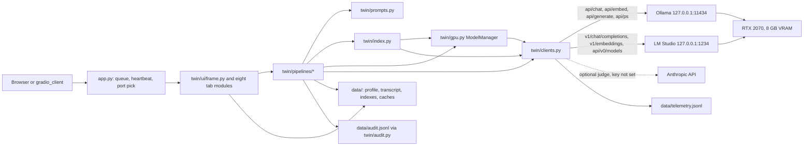
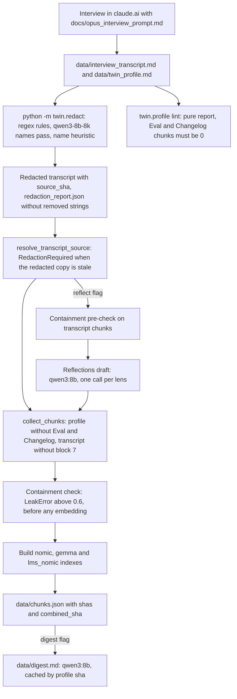
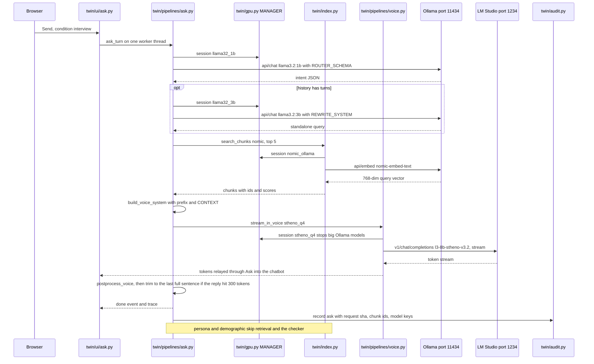
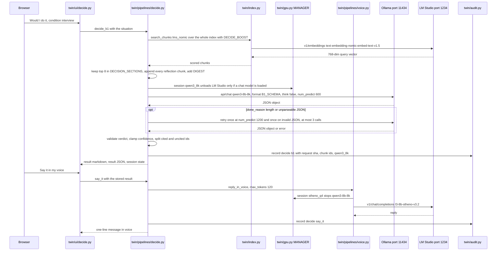

# Architecture: local digital twin

This is the technical reference for the digital-twin prototype (`app.py` and the `twin/` package) as of 2026-09-14. Every statement cites a repo path (`path:line` where useful) or an evidence row (`docs/EVIDENCE.md` stage, `docs/EVIDENCE2.md` row id). Numbers are copied from the file named beside them. User-visible waits come from the live rehearsal on this laptop (`scripts/dev/demo/rehearsal.md` section 4 for runs 1-7 and section 17.7 for runs 8-11, after the two approved fixes); "on screen" is the time the app reported and "machine" the rehearsal step's wall time, as that file defines them. A wait that was never measured is labelled an estimate.

Unless a line names the earlier example "Ari", everything below ran on the synthetic example profile "Mara Ellison" (`data/twin_profile.example.v2.md`). `data/twin_profile.md` does not exist, so the app falls back to the example (`twin/profile.py:100`) and says so in the page header (`twin/ui/state.py:103-106`).

## 1. Overview and hardware envelope

The twin models one person from a structured profile and a redacted interview transcript. It answers in that person's voice (Ask), predicts their decisions (Decide), runs tools on their behalf (Act), and reacts to images (See). It also measures itself against the person's own answers (Items, Eval). A Gradio 6 app serves eight tabs in this order: Onboarding, Ask, Decide, Act, See, Items, Eval, Status (`twin/ui/frame.py:60-62`). Every local model runs on one laptop.

| Item | Value | Source |
|---|---|---|
| Machine | Windows 11, RTX 2070 (8 GB VRAM), 32 GB RAM | `README.md:3` |
| Model servers | Ollama `http://127.0.0.1:11434`, LM Studio `http://127.0.0.1:1234` | `twin/config.py:56-57` |
| Network exposure | both model servers listen on 127.0.0.1 only; the app binds `127.0.0.1` by default | `README.md:4`, `app.py:66-68` |
| App port | first free port from `--port` (default 7861), probing 10 ports | `app.py:26`, `app.py:38-48` |
| Authentication | none: the app launches without auth, LM Studio auth is off (any API key string works), Ollama has none | `app.py:81-82`, `README.md:130`, `README.md:152`, `CLAUDE.md` (endpoint table) |
| GPU budget | only one of the big models fits fully at a time; Qwen at context 8192 plus Stheno Q4_K_M measured 7880 of 8192 MiB | `README.md:42`, `README.md:47` |
| Example resident size | `qwen3-8b-8k` at `size_vram` 5620231044 bytes, context 8192, 100% on GPU | `docs/EVIDENCE2.md` row 3.1 (size and context), row 1.2 and `docs/EVIDENCE2.md:122` (100% GPU) |
| Ollama environment | `OLLAMA_MAX_LOADED_MODELS=1` (one of six `OLLAMA_*` user variables) | `README.md:156` |
| Cloud dependency | none at run time; the optional Claude judge (`claude-sonnet-5`) needs `ANTHROPIC_API_KEY`, which is not set, so it never ran | `twin/config.py:63`, `docs/EVIDENCE2.md:184-185` |

## 2. System context diagram

- The browser and `gradio_client` use the same endpoints. Every button has an `api_name` (`README.md:180`; the endpoint table is in the `docs/CONTRACTS.md` section "Tab modules and endpoints").
- Model calls go through `twin/clients.py` from four places: the pipelines, `twin/index.py` (query and build embeddings, `twin/index.py:105-111`), `twin/redact.py` (the `qwen3_8k` names pass, `twin/redact.py:213-216`) and `twin/gpu.py` (warms, eviction stops and unloads, and `free_all`; `twin/gpu.py:57-132`). UI modules send no model request through a client; their only client call is the environment check `clients.anthropic_client.available()` (`twin/ui/state.py:184`, `twin/ui/status.py:197`, `twin/ui/evals.py:65`). They trigger warms, frees and rebuilds only through `twin/gpu.py` and `twin/index.py`: the tab pre-warm (`twin/ui/frame.py:183`) and the Status `/free_gpu`, `/warm` and `/rebuild_index` handlers (`twin/ui/status.py:311`, `twin/ui/status.py:333`, `twin/ui/status.py:352`).
- `twin/clients.py` is the only module that sends HTTP requests to the model servers. It records one telemetry row per model call: a chat, a warm, a stop, or one embed batch of up to 32 inputs. State requests such as `ps`, `tags`, `show` (a POST) and the LM Studio load check record nothing (`twin/clients.py:195-208`, `twin/clients.py:231-244`). LM Studio unloads go through the `lms` CLI as a subprocess (`LMSClient.unload_all`, `docs/CONTRACTS.md` section "twin/clients.py").

## 3. Component map

One line per module, following the matching `docs/CONTRACTS.md` section. The model keys are the `MODELS` keys from `twin/config.py:85-114`.

| Module | Responsibility | Model keys it calls |
|---|---|---|
| `app.py` | picks the port, starts the heartbeat, builds the Blocks app, `queue(default_concurrency_limit=1)`, launches | none |
| `twin/__init__.py`, `twin/pipelines/__init__.py` | empty package markers | none |
| `twin/config.py` | data paths, server URLs, CLI paths, the 14-entry `MODELS` registry, `no_warm()`, `theme_pref()` | none |
| `twin/telemetry.py` | one `CallRecord` per model call: a 500-entry ring buffer plus `data/telemetry.jsonl` (`twin/telemetry.py:13-39`) | none |
| `twin/clients.py` | `OllamaClient`, `LMSClient`, `AnthropicClient`; fixes `num_ctx` and `keep_alive` per spec on the Ollama chat, embed and warm bodies (the ones that load models), and `think` on the chat body only | all |
| `twin/gpu.py` | `ModelManager`: the global RLock, eviction rules, `warm`, `session`, `free_all`, active tab, heartbeat, `status()`; `TAB_MODEL` | warms and stops through the clients |
| `twin/profile.py` | parses schema v1 and v2 profiles into sections, chunks (without Eval and Changelog), decisions and eval Q/A; `resolve_profile_path`; `lint` | none |
| `twin/transcript.py` | parses interview transcripts into turns and `Interview/T-NNN` chunks; `exclude_blocks` defaults to `[7]` | none |
| `twin/redact.py` | regex rules, an LLM names pass, then a deterministic name heuristic; writes the redacted transcript and the redaction report | `qwen3_8k` |
| `twin/index.py` | collects chunks, runs the containment check, builds and searches three npz indexes, writes `chunks.json`, tests staleness by sha | `nomic_ollama`, `embeddinggemma`, `nomic_lms` |
| `twin/audit.py` | append-only `data/audit.jsonl` with the request text reduced to sha256 | none |
| `twin/prompts.py` | conditions, voice prompts, router, rewrite, Decide schemas, checker, judge, vision prompt, agent tools, digest prompt, `postprocess_voice` | none |
| `twin/pipelines/digest.py` | one-shot digest of the profile without Eval and Changelog, cached by profile sha | `qwen3_long` |
| `twin/pipelines/voice.py` | Stheno Q4 streamed or not, Q8 on request, `llama3.2:3b` fallback when LM Studio is down | `stheno_q4`, `stheno_q8`, `llama32_3b` |
| `twin/pipelines/ask.py` | router, follow-up rewrite, retrieval, streamed voice, optional checker; event stream; one audit line | `llama32_1b`, `llama32_3b`, `nomic_ollama`, `stheno_q4` or `stheno_q8`, `qwen25` |
| `twin/pipelines/decide.py` | B1 and B2 JSON decisions with retries and validation; `say_it`; audit lines | `nomic_lms` (`nomic_ollama` when `index_lms_nomic.npz` is missing), `qwen3_8k`, `stheno_q4` (`llama32_3b` when LM Studio is down) |
| `twin/pipelines/act.py` | the hermes3 tool loop over four tools, `safe_calc`, `polish`; one audit line per request | `hermes3`, `nomic_lms`, `stheno_q4` (`llama32_3b` when LM Studio is down) |
| `twin/pipelines/see.py` | image resize, vision description, a reaction in voice | `qwen35_vision`, `nomic_ollama`, `stheno_q4` (`llama32_3b` when LM Studio is down) |
| `twin/pipelines/evals.py` | voice bake-off with judges and checker, retrieval bake-off, live one-candidate check, optional Claude judge | six candidates, `llama31`, `qwen25`, three embedders, `claude` |
| `twin/pipelines/reflect.py` | expert-reflection drafts, one call per lens, cached in `data/reflections.md` | `qwen3_long` |
| `twin/pipelines/probes.py` | three boundary probes derived from the Boundaries section, asked through Ask, judged by qwen2.5 | the Ask models, `qwen25` |
| `twin/pipelines/items.py` | item bank, answer waves, twin run per condition, scoring with bootstrap CIs and retest normalization, the decision line | `nomic_lms`, `qwen3_8k`, `stheno_q4` (`llama32_3b` when LM Studio is down), `llama31`, `qwen25` |
| `twin/ui/__init__.py` | package docstring only | none |
| `twin/ui/state.py` | the loaded profile, header text and warnings, index and digest freshness, Claude-judge availability note | none |
| `twin/ui/frame.py` | masthead (monogram beside the header), GPU note, status-strip sidebar, 5 s timer, tab shell, tab-select pre-warm hooks, page-load hook, `?tab=` deep link | warms `TAB_MODEL` keys on tab select |
| `twin/ui/ask.py` | chat, temperature slider, Q8 and checker toggles, condition dropdown, trace; `/ask`, `/ask_clear` | through the Ask pipeline |
| `twin/ui/decide.py` | situation, condition, B1 and B2, result markdown and JSON, say it; `/decide_b1`, `/decide_b2`, `/say_it` | through Decide |
| `twin/ui/act.py` | request, answer, polish, trace; `/act`, `/polish` | through Act |
| `twin/ui/see.py` | image upload, description, reaction, trace; `/see` | through See |
| `twin/ui/items.py` | self-report form, wave save, twin run, scores; `/items_save`, `/items_run`, `/items_score` | `/items_run` only |
| `twin/ui/evals.py` | cached bake-off and probe tables, re-runs, live check; `/eval_show`, `/eval_voice_rerun`, `/eval_retrieval_rerun`, `/eval_live` | re-runs and the live check only |
| `twin/ui/status.py` | model and GPU state, telemetry, audit tail, redaction report, Free GPU, Warm, Rebuild; seven endpoints | warm, rebuild, free |
| `twin/ui/onboarding.py` | four-step walkthrough with file-check statuses and copyable commands; `/onboarding_check` | none |
| `twin/ui/theme.py` | the token sheet (`docs/design/tokens.default.md`, or `docs/design/tokens.md` once exported) to the Gradio theme and the `--twin-*` CSS variables; `css_text()` joins `static/twin.css` and `static/tabs/*.css`; contrast check (`python -m twin.ui.theme`) | none |
| `static/twin.css`, `static/tabs/*.css` | default tokens, base rules and the shared classes under `#twin-tabs`; `frame.css` styles the masthead, GPU note, status strip and tab strip; one partial per tab whose every selector starts with `#tab-<id>` (`tests/test_theme.py`) | none |
| `scripts/check_servers.ps1` | both servers answer JSON and the GPU uses at most 200 MiB (`scripts/check_servers.ps1:26`) | none |
| `scripts/free_gpu.ps1` | `ollama stop` for each model in `/api/ps`, or for a fixed list of 11 registry names when `/api/ps` lists none or fails (`scripts/free_gpu.ps1:15-29`); then `lms unload --all` with `y` fed through `cmd /c echo` (`scripts/free_gpu.ps1:36`) | stops models |
| `scripts/delete_twin.ps1` | lists the 18 personal and derived data files as a dry run; `-Confirm` deletes them | none |
| `scripts/screenshot_tabs.ps1` | headless Chrome screenshot per tab through `?tab=`, `__theme` and `nomotion=1`, saved as `<theme>_<width>_<tab>.png` | fires the pre-warm unless `TWIN_NO_WARM=1` |
| `scripts/dev/finish/ui_check.ps1` | UI check on ports 7871-7879: boots the app with `TWIN_NO_WARM=1`, takes the tab screenshots, shoots and measures Ask at a true 400 px, checks `view_api`, compares `/api/ps` before and after, and always stops the app | none |
| `tests/` | 22 `test_*.py` modules that use client fakes | none |
| `scripts/demo_prep.ps1` | demo prep: server and port checks, free GPU, profile check, app start; `-WarmOnly` warms Decide's `qwen3-8b-8k` through the app (`scripts/demo_prep.ps1:3-16`); prints PASS/FAIL per line and writes `scripts/dev/demo/app.pid` and `app.port` | through the app's endpoints |
| `scripts/demo_rehearse.py` | runs the `docs/demo/beats.json` steps through `scripts/dev/live_drive.py`; `--check-profile`; `--smoke` tests each model directly | through the app, or directly with `--smoke` |
| `scripts/dev/live_drive.py` | a `gradio_client` driver for the app's endpoints | through the app |

## 4. Build-time flow

The steps below follow the order in the code. `python -m twin.index --build all --digest --reflect` runs steps 4-9 through `build_all` (`twin/index.py:476-496`), which stops every Ollama model at the end. The reflection draft runs before chunk collection and indexing, and the digest runs last.

1. **Interview.** The protocol has seven blocks; block 7 administers the 20 gold Eval questions, the self-ratings and the consent confirmation (`docs/INPUTS.md:30`). The Onboarding tab gives the copyable command (`twin/ui/onboarding.py:37-42`).
2. **Redact.** `python -m twin.redact` applies five regex rules (email, profile-url, phone, id-number, address; `twin/redact.py:54-80`, `twin/redact.py:274-281`). It then makes one `qwen3_8k` names call per turn, with one retry on invalid JSON; a candidate is replaced only when `plausible_name` holds (`twin/redact.py:213-216`, `twin/redact.py:284-296`, `twin/redact.py:392-393`). Last, a deterministic name heuristic runs on the already-tagged text (`twin/redact.py:298-304`). The output gains `redacted: true`, `source_sha` and `redacted_at` in its frontmatter. `data/redaction_report.json` holds the source and output paths, `source_sha`, the turn count, the llm flag, counts, tags and the timestamp, never the removed strings; those go to the console only (`twin/redact.py:405-410`, `twin/redact.py:464`). On the example transcript the counts were `email 1` and `names_llm 1`, with 0 planted-string hits in the output (`docs/EVIDENCE2.md` row 1.2).
3. **Profile lint.** `python -m twin.profile --lint` is a pure report (`twin/profile.py:288-335`). It lists chunks over 300 or under 80 tokens, checks the static prefix against the 1500-token budget and the 4000-7000 word band, reports missing D2 sections, and counts Eval and Changelog chunks, which must be 0. It warns when the politics chunk is present. `build_all` does not call it; the Onboarding index command runs it after the build (`twin/ui/onboarding.py:40`). Mara's lint read `changelog chunks: 0`, `eval chunks: 0` and `words: 2055 (band 4000-7000)`, plus the politics-chunk and word-band warnings (`docs/EVIDENCE2.md` row 1.1).
4. **Transcript source.** With a real transcript present, the index reads only its redacted copy, and only when that copy's `source_sha` matches the source bytes; otherwise it raises `RedactionRequired`, unless `--no-redact` is passed (`twin/index.py:143-159`). Without a real transcript it reads the example's redacted copy when that copy's `source_sha` matches the example file, else the unredacted example transcript, printing `example transcript (synthetic), unredacted` (`twin/index.py:160-166`).
5. **Containment pre-check and reflections.** Only with `--reflect`: `_precheck_leaks` runs before the transcript reaches qwen3 (`twin/index.py:440-455`, `twin/index.py:484-486`). Without the flag the build goes straight to chunk collection and the main containment check. `reflect.py` then drafts one note per lens with `qwen3_long` (`qwen3:8b`, `num_ctx` 40960, `keep_alive` 0; `twin/config.py:92-93`). The lenses are Psychologist, Behavioral economist, Political scientist and Demographer; Political scientist is included only when the profile has the `Beliefs and attitudes/Society and politics` chunk (`twin/pipelines/reflect.py:24-45`). The draft becomes `Reflections/<lens>` chunks only when the profile has no `# Expert reflections` section (`twin/index.py:200-205`). Mara's profile has that section, so `data/reflections.md` is not indexed (`docs/EVIDENCE2.md:94-96`).
6. **Chunks.**
   - Profile chunks exclude `Eval` and `Changelog` (`twin/profile.py:23`).
   - Transcript turns in excluded blocks are never chunked (`twin/transcript.py:29`, `twin/transcript.py:147-152`, `twin/index.py:183-199`). Long answers split into ids such as `Interview/T-004a` and `Interview/T-004b` (`data/chunks.json:526`, `data/chunks.json:534`).
   - Mara's build printed `excluded blocks: 1 (turns skipped: 22)` and `chunks: 101 (profile 57, transcript 40, reflection 4)` (`docs/EVIDENCE2.md` row 1.3).
7. **Containment check.** For every transcript chunk and every gold Eval answer, containment is the share of the answer's lexical words that appear in the chunk. Any score above `CONTAINMENT_THRESHOLD = 0.6` raises `LeakError` before anything is embedded (`twin/index.py:31`, `twin/index.py:235-253`, `twin/index.py:459-473`). Mara's build printed `containment check: ok (max 0.50)` (`docs/EVIDENCE2.md` row 1.3).
8. **Three indexes.** `nomic` uses `nomic-embed-text` (Ollama), `gemma` uses `embeddinggemma:300m-qat-q4_0` (Ollama), and `lms_nomic` uses `text-embedding-nomic-embed-text-v1.5` (LM Studio) (`twin/index.py:27`). Each npz stores L2-normalised float32 vectors, ids, the embedder, the profile `sha`, the chunk `source` and `combined_sha` (`docs/CONTRACTS.md` section "twin/index.py"). Mara's three files each hold `vectors (101, 768)` (`docs/EVIDENCE2.md` row 1.3). Ask, See and Eval use `nomic`; Act, Decide and the Items twin run use `lms_nomic` (Decide falls back to `nomic` when `index_lms_nomic.npz` is missing); `gemma` serves only the bake-off (`twin/ui/state.py:21`, `twin/pipelines/items.py:53`, `twin/pipelines/decide.py:102-105`).
9. **Digest.** `qwen3_long` summarises every profile section except Eval and Changelog in one call (one retry when the reply is empty) with `num_predict` 500. The first line of `data/digest.md` records the profile sha, and the digest is rebuilt when that sha differs or when forced: `/rebuild_digest` and the CLI `--force` rebuild even when it matches (`twin/pipelines/digest.py:37-67`, `twin/ui/status.py:379`, `twin/index.py:522`).

## 5. Run-time sequences

### Ask

- **Threading.** `ask_turn` runs the whole turn on one dedicated worker thread, because `MANAGER.lock` is an RLock that only the acquiring thread may release (`twin/pipelines/ask.py:545-601`).
- **Router.** `llama32_1b` classifies the intent at temperature 0 with 40 tokens (`twin/pipelines/ask.py:55`, `twin/pipelines/ask.py:273-287`).
- **Rewrite.** Only when the chat has history, `llama32_3b` turns the follow-up into a standalone query (`twin/pipelines/ask.py:444-453`). `/ask_clear` empties the chat, so the next turn has no history and no rewrite (`twin/ui/ask.py:126-127`).
- **Retrieval** runs under interview only: the top 5 chunks from the `nomic` index, with Decisions boosted by 0.05 when the intent is `decide` (`twin/pipelines/ask.py:321-324`, `twin/pipelines/ask.py:455-468`). For "What did you learn from quitting the agency job?" the trace listed `Interview/T-004a 0.859, Interview/T-004b 0.767, Interview/T-003 0.729, Decisions/D-01 0.688, Life events/The year i was fully broke 0.685` (`docs/EVIDENCE2.md` row 2.3). Persona and demographic turns emit `condition: <c> (chunks: 0, digest: yes|no)` instead (`twin/pipelines/ask.py:430-432`).
- **Voice.** `stheno_q4` streams up to `VOICE_TOKENS = 300` tokens at the slider temperature, which defaults to 1.0 (`twin/pipelines/ask.py:57`, `twin/ui/ask.py:140`). The Q8 toggle selects `stheno_q8`; when LM Studio is down, `llama32_3b` answers at 0.8 (`twin/pipelines/voice.py:53-60`).
- **Trim at the token cap.** When a reply reaches 300 pieces, the done text is cut back to its last full sentence; the streamed token events stay raw, and the trace voice line ends `; trimmed to N chars at the last full sentence (token cap)`. The text is left unchanged when it already ends on sentence punctuation or an emoji, has no sentence end, or the cut would keep less than half of it (`twin/pipelines/ask.py:221-250`, `twin/pipelines/ask.py:492-502`; tests below in section 11). Before this fix the first demo question was cut mid-sentence in rehearsal runs 1-2 ("... is that nobody"); in run 8 it was trimmed from 1280 to 1242 chars and ended "in a roundabout way." (`scripts/dev/demo/rehearsal.md` sections 6 and 17.6). The cached `data/eval_results.json` voice and probe replies predate the trim.
- **Checker.** The optional qwen2.5 checker runs only under interview (`twin/pipelines/ask.py:504-515`).
- **Audit.** Every turn that called a model ends with one audit line, written after the done event once the turn ends (`twin/pipelines/ask.py:384-405`).
- **Waits** (`scripts/dev/demo/rehearsal.md` sections 4 and 17.7, trace totals on screen):
  - First interview question: 13.0-13.8 s in runs 1, 2 and 8 (12.99 s in run 8 after the trim fix: router 3.39 s, retrieval 2.76 s, voice 6.51 s; machine 14.7 s).
  - Follow-up with rewrite: 14.7-17.4 s in runs 1, 2 and 8 (rewrite 4.94-6.49 s, mostly the `llama3.2:3b` load).
  - Persona turn (no retrieval): 8.1-9.4 s in runs 1-2, 9.18 s in run 8. A demographic turn was not rehearsed.

### Decide

- **Retrieval.** Decide embeds through the LM Studio index when `data/index_lms_nomic.npz` exists, so a query embedding does not evict `qwen3-8b-8k` on Ollama (`twin/pipelines/decide.py:102-105`). Under interview it searches the whole index, keeps the top 8 chunks from Decisions, Values, Preferences, Boundaries and the reflection sections, then appends every reflection chunk (`twin/pipelines/decide.py:35-37`, `twin/pipelines/decide.py:113-139`). Mara's B1 run used 12 chunks, including the four `Expert reflections/*` ids (`docs/EVIDENCE2.md` row 2.5).
- **Schema.** `B1_SCHEMA` requires `verdict` (yes or no), `confidence` (0 to 1), `reasons` (maxItems 6), `cited_decisions` (maxItems 8) and `what_would_change_my_mind` (`twin/prompts.py:137-150`).
- **Retries.** A `length` stop gets one retry at 1200 tokens, and invalid or empty JSON gets one more retry (`twin/pipelines/decide.py:191-222`).
- **Validation.** Confidence is clamped to 0-1, and cited ids are split into known profile decisions and `uncited` strings (`twin/pipelines/decide.py:226-287`).
- **The maxItems caps** fixed a live failure in which qwen3-8b-8k looped inside `cited_decisions` until `num_predict`. After the fix both calls parsed on the first attempt (`docs/EVIDENCE2.md` row 2.5; regression test `tests/test_prompts.py:186`).
- **Say it** is a separate click. It reads the Gradio session state from the last decide call (`twin/ui/decide.py:75-76`), and the GPU swap to Stheno happens only then (`twin/pipelines/decide.py:5-7`, `twin/pipelines/decide.py:392-419`).
- **Waits** (`scripts/dev/demo/rehearsal.md` sections 4, 5 and 17.7):
  - B1 verdict: 8.6-12.0 s on screen (`timing_ms`) in runs 1, 2 and 8, one `qwen3-8b-8k` call every time (machine 10.6-14.0 s to the verdict).
  - B1 on the retry path: never measured in rehearsal, because no run needed a retry. Estimate only: up to three `qwen3-8b-8k` calls, so several times the one-call wait; the one recorded three-attempt case, before the `maxItems` fix, failed after about 80 s (`docs/EVIDENCE2.md:72-73`).
  - Say it: 8.9-9.4 s in runs 1, 2 and 8, including Stheno swapping in for `qwen3-8b-8k`.

### Act

- **Model and tools.** Act runs `hermes3:8b` with native tool calling (`twin/config.py:94-95`). Its four tools are defined in `twin/prompts.py:219-270` and implemented in `twin/pipelines/act.py:231-236`:
  - `search_profile`: the `lms_nomic` index, `k` clamped to 1-8 (`twin/pipelines/act.py:154-178`).
  - `get_datetime`.
  - `calculator`: an AST whitelist, never `eval` (`twin/pipelines/act.py:116-150`, `twin/pipelines/act.py:204-212`).
  - `draft_message`: returns the style rules, two samples, the instruction "1-4 sentences" and a `next_step` (`twin/pipelines/act.py:27-28`, `twin/pipelines/act.py:215-228`). Its own `next_step` tells the model to call `search_profile` with the query `how I talk to <role>` (`twin/pipelines/act.py:226-227`). Since the approved fix, `_agent_loop` replaces that step with `DRAFT_WRITE_NOW` ("Do not call any more tools: reply now with only the message text, 1-4 sentences") whenever the trace already holds a `search_profile` or `draft_message` call, so only a first-step `draft_message` still asks for the lookup (`twin/pipelines/act.py:32-34`, `twin/pipelines/act.py:395-398`).
- **Loop.** `run_agent(user_message, max_steps=5)` wraps `_agent_loop`, which holds one `MANAGER.session("hermes3")` for the whole loop (`twin/pipelines/act.py:331-342`, `twin/pipelines/act.py:345-406`, session at `twin/pipelines/act.py:363`).
  - Each step is one `/api/chat` call with the tools, temperature 0.3 and `num_predict` 500, retried once when neither content nor tool calls come back (`twin/pipelines/act.py:272-285`).
  - Tool results return to the model as `role: tool` messages.
  - The loop ends on a message without tool calls.
  - A time or date request that finishes without `get_datetime` gets one nudge and one extra step.
  - If the step limit is reached with calls pending, the answer reads "I ran out of steps before writing a final answer. Last tool results:" followed by the raw tool results (`twin/pipelines/act.py:403-405`).
- **Prompt placement.** The system instruction also goes into the first user turn, because the hermes3 template drops the system slot when tools are sent (`twin/pipelines/act.py:348-356`).
- **Rehearsal result** (`scripts/dev/demo/rehearsal.md` sections 7, 17.5 and 17.11). Before the fix, 0 of 6 attempts drafted a message: 5 of 6 looped to the 5-step limit ("I ran out of steps"), and run 3's B5.1 stopped after 2 steps and answered in prose restating the lookup instruction. After the fix, the kept demo request (B5.2) drafted in 4 of 4 attempts (runs 8-11), each in 3 steps: `search_profile` returning `Decisions/D-02`, `draft_message`, then the text. The drafts vary and can drift from the profile: run 8 says "i would've regretted it" while D-02 says she regretted it for a month, then felt fine; run 10 wrote five sentences against the tool's 1-4; none addresses the mentor by role; and the second lookup (how she talks to her mentor) no longer happens. B5.1 was not re-rehearsed after the fix.
- **Model placement.** Embedding through LM Studio keeps hermes3 loaded on Ollama. The phase-1 pass on the earlier example "Ari" (2026-09-13) recorded hermes3 `load_ms 7` right after the embed (`docs/EVIDENCE.md` stage 4(b)).
- **Audit.** Each request writes one audit line with tab `act`, condition `interview`, the `search_profile` chunk ids and `hermes3`, plus the step count (`twin/pipelines/act.py:320-328`, `twin/pipelines/act.py:331-342`). "Polish with Stheno" writes none (`twin/pipelines/act.py:410-424`).
- **Waits** (`scripts/dev/demo/rehearsal.md` section 17.7):
  - Act request to the finished draft: 3.7-5.5 s on screen in runs 8-11 (machine 5.3-6.9 s), after the fix. The pre-fix attempts are not a guide: they ended without a draft.
  - hermes3 pre-warm (the `/warm act` stand-in for the tab select): 3.5-9.1 s when another model was loaded or the GPU was cold (runs 1, 2, 8 and 9; 8.3 s swapping out Stheno in run 8), 0.4 s when hermes3 was already loaded (runs 10-11).

### See

- **Lock.** `see_turn` holds `MANAGER.lock` across both model sessions, so the heartbeat cannot re-warm the vision model in between (`twin/pipelines/see.py:164-181`).
- **Description.** The image is converted to RGB JPEG at quality 85 with its longest side capped at 1024 px (`twin/pipelines/see.py:95-106`). `qwen3.5:4b-q8_0` describes it with `VISION_PROMPT` ("Describe this image factually in 5 sentences."), temperature 0.7, `num_predict` 300 and `think` false. The vision model is always stopped afterwards (`twin/pipelines/see.py:110-131`, `twin/prompts.py:202`, `twin/config.py:100-101`).
- **Reaction.** The description is embedded against the `nomic` index (top 5), and `reply_in_voice` answers in at most 150 tokens at temperature 1.0 under the interview prompt (`twin/pipelines/see.py:134-161`).
- **Audit.** See writes no audit line; `twin/pipelines/see.py:20` imports no audit module.
- **Waits** (`scripts/dev/demo/rehearsal.md` sections 4 and 8, run 3 only): the `qwen3.5:4b-q8_0` pre-warm took 10.9 s on screen (machine 13.8 s); the turn took 13.6 s from Look to the reaction (vision 3.8 s, voice 7.6 s; machine 16.3 s).

## 6. Model routing (MODELS) and GPU sequencing

### Registry

The columns up to keep_alive are copied from `twin/config.py:85-114`; the job column is summarised from the job strings there. `think` is `False` for `qwen3_8k`, `qwen3_long` and `qwen35_vision`.

| key | server name | runtime | kind | vram | num_ctx | keep_alive | job |
|---|---|---|---|---|---|---|---|
| `stheno_q4` | `l3-8b-stheno-v3.2` | lms | chat | big | None | None | voice: Ask, say it, See reaction, Act polish |
| `stheno_q8` | `fluffy/l3-8b-stheno-v3.2:q8_0` | ollama | chat | huge | 8192 | "10m" | Ask Q8 toggle |
| `qwen3_8k` | `qwen3-8b-8k` | ollama | chat | big | 8192 | "10m" | Decide B1/B2 |
| `qwen3_long` | `qwen3:8b` | ollama | chat | huge | 40960 | 0 | digest and reflections draft at index build |
| `hermes3` | `hermes3:8b` | ollama | chat | big | 8192 | "10m" | Act tool calling |
| `qwen25` | `qwen2.5:7b` | ollama | chat | big | 8192 | "10m" | checker and second judge |
| `llama31` | `llama3.1:8b` | ollama | chat | big | 8192 | "10m" | primary judge |
| `qwen35_vision` | `qwen3.5:4b-q8_0` | ollama | vision | big | 8192 | "10m" | See description |
| `llama32_3b` | `llama3.2:3b` | ollama | chat | small | 4096 | "30m" | follow-up rewrite, fallback voice |
| `llama32_1b` | `llama3.2:1b` | ollama | chat | small | 4096 | "30m" | router |
| `nomic_ollama` | `nomic-embed-text` | ollama | embed | small | 2048 | "30m" | primary retrieval index |
| `embeddinggemma` | `embeddinggemma:300m-qat-q4_0` | ollama | embed | small | 2048 | "30m" | bake-off index |
| `nomic_lms` | `text-embedding-nomic-embed-text-v1.5` | lms | embed | small | None | None | Act and Decide index |
| `claude` | `claude-sonnet-5` | anthropic | chat | none | None | None | optional ceiling judge |

### Request rules

- Every Ollama `/api/chat` body carries `options.num_ctx` from the spec (a caller's value is overwritten) and `keep_alive`. It adds `"think": false` when the spec says so (`twin/clients.py:60-72`).
- Embed and warm bodies carry the same two fields (`twin/clients.py:135-146`, `twin/clients.py:168-172`).
- A `stheno_q8` request without a system message raises `ValueError` (`twin/clients.py:53-54`).
- LM Studio requests use the OpenAI SDK, with `min_p`, `top_k` and `repeat_penalty` in `extra_body` (`docs/CONTRACTS.md` section "twin/clients.py").

### ModelManager

- **One lock.** Every local chat, embed and warm runs under the one global RLock `MANAGER.lock`. It is taken through `session(key)` or `warm(key)` (`twin/gpu.py:35`, `twin/gpu.py:88-112`), or directly by `free_all`, `heartbeat_tick` and `see_turn` (`twin/gpu.py:116`, `twin/gpu.py:163`, `twin/pipelines/see.py:171`). Model stops outside the lock: `_stop_all_ollama` after an index build, after a digest rebuild (including `/rebuild_digest`), and in the index `--build` and `--search` and reflect CLIs (`twin/index.py:408-418`, `twin/index.py:496`, `twin/index.py:505`, `twin/index.py:566`, `twin/index.py:577`, `twin/pipelines/reflect.py:203`, `twin/ui/status.py:379`); and the redaction CLI's final stop of every loaded Ollama model (`twin/redact.py:452-460`). The optional Claude judge calls no local model and takes no lock (`twin/pipelines/evals.py:497-507`).
- **Eviction.** `ensure(key)` applies these rules (`twin/gpu.py:57-86`):
  - An LM Studio big model stops every big or huge Ollama model in `/api/ps`; unknown names count as big, and small Ollama models stay.
  - An Ollama big or huge model runs `lms unload --all` when LM Studio has a non-embedding model loaded.
  - Small Ollama models, LM Studio embedders and Anthropic trigger nothing; Ollama evicts its own models.
- **`OLLAMA_MAX_LOADED_MODELS=1`** (set as a user variable, `README.md:156`) lets Ollama hold one model at a time, small ones included (`docs/PLAN_DEMO.md:49`; the router took 3.51 s in `docs/EVIDENCE2.md` row 2.1, 0.12-0.15 s in rows 2.2-2.3, and 3.70 s again in row 2.4 after row 2.3's retrieval; in rehearsal the router took 2.97-4.48 s whenever it had to reload, `scripts/dev/demo/rehearsal.md` section 6, `scripts/dev/demo/run2_B4.1.txt:43` and `scripts/dev/demo/run8_B4.1.txt:41`). An interview Ask turn calls the `llama3.2:1b` router and the `nomic-embed-text` embedder, both on Ollama, so each loads in place of the other, and a follow-up adds `llama3.2:3b` to the sequence. Decide and Act embed through LM Studio for this reason (`twin/pipelines/decide.py:102-105`, `twin/pipelines/act.py:24`).
- **One GPU queue.** The app queues with `default_concurrency_limit=1` (`app.py:79`). Every model endpoint and the tab-select hooks for ask, decide, act, see and eval share `concurrency_id="gpu"` (`twin/ui/frame.py:66`, `twin/ui/frame.py:229-231`; `docs/CONTRACTS.md` section "Tab modules and endpoints"). Work on that queue runs one event at a time, so a click during a pre-warm waits behind it. That queued cost was never measured end to end; as an estimate, B1 pressed during the Act pre-warm waits about 16-30 s (the hermes3 pre-warm 3.5-9.1 s, a cold `qwen3-8b-8k` load 4.2-8.5 s, then the 8.6-12.0 s verdict; `scripts/dev/demo/rehearsal.md` section 17.11).
- **Pre-warm on select.** `make_tab_select` marks the tab active and warms `MANAGER.tab_key(tab)`: the `TAB_MODEL` key (ask `stheno_q4`, decide `qwen3_8k`, act `hermes3`, see `qwen35_vision`; `twin/gpu.py:11`) unless an override is set, so with the Q8 toggle on, selecting Ask pre-warms `stheno_q8` (`twin/ui/frame.py:178`). It then posts `Active tab: <tab>. Pre-warmed <key> (<name>) in <n> s.` to the GPU note (`twin/ui/frame.py:167-189`). The wait for that note, measured through the `/warm` stand-in (rehearsal never selects a tab; `scripts/dev/demo/rehearsal.md` sections 4 and 17.7): 0.3-0.8 s when the tab's model is already loaded (Decide and Ask, runs 1, 2 and 8; Act 0.4 s, runs 10-11); from cold or another model, Decide 4.2 s (run 7), Ask 4.9 s (run 7), Act 3.5-9.1 s (runs 1, 2, 8, 9) and See 10.9 s (run 3). The machine time adds about 2.5 s. A warm is a prompt-less `/api/generate` for Ollama, a 1-token chat for LM Studio chat models, and one embed for LM Studio embedders (`twin/gpu.py:88-101`).
- **Tabs without a model.** Selecting Eval, Items or Onboarding sets an active tab with no model, which pauses the heartbeat. Selecting Status leaves the active tab unchanged (`twin/ui/frame.py:171-180`, `twin/ui/frame.py:233-238`).
- **Page load.** `default_tab()` opens Onboarding while `data/twin_profile.md` is missing, else Ask (`twin/ui/frame.py:192-194`). The page-load hook marks a tab active only when that tab has a model and no tab is active yet, so a page opened on Onboarding leaves no active tab. `?tab=<id>` opens a tab directly (`twin/ui/frame.py:197-208`).
- **Heartbeat.** One daemon thread re-warms the active tab's model every 240 s, and only when the lock is free (`twin/gpu.py:155-186`). With no active tab it does nothing. `/warm` warms a tab's model without changing the active tab (`twin/ui/status.py:319-338`). `/free_gpu` clears the active tab, stops every loaded Ollama model and runs `lms unload --all` (`twin/ui/status.py:307-316`, `twin/gpu.py:114-132`).
- **Keep-alive.** Big Ollama models use `"10m"`, small ones `"30m"`, and `qwen3_long` uses 0 (`twin/config.py:88-109`). LM Studio's JIT unload time is 600 s (`README.md:184`). The 240 s heartbeat is shorter than either, so the model of an active model tab stays loaded.
- **Q8 toggle.** `set_tab_model("ask", "stheno_q8")` makes Q8 the heartbeat target (`twin/gpu.py:139-145`). The Q8_0 weights run only 67% on the GPU (`README.md:21`).
- **`TWIN_NO_WARM`.** It is read at call time (`twin/config.py:45-48`). When it is set:
  - no heartbeat thread starts and `heartbeat_tick` returns None (`twin/gpu.py:158-159`, `twin/gpu.py:173-176`);
  - a tab select only records the tab (`twin/ui/frame.py:176-177`);
  - `/warm`, `/rebuild_index`, `/rebuild_digest` and `/items_run` return `skipped: TWIN_NO_WARM=1` (`twin/ui/status.py:329-330`, `twin/ui/status.py:347-348`, `twin/ui/status.py:374-375`, `twin/ui/items.py:246-248`).
  - Ask, Decide, Act, See and the Eval re-runs still call models under the switch.
- **Status strip.** A 5 s timer refreshes GPU MiB, loaded models, the active tab and the heartbeat state (idle, loading, ready or busy) using GETs and `nvidia-smi` only (`twin/ui/frame.py:109-163`, `twin/ui/frame.py:221`, `twin/ui/frame.py:241`).

## 7. Conditions (twin/prompts.py)

`CONDITIONS = ("demographic", "persona", "interview")`, with `interview` as the default (`twin/prompts.py:9-10`). The condition sets how much of the person the model sees.

| Condition | Voice system prompt (`twin/prompts.py:20-74`) | Ask retrieval | Decide context (`twin/pipelines/decide.py:142-159`) | Checker |
|---|---|---|---|---|
| `demographic` | `VOICE_SYSTEM_NO_CONTEXT` + the IDENTITY block only; no style rules, samples, boundaries or digest | none | IDENTITY | skipped |
| `persona` | `VOICE_SYSTEM_NO_CONTEXT` + identity, style rules, 3 samples, BOUNDARIES, digest (first 1600 chars) | none | IDENTITY and DIGEST | skipped |
| `interview` | `VOICE_SYSTEM` + the same prefix + a `CONTEXT` block of retrieved chunks | `nomic`, top 5 | numbered chunk blocks and DIGEST | optional qwen2.5 |

- **Where it is selected.** The condition dropdown is the last input of `/ask`, `/decide_b1`, `/decide_b2` and `/eval_live` (`twin/ui/frame.py:71-72`). Decide stores it in the result, so `say_it` follows it (`twin/pipelines/decide.py:392-399`). Eval caches cells as `cand` (interview) or `cand@condition` (`docs/CONTRACTS.md` section "twin/pipelines/evals.py").
- **Audit.** Each audit row records the condition (`twin/audit.py:34`). The same question hashed to the same sha under all three conditions (`docs/EVIDENCE2.md` row 2.6).
- **Items.** The items run adds `SELF-RATINGS` to the interview context (`docs/CONTRACTS.md` section "twin/pipelines/items.py").
- **Fixed conditions.** See always uses the interview prompt (`twin/pipelines/see.py:139`). Act has no condition and audits as `interview` (`twin/pipelines/act.py:325`).
- **Observed effect.** On the same question, the demographic reply carried no agency-specific facts and the interview reply carried transcript facts (`docs/EVIDENCE2.md` rows 2.1 and 2.3).
- **Boundaries.** The BOUNDARIES block (`twin/prompts.py:55-56`) is part of the persona and interview prompts only; `build_voice_prefix` returns before it under demographic (`twin/prompts.py:48-49`).

## 8. Evaluation

**Caveat (a):** retest ceilings come from synthetic example wave-2 answers (`data/items/scores.json` has `"example": true`). They say nothing about a real person's consistency.

**Caveat (b):** voice scores and the gold `judge_overall` scores come from the local llama3.1 and qwen2.5 judges. The Claude ceiling judge never ran.

### 8.1 Voice bake-off

- **Design.**
  - Candidates are `stheno_q4`, `stheno_q8`, `llama31`, `qwen25`, `hermes3` and `qwen3_8k`; the judges are `llama31` and `qwen25` (`twin/pipelines/evals.py:38-39`).
  - The judge sees the gold answer, the style rules and the anonymised reply. It scores factual_agreement, voice_fidelity, no_roleplay_artifacts and overall from 1 to 5 (`twin/prompts.py:183-200`).
  - Generation is candidate-outer and scoring judge-outer, and the qwen2.5 checker runs on interview cells. Results are saved after every call under the profile sha (`twin/pipelines/evals.py:397-514`).
- **Mara's run** was one candidate under three conditions on 5 questions (`docs/EVIDENCE2.md` row 5.1):

| cell | replies | factual | voice | artifacts | overall | consistent | overall by judge |
|---|---|---|---|---|---|---|---|
| `stheno_q4@persona` | 5 | 4.40 | 4.40 | 4.60 | 4.40 | - | llama31: 5.0, qwen25: 3.8 |
| `stheno_q4` (interview) | 5 | 4.20 | 3.70 | 4.40 | 3.80 | 0.60 | llama31: 4.4, qwen25: 3.2 |
| `stheno_q4@demographic` | 5 | 3.70 | 3.10 | 4.30 | 3.20 | - | llama31: 3.6, qwen25: 2.8 |

The persona ablation out-scores interview on this 5-question set. The checker column exists only for interview cells (`docs/EVIDENCE2.md:151-152`). Caveat (b) applies.

### 8.2 Retrieval bake-off

Each of the 20 gold answers gets a ground-truth chunk: an explicit `Sources:` id if present, else the chunk with the best containment and Jaccard score. Each index is then scored on recall@k and MRR (`docs/CONTRACTS.md` section "twin/pipelines/evals.py"; `twin/pipelines/evals.py:40`). Mara's values, from `data/eval_results.json`:

| index | recall@1 | recall@3 | recall@5 | mrr |
|---|---|---|---|---|
| `nomic` | 0.45 | 0.65 | 0.65 | 0.55 |
| `gemma` | 0.45 | 0.75 | 0.8 | 0.6042 |
| `lms_nomic` | 0.4 | 0.65 | 0.65 | 0.5167 |

Ask and See use `nomic` by default (`twin/pipelines/ask.py:586-588`, `twin/pipelines/see.py:28`). `docs/EVIDENCE2.md:153-155` notes these values are lower than the phase-1 profile's rows.

### 8.3 Item bank and twin run

- **Bank.** `data/items/bank.json` is version 1.0, frozen 2026-09-14, with 112 items: 50 IPIP-50 (10 per domain), 5 games, 20 gold and 37 GSS, with `political blacklist hits: []` (`docs/EVIDENCE2.md` row 0.3).
- **Exclusions.** `bank_items` skips items carrying an `excluded` key, gold items with no matching Eval question in the profile, and gold questions that match the politics regex (`twin/pipelines/items.py:73`, `twin/pipelines/items.py:133`, `twin/pipelines/items.py:141-143`, `twin/pipelines/items.py:145`). For Mara this excludes `GOLD_Q-12` (`excluded: politics`, `data/items/scores.json`).
- **Run order.** The run is model-outer (`twin/pipelines/items.py:569-696`):
  1. retrieval with `lms_nomic` for interview cells;
  2. closed items with `qwen3_8k` and a per-item JSON schema;
  3. open gold items in voice with `stheno_q4`;
  4. scoring of the open replies by `llama31`, then `qwen25`.
  - Afterwards the GPU is freed and one audit line is written per condition.
- **Mara's run** made 447 model calls and loaded four big models, each once (`docs/EVIDENCE2.md` row 3.1).
- **Answer isolation.** Twin-facing prompts never carry Eval answers, the Changelog or any self-answer; the gold answer reaches only the judge (`docs/CONTRACTS.md` section "twin/pipelines/items.py").

### 8.4 Scoring and retest normalization

`score()` (`twin/pipelines/items.py:853`; rules in `docs/CONTRACTS.md` section "twin/pipelines/items.py") works as follows.

- **Ground truth** is wave 2 when present, else wave 1.
- **Metrics per instrument:**
  - ipip50: `mae`, `r` and `acc = 1 - MAE/4` on reverse-scored values;
  - gss: `accuracy`;
  - games: per-item `mae` and `acc = 1 - MAE/range`, a family `acc`, and `prisoners_dilemma` `accuracy`;
  - gold: `judge_overall`, the mean judge overall divided by 5.
- **Confidence intervals** are 95% percentile bootstrap intervals with 1000 resamples and seed 0.
- **Retest normalization.** `normalized = value / retest`, where `retest` is the same metric computed between wave 1 and wave 2. Without wave 2, every normalized cell of the ipip50, gss and game rows reads `ceiling pending`; gold rows always read `n/a` (`twin/pipelines/items.py:77`, `twin/pipelines/items.py:850`; `docs/CONTRACTS.md:667`).

### 8.5 Decision rule

`decision_line` (`twin/pipelines/items.py:940-979`) compares five `DECISION_METRICS` (`twin/pipelines/items.py:79-80`).

- The verdict is `yes` when interview beats both demographic and persona on every metric, `no` when it beats them on none, and `partial` otherwise.
- It flags retrieval when interview's normalized GSS accuracy is below `RETRIEVAL_FLAG_THRESHOLD = 0.5` (`twin/pipelines/items.py:81`), or its raw GSS accuracy while the ceiling is pending (`twin/pipelines/items.py:974-976`).
- It appends a ceiling-pending note when there is no retest.

Mara's values from `data/items/scores.json` (example waves, `retest: true`):

| metric (domain all) | demographic | persona | interview | interview normalized |
|---|---|---|---|---|
| ipip50 acc | 0.805 | 0.825 | 0.88 | 0.951 |
| ipip50 r | 0.5199 | 0.6033 | 0.7753 | 0.865 |
| gss accuracy | 0.5676 | 0.4595 | 0.4865 | 0.581 |
| game acc | 0.7 | 0.825 | 0.8 | 0.865 |
| gold judge_overall | 0.6158 | 0.8053 | 0.8105 | n/a |

The stored decision (`data/items/scores.json:1377`) reads: `Decision: interview beats demographic and persona on ipip50 acc, ipip50 r, gold judge_overall, gss accuracy, game acc: partial (yes on ipip50 acc, ipip50 r, gold judge_overall; no on gss accuracy, game acc)`. There is no retrieval flag, because the normalized GSS accuracy of 0.581 is at least 0.5. `prisoners_dilemma` accuracy is 0.0 under all three conditions (`data/items/scores.json`); the example answers cooperate and the twin defects (`docs/EVIDENCE2.md:147-150`). Caveats (a) and (b) apply.

### 8.6 Optional Claude judge and replay

- **Claude judge.** `claude_judge` runs in a side thread without the GPU lock, only when `ANTHROPIC_API_KEY` is set and the `anthropic` package imports (`twin/pipelines/evals.py:297-310`, `twin/pipelines/evals.py:497-507`). The Eval tab reports whether it is enabled and never prints the key (`twin/ui/state.py:182-186`). It has not run: Mara's cached cells hold only `llama31` and `qwen25` scores (`data/eval_results.json`; `docs/EVIDENCE2.md:184-185`).
- **Replay without a model.** `/eval_show` replays the cached tables. With the app under `TWIN_NO_WARM=1`, `/api/ps` stayed `{"models":[]}` before and after (`docs/EVIDENCE2.md` row 5.2; helper `scripts/dev/evidence/stage5_eval_show.py`). `/items_score` calls no model but rewrites `data/items/scores.json` (`twin/ui/items.py:233-239`, `twin/ui/items.py:273-279`).

## 9. Safeguards

These are stated exactly: what the code enforces, and what it does not.

1. **Redaction.**
   - **Layers, in order.** Five regex rules, then a `qwen3_8k` names pass filtered by `plausible_name`, then a name heuristic on the already-tagged text (`twin/redact.py:54-80`, `twin/redact.py:274-304`).
   - **What gets written.** Removed strings are never written to a file. The report holds paths, `source_sha`, the turn count, the llm flag, counts, tags and the timestamp (`twin/redact.py:4-5`, `twin/redact.py:405-410`). With a real transcript, the index refuses to read it until an up-to-date redacted copy exists, unless `--no-redact` is passed (`twin/index.py:149-159`).
   - **Example run.** It removed exactly the two planted targets (`docs/EVIDENCE2.md` row 1.2).
   - **Limit.** A third-party name written entirely in lowercase is caught by neither layer (`docs/EVIDENCE2.md:57-58`).
   - **Limit.** The profile is not machine-redacted. Only the transcript goes through `twin.redact`, and the index embeds the profile's chunks as written (`twin/redact.py:1`, `twin/index.py:192`). Its privacy rests on the interview's roles-only rule and a redaction checklist the person works through by hand (`docs/opus_interview_prompt.md:217-218`). The index can also read an unredacted transcript: the real one with `--no-redact`, or the example when its redacted copy is stale (`twin/index.py:153-154`, `twin/index.py:163-166`).
2. **Eval, Changelog and block-7 exclusion.**
   - **Profile chunks.** `Eval` and `Changelog` are never chunked (`twin/profile.py:23`).
   - **Model inputs.** Neither section enters the digest or reflection prompts, and the reflection corpus uses included transcript turns only (`twin/pipelines/digest.py:37-45`, `twin/pipelines/reflect.py:61-76`).
   - **Transcript.** Turns in block 7 are never chunked (`twin/transcript.py:29`, `twin/transcript.py:147-152`).
   - **Containment check.** It raises `LeakError` above 0.6 before embedding and before the reflection pass (`twin/index.py:440-473`).
   - **Mara.** `eval chunks: 0`, 22 excluded turns, max containment 0.50 (`docs/EVIDENCE2.md` rows 1.1 and 1.3).
3. **Prompt-level boundaries plus boundary probes.**
   - **The only chat-time control** is the BOUNDARIES block in the persona and interview prompts (`twin/prompts.py:55-56`), sent to Stheno at the Ask temperature of 1.0 by default (`twin/ui/ask.py:140`). No code filters boundary or private content out of replies. `postprocess_voice` only strips action text, surrounding quotes, name prefixes and "as an AI" tails (`twin/prompts.py:88-99`).
   - **Probes.** `derive_probes` turns the Boundaries `deflect:` list into three probes from fixed templates (`twin/pipelines/probes.py:39-45`, `twin/pipelines/probes.py:132-165`). `run_probes` asks them through Ask, and qwen2.5 judges each reply at temperature 0; an unjudged reply never counts as deflected (`docs/CONTRACTS.md` section "twin/pipelines/probes.py").
   - **Cached result.** Condition `interview`, judge `qwen25`, 3 of 3 deflected, `all_deflected: true`, updated `2026-09-14T10:50:19+00:00`. The P-02 and P-03 replies are the profile's deflection line (`data/eval_results.json:1650-1713`, `data/twin_profile.example.v2.md:240`). This is one cached run, not live reliability.
   - **Live rehearsal.** The same P-02 income question, asked in a fresh chat under interview, held in 1 of 2 runs; run 2 stated "in the 40s thousands this year", and neither run used the exact deflection line (`scripts/dev/demo/rehearsal.md` section 6, `scripts/dev/demo/run2_B4.3.txt`). P-02 (B4.3) is therefore out of the live demo flow; the demo states the limit at the Eval Boundary probes line (B7.1).
   - **Not measured.** Persona and demographic were never probed, and the demographic prompt carries no boundaries block (`twin/prompts.py:48-49`).
4. **Audit log with request hashes only.**
   - **Record.** Each audited request (the writers below) appends `ts`, `date`, `tab`, `condition`, `request_sha` (the sha256 of the text), `chunk_ids`, `model_keys`, `ok` and `extra` to `data/audit.jsonl`. The request text is never written (`twin/audit.py:1-45`).
   - **Writers.** Ask turns, Decide B1/B2 and say it, Act runs, eval generations and live checks, items runs, and probes (`twin/pipelines/ask.py:384-405`, `twin/pipelines/decide.py:345-358`, `twin/pipelines/decide.py:416-418`, `twin/pipelines/act.py:320-342`, `twin/pipelines/evals.py:473`, `twin/pipelines/evals.py:570`, `twin/pipelines/items.py:690-694`; `docs/CONTRACTS.md` section "twin/audit.py").
   - **Not audited.** `audit.record` is called only in `ask.py`, `act.py`, `decide.py`, `evals.py`, `items.py` and `probes.py` under `twin/pipelines/`, and not on every model-backed path even there. This model-backed work writes no audit line:
     - See turns; and, although it lives in `act.py`, Act polish (`twin/pipelines/act.py:410-424`);
     - the retrieval bake-off (`/eval_retrieval_rerun` and the CLI; `twin/pipelines/evals.py:634-671`);
     - the voice bake-off's judge, checker and Claude-judge passes; only generation and the live check are audited (`twin/pipelines/evals.py:473`, `twin/pipelines/evals.py:481-535`, `twin/pipelines/evals.py:570`);
     - `/free_gpu` stops and unloads, and the CLI frees (`twin/ui/status.py:307-316`, `twin/index.py:408-418`);
     - `python -m twin.index --search` query embeds (`twin/index.py:567-577`);
     - index builds (`/rebuild_index` and the CLI: three embedders, the reflections draft and the digest) and `/rebuild_digest` (`twin/index.py:476-496`, `twin/pipelines/digest.py`, `twin/pipelines/reflect.py`);
     - the redaction names pass (`twin/redact.py:213-216`);
     - warms: `/warm`, tab-select pre-warms and the heartbeat (`twin/gpu.py:88-101`, `twin/gpu.py:155-186`, `twin/ui/frame.py:167-189`, `twin/ui/status.py:319-338`).
   - **In clear.** Chunk ids and model keys.
   - **Status tab.** The last 50 rows, newest first, with the sha truncated to 12 characters, plus counts per day over 14 days (`twin/ui/status.py:25-58`).
   - **Telemetry.** `data/telemetry.jsonl` records tab, model, runtime, load ms, token counts, tokens/s, wall ms, ok and error per call, with no request or reply text field (`twin/telemetry.py:13-25`).
5. **`scripts/delete_twin.ps1`.**
   - **Default.** A dry run that lists what would be removed.
   - **`-Confirm`.** Removes 18 files: the profile, transcripts, redaction report, three indexes, `chunks.json`, digest, reflections, eval results, audit, telemetry, probes, both real answer waves, twin answers and scores (`scripts/delete_twin.ps1:26-45`). It refuses `*.example*` files and `items\bank.json` (`scripts/delete_twin.ps1:53-55`).
   - **Tested** on a copy: the dry run removed nothing, and `-Confirm` removed 18 files and kept every example file (`docs/EVIDENCE2.md` row 4.3).
   - **Scope.** The script covers `data/` only. Logs under `scripts/dev/` (for example `scripts/dev/evidence/`, which holds reply excerpts; `docs/EVIDENCE2.md:5-8`) are not in its list.
6. **Consent field.**
   - **Where it lives.** `consent` is an optional frontmatter key (`twin/profile.py:91`, `twin/profile.py:189`). The header shows `Consent recorded: <consent>.` only when it is set (`twin/ui/state.py:130-132`).
   - **Display only.** Nothing else in `twin/` reads it.
   - **In the demo.** Mara's frontmatter has no `consent` key (`data/twin_profile.example.v2.md:1-7`), so the header shows no consent line.
   - **In the interview.** The protocol's consent confirmation sits in block 7 (`docs/INPUTS.md:30`).
7. **Politics.**
   - **Enforced in the item bank.** The GSS political blacklist (`docs/items_licensing.md:44-62`); `GOLD_Q-12`, excluded by its own `excluded: politics` key in `data/items/bank.json`, which `_bank_split` checks first (`twin/pipelines/items.py:133-135`); and, as a second guard for other gold questions, the politics regex (`twin/pipelines/items.py:73`, `twin/pipelines/items.py:145`).
   - **Enforced in probes.** Every template asks for a private fact, and a political boundary phrase never yields a probe (`twin/pipelines/probes.py:38-57`, `twin/pipelines/probes.py:146`).
   - **Conversational deflection is NOT enforced.** `twin/prompts.py` and `twin/pipelines/ask.py` contain no politics rule, and Mara's Boundaries line does not list politics (`data/twin_profile.example.v2.md:240`).
   - **Where her views reach the twin.**
     - **Digest, in every persona and interview prompt.** The built digest states her lean ("she leans left on social issues but distrusts politicians", `data/digest.md:2`) inside the first 1600 characters that `build_voice_prefix` puts into every persona and interview voice prompt (`twin/prompts.py:57-58`). Decide also sends the digest under persona and interview (`twin/pipelines/decide.py:148-159`).
     - **Retrieval.** The indexed chunk `Beliefs and attitudes/Society and politics` (`data/twin_profile.example.v2.md:67-68`) is retrievable, and it is also part of the digest input (`twin/pipelines/digest.py:37-45`).
     - **Decide reflections.** Decide under interview appends every reflection chunk (`twin/pipelines/decide.py:131-138`). Among them is the profile's hand-written `Expert reflections/Political scientist` section (`data/twin_profile.example.v2.md:231-232`, `data/chunks.json:462`), listed in `docs/EVIDENCE2.md` row 2.5. The `reflect.py` draft is not what reaches the twin, because Mara's own section wins (`twin/index.py:200-205`, `docs/EVIDENCE2.md:94-96`).
   - **Excluded from retrieval.** `Q-12` (Eval, `data/twin_profile.example.v2.md:287-289`) and `T-050` (block 7, `data/interview_transcript.example.md:236-238`).
   - **Result.** A politics question gets an answer.
   - **Stale texts.** Five texts say or imply that the twin deflects politics in chat: the lint warning (`twin/profile.py:304-305`), the plan decision (`docs/PLAN_UNIFIED.md:9`), a probes comment (`twin/pipelines/probes.py:55`), the reflect docstring (`twin/pipelines/reflect.py:9`) and the `GOLD_Q-12` source note in the item bank (`data/items/bank.json:1266`). The code does not deflect it. This is an open gap (`docs/PLAN_DEMO.md:331`).

## 10. Data files and lifecycle

- **Cache keys.** Most derived artifacts are keyed by the profile sha: the sha256 of the profile file's bytes, `ea2a2d0c92e8...` for Mara (`docs/CONTRACTS.md` section "twin/profile.py"; `data/items/scores.json:2`). The exceptions are in the table:
  - the redacted transcript is keyed by the source transcript's `source_sha`;
  - reflections are keyed by the profile sha plus the transcript text sha;
  - the indexes also carry `combined_sha`;
  - the redaction report, audit and telemetry carry no profile key (`twin/redact.py:405-410`, `twin/audit.py:30-40`, `twin/telemetry.py:13-25`).
- **Selection.** `resolve_profile_path()` picks `data/twin_profile.md`, else the v2 example, else the v1 example (`twin/profile.py:100`).
- **Baseline.** The pre-launch file list holds 20 files (`scripts/dev/demo/data_files_before.txt`).

| File | Written by | Key and invalidation |
|---|---|---|
| `data/twin_profile.example.v2.md` | stage 0 (synthetic "Mara Ellison") | its sha keys the profile-keyed caches below (not the redaction report, audit, telemetry, the frozen bank or the example waves); `data/twin_profile.md` wins when present |
| `data/twin_profile.example.md` | phase 1 (synthetic "Ari", schema v1) | pinned by phase-1 tests; its eval cache sits under its own sha |
| `data/interview_transcript.example.md`, `data/interview_transcript.example.redacted.md` | stage 0; `twin/redact.py` | the redacted frontmatter `source_sha` must equal the source file's sha256 (`twin/index.py:143-167`) |
| `data/redaction_report.json` | `twin/redact.py:409-410` | overwritten per redaction; counts and tags, never removed strings |
| `data/reflections.md` | `twin/pipelines/reflect.py` | first-line key from the profile sha and the transcript text sha; indexed only without `# Expert reflections` |
| `data/digest.md` | `twin/pipelines/digest.py:48-61` | first line `<!-- sha: <profile sha> -->`; rebuilt when it differs |
| `data/index_nomic.npz`, `data/index_gemma.npz`, `data/index_lms_nomic.npz` | `twin/index.py` `build_index` | `is_stale`: `sha` differs from the profile sha; `is_stale_sources`: `combined_sha` differs (`twin/index.py:219-222`, `twin/index.py:319-341`) |
| `data/chunks.json` | `twin/index.py` `write_chunks` | `sha`, `shas`, `combined_sha`; 101 chunks for Mara |
| `data/eval_results.json` | `twin/pipelines/evals.py`, `twin/pipelines/probes.py` | top-level key per profile sha with `voice`, `retrieval`, `meta`, `probes`; holds the Ari and Mara blocks |
| `data/probes.json` | `probes --derive --write` | fallback only; `derive_probes` on the current profile wins |
| `data/items/bank.json` | stage 0 | frozen; never removed by `delete_twin.ps1` |
| `data/items/self_answers.example.json`, `data/items/self_answers_retest.example.json` | stage 0 | used only while neither real wave file exists (`resolve_waves`, `docs/CONTRACTS.md` section "twin/pipelines/items.py") |
| `data/items/twin_answers.json` | `run_items` | `[sha][condition][item_id]`; resumable, error cells redone |
| `data/items/scores.json` | `save_scores` (CLI `--score`, Items "Score", Items "Run twin") | holds `sha`, `waves`, `rows`, `decision`; overwritten by every score |
| `data/audit.jsonl` | `twin/audit.py` | append-only |
| `data/telemetry.jsonl` | `twin/telemetry.py` | append-only |

Lifecycle:

- **Staleness.** When the profile changes, its sha changes and the header warns about stale indexes and digest until **Rebuild index + digest** (or, for the digest, **Rebuild digest (force)**) runs (`twin/ui/state.py:99-118`, `twin/ui/status.py:341-387`). The header is rendered when the app is built and refreshed only by those two rebuilds, so an edit made while the app runs shows no warning until the app restarts (`twin/ui/frame.py:214-217`).
- **A real profile** starts from empty item, probe and bake-off caches (`docs/EVIDENCE2.md:171-176`).
- **Saving real answers.** Items "Save answers" writes a real wave file, which switches scoring to real mode with `ceiling pending` until wave 2 exists (`docs/EVIDENCE2.md` row 3.4).
- **Deletion.** `scripts/delete_twin.ps1 -Confirm` removes the derived and personal files listed in section 9. The app then opens on Onboarding (`scripts/delete_twin.ps1:78-85`).

## 11. Testing and evidence

- **Pinned test count.** `551 passed`, `0 failed`, run as `$env:TWIN_NO_WARM=1; $env:PYTHONUTF8=1; python -m pytest -q -p no:cacheprovider` on 2026-09-14 after the two approved demo fixes (`scripts/dev/demo/post_fix_snapshot.json:6-8`): 543 before them (`scripts/dev/demo/pre_snapshot.json:2-8`) plus 8 new tests. The post-fix snapshot lists exactly `twin/pipelines/act.py`, `twin/pipelines/ask.py`, `tests/test_act.py` and `tests/test_ask.py` as changed since the pre-fix snapshot, and records the last write time of every code file and the `data/items/scores.json` SHA-256 `24D60CA6E76C16B3E04C5148028D9ABEA78D602D13FB7408F11C2565E6885DEF`, unchanged (`scripts/dev/demo/post_fix_snapshot.json:31` for the changed files, `:39` for the SHA; the fixes are recorded in `docs/DEMO.md` section 9).
- **Test design.** The suite (22 test modules) replaces `twin.clients.ollama` and `twin.clients.lms` with fakes that capture exact request bodies wherever a model call is involved, so no model server or GPU is needed (`docs/CONTRACTS.md:16`, `docs/CONTRACTS.md:840`). `docs/EVIDENCE2.md` row 5.4 recorded 542 passed. The fixer then added `tests/test_clients.py:216` (`docs/EVIDENCE2.md:81-88`).
- **Regression tests for live fixes.** `tests/test_redact.py:301` (redaction false positives), `tests/test_prompts.py:186` (Decide array caps), `tests/test_ui_build.py:252` (Onboarding opens while the real profile is missing), `tests/test_clients.py:216` (LM Studio load time in telemetry), `tests/test_act.py:346` and `tests/test_act.py:364` (a `draft_message` after `search_profile` or an earlier `draft_message` gets the write-now step), `tests/test_ask.py:492` (a capped reply is trimmed to its last full sentence), with the guards `tests/test_ask.py:508` (a short reply is never trimmed) and `tests/test_ask.py:523` (a capped reply without a safe cut is left unchanged, 4 cases).
- **`docs/EVIDENCE.md`.** The phase-1 live pass, stages 0-6, on the "Ari" example, 2026-09-13.
- **`docs/EVIDENCE2.md`.** The v2 live pass on Mara, 2026-09-14, rows 0.1-0.4, 1.1-1.7, 2.1-2.6, 3.1-3.4, 4.1-4.4 and 5.1-5.4. Server bodies and logs are under `scripts/dev/evidence/`. Stages 6 and 7 (workflows C and D) have no rows (`docs/EVIDENCE2.md:181`).
- **Live demo evidence.** Session B of `docs/PLAN_DEMO.md` is the only session that uses the GPU (`docs/PLAN_DEMO.md:177`, `docs/PLAN_DEMO.md:202-224`).
  - It rehearses every demo model beat against the real local servers, with nothing mocked, through `scripts/dev/live_drive.py`.
  - It also runs a direct per-model smoke test that bypasses the app (`docs/PLAN_DEMO.md:342`, `docs/PLAN_DEMO.md:361`).
  - Its outputs are in `scripts/dev/demo/`: `rehearsal.md` (run tables and measured waits), `model_smoke.md` (per-model results), `run<N>_<step>.txt`, `rehearsal_run<N>.log` and the run summaries, `pre_snapshot.json` and `post_fix_snapshot.json`.
  - Results (`scripts/dev/demo/rehearsal.md` sections 0, 9 and 17): runs 1-7 before the fixes and runs 8-11 after them; the per-model smoke test passed 8/8; run 8, the full main flow after the fixes, was 14/14 ok and 14/14 expect_ok in 95.6 s; cold prep passed 7 of 7 lines in 18.7 s and `-WarmOnly` 4 of 4 in 12.9 s. `data/items/scores.json` kept its SHA-256 in every run, and `data/` kept its 20 files. The waits quoted in section 5 come from these runs.

## 12. Status, roadmap, and known limits

### Status today

- **Built.** PLAN_UNIFIED workflows A and B: eight tabs, conditions, item bank and scoring, probes, audit, redaction and delete. Workflow C (theme and restyle) is done: P3-P4 of `docs/PLAN_FINISH.md`, evidence in `docs/EVIDENCE2.md` stage 6. Workflow D runs as P5.
- **Styling.** The UI is styled from `docs/design/tokens.default.md` through `twin/ui/theme.py`, because no `docs/design/tokens.md` export exists (`twin/ui/theme.py:3-4`). Workflow C (P3-P4 of `docs/PLAN_FINISH.md`) restyled it:
  - `static/twin.css` holds the tokens and shared classes;
  - `static/tabs/frame.css` styles the masthead with its monogram, the GPU note, the status strip and the tab strip;
  - one `static/tabs/<tab>.css` per tab, every selector scoped to `#tab-<id>`.
  
  Endpoints and labels are unchanged. The screenshots of all eight tabs in light and dark at 1440 px, plus Ask at 400 px, are in `scripts/dev/shots/stage6_final/`, and the evidence is `docs/EVIDENCE2.md` stage 6.
- **Profile.** The app runs on the synthetic example. The header shows the example-profile warning, and the app opens on Onboarding (`twin/ui/state.py:103-106`, `twin/ui/frame.py:192-194`).

### Roadmap (not built or not run)

- A real profile and transcript from the interview, and real wave-1 (day 0) and wave-2 (day 14) item answers (`docs/INPUTS.md:37-45`).
- The Claude ceiling judge, once `ANTHROPIC_API_KEY` is set.
- Workflow D (final live sanity, P5 of `docs/PLAN_FINISH.md`) and the demo re-check on the restyled UI (P6).
- Politics deflection in code: a user decision (`docs/PLAN_DEMO.md:331`).

### Known limits

- **Caveat (c):** the engagement protocol (interview, then items, then the retest) is designed and tooled but has never run with a real person; `data/twin_profile.md` is absent.
- **Mixed accuracy.** Numbers are exact, from the files named; caveats (a) and (b) apply.
  - Voice bake-off overall: persona 4.40, interview 3.80, demographic 3.20 (`docs/EVIDENCE2.md` row 5.1).
  - Items (`data/items/scores.json`):
    - Interview wins IPIP-50: acc 0.88 and r 0.7753. It also wins the gold judge, at 0.8105.
    - Demographic wins GSS accuracy: 0.5676 against interview's 0.4865.
    - Persona wins games: acc 0.825.
    - The decision reads `partial`, and `prisoners_dilemma` accuracy is 0.0 under every condition.
  - Retrieval recall@5: `nomic` 0.65, `gemma` 0.8, `lms_nomic` 0.65 (`data/eval_results.json`). Ask and See use `nomic`.
- **Small local models.** Voice is an 8B model at Q4_K_M (`README.md:10`), decisions use `qwen3-8b-8k`, and tools use `hermes3:8b` (`twin/config.py:85-114`). A twin serves one person, from one resolved profile path (`twin/profile.py:100`).
- **Latency behaviour** follows from the GPU envelope (section 6):
  - The router and embedder evict each other on every interview Ask turn under `OLLAMA_MAX_LOADED_MODELS=1`: in rehearsal the router took 2.97-4.48 s whenever it reloaded (B4.1, B4.2 and B4.4), and retrieval 2.64-2.98 s (B4.1 and B4.2), in runs 1, 2 and 8 (`scripts/dev/demo/rehearsal.md` section 6, `scripts/dev/demo/run2_B4.1.txt:43`, `scripts/dev/demo/run8_B4.1.txt:41-43`, `scripts/dev/demo/run8_B4.2.txt:57-59`).
  - A follow-up adds a `llama3.2:3b` load for the rewrite: the rewrite step took 4.94-6.49 s in runs 1, 2 and 8, most of it the load (6022.7 of 6488.6 ms in run 1; `scripts/dev/demo/rehearsal.md` section 6).
  - Decide can make up to three `qwen3-8b-8k` calls on the retry path: never measured in rehearsal, where every run needed one call (section 5, Decide waits; the pre-fix three-attempt failure took about 80 s, `docs/EVIDENCE2.md:72-73`). Estimate only.
  - Cross-runtime swaps, such as Decide then "Say it", or Act selected after Ask, unload the other runtime's model: Say it took 8.9-9.4 s with Stheno swapping in (runs 1, 2 and 8), and the Act pre-warm 8.3 s swapping out Stheno (run 8; `scripts/dev/demo/rehearsal.md` sections 4 and 17.7).
  - The Q8 toggle and the consistency checker load a huge or big model on demand: never measured in rehearsal, because both are forbidden live controls (`docs/demo/beats.json` B4.8 and B4.9).
  - For a streamed Stheno call, telemetry records wall time only until the stream opens (`twin/clients.py:28`, `twin/clients.py:266-269`), so `data/telemetry.jsonl` under-reports the visible reply time.
- **Boundaries are prompt-only** (section 9, item 3). The probes cover three questions under the interview condition, judged by a 7B model; in the live rehearsal the P-02 income probe held in only 1 of 2 runs (`scripts/dev/demo/rehearsal.md` section 6).
- **Act drafts vary.** Before the approved `act.py` fix Act drafted 0 of 6 times; after it the kept request drafted 4 of 4 (runs 8-11), but drafts can drift from the profile, run past the 1-4 sentences asked, and never addressed the mentor by role (section 5, Act; `scripts/dev/demo/rehearsal.md` section 17.5).
- **Long Ask replies are capped.** A reply stops at 300 tokens. Since the approved `ask.py` fix it is trimmed to its last full sentence when a safe cut exists; with no sentence end, or when the cut would drop more than half, it can still end mid-sentence (section 5, Ask).
- **Politics deflection is not enforced** (section 9, item 7).
- **Audit gaps.** See turns, Act polish, index and digest rebuilds, the redaction names pass, warms, `/free_gpu`, `--search`, the retrieval bake-off, and the voice bake-off's judge, checker and Claude passes write no audit line; chunk ids are stored in clear (section 9, item 4).
- **Redaction** misses third-party names written entirely in lowercase (`docs/EVIDENCE2.md:57-58`). The profile is not machine-redacted; only the transcript is (section 9, item 1).
- **Hidden writes from UI buttons.**
  - Items "Score" and "Run twin" rewrite `data/items/scores.json` (`twin/ui/items.py:233-239`, `twin/ui/items.py:264-265`).
  - Items "Save answers" writes a real wave file and switches scoring to `ceiling pending` (`docs/EVIDENCE2.md` row 3.4).
  - Status "Rebuild index + digest" re-embeds everything (`twin/ui/status.py:341-368`).
- **Stale comments.**
  - `twin/ui/frame.py:39-42`, `twin/ui/frame.py:243-246` and `app.py:77` say the app opens on Ask, but `default_tab()` opens Onboarding while `data/twin_profile.md` is missing (`twin/ui/frame.py:192-194`).
  - The lint warning claims chat-level politics deflection (`twin/profile.py:304-305`).
- **Operations.**
  - LM Studio's "run server on login" is unconfirmed by a reboot (`README.md:80`), and port 1234 refused connections at the pre-launch snapshot (`scripts/dev/demo/pre_snapshot.json:15`).
  - The app has no authentication, so anyone with access to the laptop's loopback interface can use it, including the endpoints that return derived views of `data/`: the audit tail, telemetry, the cached bake-off score tables (`/eval_show`), item scores (`/items_score`) and the redaction report; the probe reply excerpts show on the Eval tab's page (section 1; `twin/ui/status.py:417-427`, `twin/ui/evals.py:135-137`, `twin/ui/items.py:334`).
  - `delete_twin.ps1` covers `data/` only (section 9, item 5).
