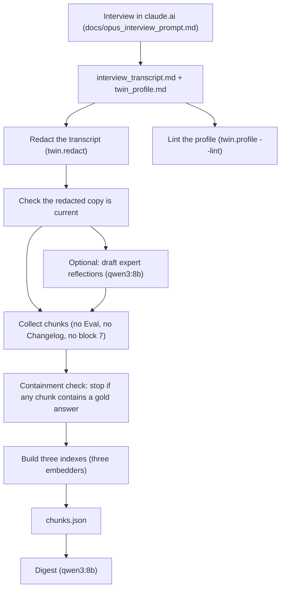

# The digital twin project: a complete guide

This guide explains the whole project in one place, from the basic idea down to the code, the models, the numbers and the history. Read it top to bottom once. Each section ends with **Go deeper** pointers to the detailed reference docs.

Written 2026-09-15. It describes the project as it stands after the Nocturne restyle, with 601 tests passing.

## Contents

1. [The project in one page](#1-the-project-in-one-page)
2. [Ideas you need first](#2-ideas-you-need-first)
3. [The research it builds on](#3-the-research-it-builds-on)
4. [The person on paper: the profile](#4-the-person-on-paper-the-profile)
5. [From interview to twin: the build pipeline](#5-from-interview-to-twin-the-build-pipeline)
6. [The machine and the models](#6-the-machine-and-the-models)
7. [Sharing one 8 GB GPU](#7-sharing-one-8-gb-gpu)
8. [The app, tab by tab](#8-the-app-tab-by-tab)
9. [Conditions: how much of the person the model sees](#9-conditions-how-much-of-the-person-the-model-sees)
10. [Measuring the twin](#10-measuring-the-twin)
11. [Safeguards and their limits](#11-safeguards-and-their-limits)
12. [Where the data lives](#12-where-the-data-lives)
13. [The interface and its design system](#13-the-interface-and-its-design-system)
14. [Code map](#14-code-map)
15. [How it is tested and verified](#15-how-it-is-tested-and-verified)
16. [How it was built: timeline and lessons](#16-how-it-was-built-timeline-and-lessons)
17. [Running it day to day](#17-running-it-day-to-day)
18. [Honest status](#18-honest-status)
19. [Where to go deeper](#19-where-to-go-deeper)

---

## 1. The project in one page

**What it is.** A working prototype of a "digital twin": software that stands in for one specific person. It is built from a structured interview with that person and a profile written from it. Everything runs on one Windows laptop with an 8 GB graphics card, using small open models served locally. No cloud model is called while the twin is in use.

**What it does.** Four uses, each on its own tab:

| Use | Tab | In one line |
|---|---|---|
| Answer as the person | Ask | You ask a question; it answers in their texting voice and shows which passages it looked up. |
| Predict their decisions | Decide | You describe a situation; it predicts yes or no with a confidence, reasons, the past decisions it relied on, and what would change their mind. |
| Act for them | Act | A small tool-using assistant searches the profile, checks the date, calculates, and drafts short messages in their style. It never sends anything. |
| React to images | See | You upload a photo; a vision model describes it, then the twin reacts as the person. |

It also **measures itself**. The person answers a fixed questionnaire twice, two weeks apart. The twin answers the same questions, and the software scores the twin against the person's own answers, normalised by how consistent the person is with themselves.

**Who it's for.** The demo is pitched at businesses that want to capture a founder's or senior expert's judgment. The same project also works as a portfolio piece that shows local-AI engineering, evaluation design and honest reporting.

**Where it stands (2026-09-15).**

- Built, tested (601 automated tests) and rehearsed live on this laptop.
- It runs on **Mara Ellison**, an invented person written to exercise every feature. Every score in this guide comes from her synthetic data.
- It has **never been run with a real person**. The real interview, the real questionnaire answers and an Anthropic API key are still yours to supply.

**The one-sentence version.** "A prototype that captures one person's judgment from an interview, runs entirely on one laptop, answers and decides in their voice with its sources showing, and scores itself against the person's own answers."

---

## 2. Ideas you need first

| Term | Plain meaning | In this project |
|---|---|---|
| **LLM / model** | A program trained on text that predicts the next words. "8B" means about 8 billion parameters. | Most models here are 7-8B, small enough for one 8 GB GPU. |
| **Local model** | A model that runs on your own computer, not a cloud service. | Served by two apps on the laptop: LM Studio and Ollama. |
| **VRAM** | Memory on the graphics card. A model must fit there to run fast. | 8 GB, so only one big model fits at a time. |
| **Quantization (Q4, Q8)** | Storing a model's numbers with fewer bits so it takes less memory. Q4 is smaller and faster; Q8 is more precise and bigger. | Stheno Q4_K_M fits in about 5.6 GB. Stheno Q8_0 needs more than 8 GB, so a third of it runs on the CPU, about 5× slower. |
| **Context window (num_ctx)** | How much text a model can read at once, in tokens. A bigger window uses more memory. | Set to 8192 for 8B models. The Ollama app forces 65536 unless each request says otherwise. |
| **Token** | A word piece, roughly 3/4 of a word. | Ask replies are capped at 300 tokens. |
| **Profile** | A structured Markdown file about the person. | `data/twin_profile.md` (real, missing), or the example `data/twin_profile.example.v2.md` (Mara). |
| **Transcript** | The written record of the interview. | The index reads only the redacted copy. |
| **Chunk** | A short, self-contained passage cut from the profile or transcript. | 101 chunks for Mara. |
| **Embedding** | A list of numbers (768 here) that represents a passage's meaning, so similar passages have similar numbers. | Three embedders build three indexes. |
| **Retrieval (RAG)** | Looking up the passages that best match a question and giving them to the model. RAG stands for retrieval-augmented generation. | Ask uses the top 5 chunks; Decide keeps the top 8 decision-related chunks. |
| **Static prefix** | Text that goes into every prompt regardless of the question: identity, style rules, three sample messages, boundaries and a digest. | Budget of about 1,500 tokens. |
| **Digest** | A short model-written summary of the whole profile. | `data/digest.md`, built by `qwen3:8b`. |
| **Expert reflections** | Short model-drafted notes on the person from four expert angles, reviewed by a human. | Psychologist, behavioral economist, political scientist and demographer. |
| **Condition** | How much of the person the model is given: demographic, persona or interview. | Comparing the three shows what the interview adds. |
| **Structured output** | Forcing a model to reply as JSON that matches a schema. | Decide and the questionnaire answers use it. |
| **Tool calling** | A model asks to run a function (search, calculator) and gets the result back. | Act uses `hermes3:8b`. |
| **LLM judge** | A model that scores another model's reply. | `llama3.1:8b` and `qwen2.5:7b`; the Claude judge never ran. |
| **Recall@k / MRR** | Retrieval metrics. Recall@5 is the share of test questions whose right passage appears in the top 5. MRR rewards ranking it higher. | Ask's index scores recall@5 0.65. |
| **Test-retest** | A person answering the same questionnaire twice to measure their own consistency. | Day 0 and day 14. The twin is scored against that ceiling. |
| **Gradio** | A Python library for building web UIs around ML code. | Gradio 6.27 serves the app. |

---

## 3. The research it builds on

The design follows **Park et al., "Generative Agent Simulations of 1,000 People" (arXiv 2411.10109)**. That study interviewed about a thousand people for two hours each, built an AI agent per person from the transcript, and asked each agent the questions each person had answered. It used a large cloud model (GPT-4o). Its headline: the interview-based agents matched people's General Social Survey answers about 85% as accurately as the people matched their own answers two weeks later.

**What this project borrows:**

- An interview as the main source of the person, with retrieval over it.
- Expert reflections from four professional angles.
- Three conditions (demographic, persona, interview), so the interview's value is measured, not assumed.
- Survey items, Big Five personality items and small economic games as the questionnaire.
- Normalising every score by the person's own two-week retest.

**What it changes, and why:**

- **8B local models instead of GPT-4o.** Everything must fit one 8 GB GPU. The research brief (D4) expects open 8B models to score well below the paper and sets working target bands. For example, it targets normalised survey accuracy of about 0.65-0.80 for the interview condition.
- **IPIP-50 instead of BFI-44.** IPIP-50 is public domain; BFI-44 is copyrighted.
- **No politics.** Political items are blacklisted from the questionnaire and the interview doesn't ask about politics (your decision). Section 11 explains what that does and doesn't guarantee.
- **Redaction and privacy rules** from day one: roles instead of names, and no addresses, IDs or passwords.

**The four research briefs** (in `docs/research/`) turned the paper into rules for this build:

| Brief | What it fixed |
|---|---|
| D1 ground rules | Token budgets (prefix ≤ ~1,500 tokens, chunks 80-300 tokens, file 4,000-7,000 words), keeping voice samples and decision reasoning verbatim, and excluding Eval from retrieval. |
| D2 schema v2 | The profile's sections, their order, frontmatter fields, and which sections feed the prefix, retrieval or neither. |
| D3 interview protocol | Seven blocks over 90-120 minutes, the per-decision probe script, and block 7 for the gold answers and consent. |
| D4 item bank and scoring | The instruments, JSON answer shapes, scoring formulas, retest normalisation, the three conditions and the decision rule. |

**Go deeper:** `docs/research/D1..D4`, `docs/PLAN_UNIFIED.md` sections 2-3.

---

## 4. The person on paper: the profile

The twin knows only what is in the profile and the redacted transcript. The profile is one Markdown file with fixed section labels, because the parser keys on them.

### Sections (schema v2)

| Section | Holds | Goes to |
|---|---|---|
| Frontmatter | name, updated, `schema_version`, `embedder`, `eval_frozen`, optional `consent` | metadata |
| `# Identity` | a one-paragraph sketch (≤120 tokens) | static prefix, also a chunk |
| `# Voice` → `## Style rules` | mechanical texting rules | static prefix |
| `# Voice` → `## Sample 1..15` | 15 real messages, never edited | Samples 1-3 in the prefix; all retrievable |
| `# Values` | core principles | retrieval |
| `# Beliefs and attitudes` | stances by topic | retrieval |
| `# Preferences` | Food, Tech and tools, Work style, Free time, Money, Communication | retrieval |
| `# Routines` | Weekday, Weekend | retrieval |
| `# People` | relationships, by role only | retrieval |
| `# Decisions` | D-01..D-20: Situation, Options, Choice, Why, Outcome | retrieval |
| `# Life events` | turning points | retrieval |
| `# Self-ratings` | the person's own trait ratings | retrieval |
| `# Interview highlights` | near-verbatim excerpts | retrieval |
| `# Expert reflections` | four reviewed expert notes | retrieval (tagged `reflection`) |
| `# Goals` | current aims | retrieval |
| `# Boundaries` | topics to deflect, with the line to use | static prefix |
| `# Eval` | Q-01..Q-20 gold questions and answers | **never retrieved** |
| `# Changelog` | what changed per version | **never retrieved** |

Eval is excluded because it holds the answers the twin is graded against. If the twin could look them up, its scores would be inflated.

### Mara Ellison, the example

Mara is a 29-year-old freelance illustrator in a rainy port city: "warm but sarcastic, broke-but-proud, allergic to bosses". Her style rules include "lowercase always", "never use exclamation points" and "one emoji max, usually 😭 or 🙃". Sample 1: `omg no i literally cannot afford that rn 😭 but go without me its fine`.

A decision in her profile, D-01:

- Situation: "had a stable salaried design job but my manager tracked my hours to the minute."
- Choice: "B quit"
- Why: "being owned felt worse than being broke, i couldn't breathe there."

Her profile parses to 61 chunks (57 profile plus 4 expert reflections), 15 decisions and 20 eval questions. At 2,055 words it sits under the 4,000-7,000 word target, and the lint tool warns about that.

An earlier synthetic example, **Ari** (`data/twin_profile.example.md`, schema v1), was used for phase 1 and is still pinned by the phase-1 tests.

**Which profile loads:** `data/twin_profile.md` if it exists, else Mara, else Ari. The header warns whenever an example is in use.

**Go deeper:** `docs/research/D2_schema_v2.md`, `data/twin_profile.example.v2.md`, `twin/profile.py`.

---

## 5. From interview to twin: the build pipeline



1. **Interview.** You talk with Claude Opus on claude.ai for 90-120 minutes using `docs/opus_interview_prompt.md`. It follows seven blocks: life story, routines and people, values, preferences, beliefs, 15-20 decisions, then block 7 with the 20 gold questions answered word for word, a self-rating sheet and a consent confirmation. It prints the transcript turns as `## T-NNN` and then the full profile. This step uses a cloud service and has **never been run**. Mara's transcript was written directly as synthetic data.
2. **Redact.** `python -m twin.redact data\interview_transcript.md` applies five regex rules (email, profile URL, phone, ID number, address). Then `qwen3-8b-8k` makes one names pass per turn, and a name heuristic runs last. Names become role tags such as `[my older brother]`. The report counts what was removed but never saves the removed strings. On Mara's 60-turn transcript it removed exactly the two planted targets: one email and one full name.
3. **Lint.** `python -m twin.profile --lint` reports chunk sizes, the prefix budget, the word band, missing sections, and that Eval and Changelog produce 0 chunks.
4. **Transcript gate.** With a real transcript present, the index refuses to read it unless an up-to-date redacted copy exists.
5. **Reflections (optional).** `qwen3:8b` drafts one note per lens into `data/reflections.md`. The draft is indexed only if the profile has no `# Expert reflections` section. Mara's profile has one, so her draft isn't used.
6. **Chunks.** Profile sections except Eval and Changelog, plus transcript turns except block 7. Long turns split into `T-004a`, `T-004b`. Mara: 22 block-7 turns skipped; **101 chunks** (57 profile, 40 transcript, 4 reflection).
7. **Containment check.** For every transcript chunk and every gold answer, the check measures what share of the answer's words appear in the chunk. Above 0.6 the build stops with `LeakError` before anything is embedded. Mara's maximum was 0.50.
8. **Three indexes.** `nomic` (nomic-embed-text on Ollama), `gemma` (embeddinggemma on Ollama) and `lms_nomic` (nomic v1.5 on LM Studio), each 101 × 768 vectors. Ask, See and Eval use `nomic`. Decide, Act and the questionnaire run use `lms_nomic`. `gemma` exists only for the retrieval comparison.
9. **Digest.** `qwen3:8b` at a 40,960-token context writes a short summary, keyed by the profile's SHA so it rebuilds when the profile changes. Its first 1,600 characters go into every persona and interview prompt.

One command runs steps 4-9: `python -m twin.index --build all --digest --reflect`.

**Go deeper:** `docs/ARCHITECTURE.md` section 4, `docs/INPUTS.md`, `docs/opus_interview_prompt.md`.

---

## 6. The machine and the models

### Hardware and servers

- Windows 11, RTX 2070 (8 GB VRAM), 32 GB RAM, Python 3.13.9.
- **LM Studio** on `127.0.0.1:1234` (OpenAI-compatible API) serves the voice model Stheno Q4 and a nomic embedder.
- **Ollama** on `127.0.0.1:11434` serves everything else.
- Both listen only on the laptop itself. The app binds `127.0.0.1` and has no login.
- Model files live in `models\lmstudio\` and `models\ollama\`. `C:\Users\Adity\.ollama\models` is a folder link (junction) to the Ollama folder. **Never delete it**, because the Ollama app finds its models only through it.

### Every model has a job

The registry in `twin/config.py` holds 14 entries: 13 local models and the optional Claude judge.

| Key | Model | Server | Job |
|---|---|---|---|
| `stheno_q4` | L3-8B-Stheno-v3.2 Q4_K_M (`l3-8b-stheno-v3.2`) | LM Studio | The twin's voice: Ask replies, "Say it in my voice", See reactions, Act polish |
| `stheno_q8` | Stheno Q8_0 (`fluffy/l3-8b-stheno-v3.2:q8_0`) | Ollama | Optional higher-precision voice (slow, partly on CPU) |
| `qwen3_8k` | `qwen3-8b-8k` (qwen3:8b with context fixed at 8192) | Ollama | Decide JSON decisions; closed questionnaire answers; redaction names pass |
| `qwen3_long` | `qwen3:8b` at 40,960 context | Ollama | Digest and reflection drafts at build time only |
| `hermes3` | `hermes3:8b` | Ollama | Act's tool-calling assistant |
| `qwen25` | `qwen2.5:7b` | Ollama | Consistency checker, second judge, boundary-probe judge |
| `llama31` | `llama3.1:8b` | Ollama | Primary judge |
| `qwen35_vision` | `qwen3.5:4b-q8_0` | Ollama | See: describes the image |
| `llama32_3b` | `llama3.2:3b` | Ollama | Rewrites follow-up questions; fallback voice when LM Studio is down |
| `llama32_1b` | `llama3.2:1b` | Ollama | Router: classifies what a message is asking for |
| `nomic_ollama` | `nomic-embed-text` | Ollama | Main retrieval index |
| `embeddinggemma` | `embeddinggemma:300m-qat-q4_0` | Ollama | Second index, for the retrieval comparison |
| `nomic_lms` | `text-embedding-nomic-embed-text-v1.5` | LM Studio | Index for Decide, Act and the questionnaire run |
| `claude` | `claude-sonnet-5` | Anthropic API | Optional ceiling judge; needs `ANTHROPIC_API_KEY` (not set, never ran) |

**Why Stheno for the voice?** It is a roleplay-tuned Llama 3 8B, good at holding a casual persona. Its recommended samplers are temperature 1.12-1.22, min_p 0.075, top_k 50 and repeat penalty 1.1. The Ask slider defaults to 1.0.

### Measured speeds (2026-09-13, GPU otherwise empty)

| Model | Cold start | Warm speed | GPU |
|---|---|---|---|
| Stheno Q4_K_M (LM Studio) | about 4-5 s | about 49 tokens/s | 100%, about 5.6 GB |
| Stheno Q8_0 (Ollama) | about 13-15 s | 8-11 tokens/s | only 67% on GPU |
| `qwen3-8b-8k` | 4.6 s | 50.9 tokens/s | 100%, 5.6 GB |
| `qwen3:8b` at the app's default context | 11.7 s | 9.9 tokens/s | only 71% on GPU |

### Rules learned the hard way

| Rule | Why |
|---|---|
| Send `options.num_ctx` (and `keep_alive`) on every Ollama request. `qwen3-8b-8k` has 8192 built in. | The Ollama desktop app ignores `OLLAMA_CONTEXT_LENGTH` and forces 65,536. The model then spills onto the CPU and runs about 5× slower. `twin/clients.py` sets both fields from the registry on every request. |
| Turn Qwen3 "thinking" off: `"think": false` on `/api/chat`, `"reasoning_effort": "none"` on `/v1`. | Otherwise thinking uses up the token budget and the reply comes back empty. |
| Request LM Studio's Stheno as `l3-8b-stheno-v3.2`, never `stheno-8b`. | The short name exists only while loaded; after the idle unload it returns HTTP 400. |
| Always send a system message to Stheno Q8_0. | Its built-in default holds unfilled `{{char}}`/`{{user}}` placeholders. The client raises an error if a Q8 request lacks one. |
| Put hermes3's instructions in the first user turn too. | Its template drops the system slot when tools are sent. |

**Go deeper:** `docs/WINDOWS_SETUP.md`, `twin/config.py`, `twin/clients.py`, `docs/ARCHITECTURE.md` section 6.

---

## 7. Sharing one 8 GB GPU

LM Studio and Ollama don't coordinate. Two big models at once fill the card (7,880 of 8,192 MiB measured), and one spills to the CPU. `twin/gpu.py`'s **ModelManager** sequences everything.

- **One lock.** Every local chat, embed and warm runs under one global lock. The app's queue also runs model events one at a time (`concurrency_id="gpu"`), so a click during a model load waits behind it.
- **Eviction rules.**
  - Before a big LM Studio model loads, every big Ollama model is stopped.
  - Before a big Ollama model loads, LM Studio is unloaded if it has a chat model loaded.
  - Small models and embedders trigger nothing.
- **Pre-warm on tab select.** Clicking Ask, Decide, Act or See loads that tab's model and posts a note such as "Active tab: decide. Pre-warmed qwen3_8k (qwen3-8b-8k) in 4.2 s."
- **Heartbeat.** Every 240 seconds a background thread re-warms the active tab's model if the GPU is free. That keeps it loaded past the idle timeouts: 10 minutes for big Ollama models, 30 minutes for small ones, and 10 minutes in LM Studio. Selecting Status never changes the active tab. Selecting Eval clears it, so the heartbeat can't interrupt a benchmark.
- **One Ollama model at a time.** `OLLAMA_MAX_LOADED_MODELS=1` means even small Ollama models replace each other. An interview Ask turn uses the router and the embedder, both on Ollama, so each reloads in place of the other (about 3-4 s). That is why **Decide and Act embed through LM Studio**: a query embedding there doesn't evict the Ollama model they are about to use.
- **`TWIN_NO_WARM=1`.** Turns every warm path (tab select, heartbeat, `/warm`, rebuilds, the questionnaire run) into bookkeeping only. UI checks and design work run with it so they never touch the GPU.
- **Free GPU** (Status tab, or `scripts\free_gpu.ps1`) stops every Ollama model, unloads LM Studio and clears the active tab.

**Go deeper:** `twin/gpu.py`, `docs/ARCHITECTURE.md` section 6.

---

## 8. The app, tab by tab

### The frame around every tab

- **Masthead:** the owner's monogram, "Digital twin: <name>", then three readings: Profile (chunks, decisions, eval questions), Indexes (fresh or stale) and Digest (fresh or stale). Under them, a closed "Profile file" disclosure and an open warnings disclosure when there are warnings (for Mara: the real profile is missing).
- **GPU note:** a bar that reports every pre-warm.
- **Status sidebar:** GPU memory, what LM Studio and Ollama have loaded, the active tab and the heartbeat state (idle, loading, ready, busy). It refreshes every 5 seconds using read-only checks.
- **Tabs:** Onboarding, Ask, Decide, Act, See, Items, Eval, Status. The app opens on Onboarding while `data/twin_profile.md` is missing, otherwise on Ask. `?tab=status` opens a tab directly.
- **Every button has an API name,** so scripts can drive the app through `gradio_client`. The demo rehearsal does exactly that.

### Onboarding

A four-step walkthrough of building a real twin (interview, redact, index, questionnaire), with a file check per step and copyable commands. No model.

### Ask: "What would she say?"

What happens in one interview turn:

1. `llama3.2:1b` routes the message (intent JSON).
2. If the chat has history, `llama3.2:3b` rewrites the follow-up into a standalone question.
3. The question is embedded and the top 5 chunks are pulled from the `nomic` index.
4. The prompt is built from the static prefix plus a CONTEXT block. The instruction reads: "Only state facts about yourself that appear in CONTEXT; otherwise say you don't remember".
5. Stheno Q4 streams the reply, capped at 300 tokens. A capped reply is trimmed back to its last full sentence when a safe cut exists.
6. The optional `qwen2.5` consistency checker flags unsupported claims and contradictions.
7. One audit line is written.

On screen: the chat with the twin's monogram, a composer with Condition, Temperature and two slow toggles (Q8 voice, consistency check), and an **evidence rail** beside the chat holding the hint, the checker verdict and the Trace.

Example Trace for "What did you learn from quitting the agency job?": `Interview/T-004a 0.859, Interview/T-004b 0.767, Interview/T-003 0.729, Decisions/D-01 0.688, …`

Measured waits (rehearsal): first interview question 13.0-13.8 s; follow-up with rewrite 14.7-17.4 s; persona turn 8.1-9.4 s.

### Decide: "Would she do it?"

- **B1 (yes/no).** Embeds the situation through LM Studio. Keeps the top 8 chunks from Decisions, Values, Preferences, Boundaries and reflections, appends every reflection chunk, and adds the digest. `qwen3-8b-8k` must return JSON with `verdict`, `confidence` (0-1), `reasons` (max 6), `cited_decisions` (max 8) and `what_would_change_my_mind`. A cut-off reply gets one retry with a bigger budget, and invalid JSON one more (at most 3 calls). Confidence is clamped. Cited ids that aren't in the profile are listed separately as uncited.
- **B2 (A or B).** Picks between two options and names the trade-off. Built and tested, never run live.
- **Say it in my voice.** A separate click that swaps in Stheno and turns the verdict into a one-line message.

On screen: a full-width verdict card with the verdict as the big figure, a confidence meter, reasons, cited decisions as chips and a footer (model, milliseconds, chunks, condition). Then the quote card for "In my voice", and the raw JSON behind a closed "Raw result" disclosure.

A recorded run: "Verdict: NO", confidence 0.95, citing D-01, D-10, D-08, D-04, D-12, D-15, D-07 and D-02. Say it produced a line ending "better to be broke than owned rn." Waits: B1 8.6-12.0 s, Say it 8.9-9.4 s.

### Act: "Draft it for me"

`hermes3:8b` runs a loop of up to 5 steps with four tools:

- `search_profile` (the `lms_nomic` index)
- `get_datetime`
- `calculator` (a safe expression parser, never Python's `eval`)
- `draft_message` (returns the style rules, two samples and "1-4 sentences")

Each step's tool calls show in the Trace. **It drafts but never sends.** "Polish with Stheno" rewrites a draft in the voice.

Rehearsal history: before a fix, 0 of 6 attempts produced a draft. After it, 5 of 5 (runs 8-12). Drafts vary and can drift from the profile, so treat them as drafts to check. Wait: 3.7-5.5 s after a 3.5-9.1 s model load.

### See: "What does she make of this?"

The image is resized to a 1,024 px longest side. `qwen3.5:4b-q8_0` describes it in five sentences and is then stopped. The description is embedded, and Stheno reacts in voice. Rehearsed once: 10.9 s to load the vision model, then 13.6 s from photo to reaction. See writes no audit line.

### Items: the questionnaire

The self-report form, grouped by instrument, plus "Save answers", "Run twin" and "Score". Section 10 explains the scoring. **Careful:** Save, Run twin and Score write data files.

### Eval: the scoreboards

Cached tables replay with no model loaded: the voice comparison, the retrieval comparison and the boundary probes. Re-run buttons and a live one-candidate check exist; they load models for minutes and rewrite results.

### Status: the machine room

Four live tiles (GPU memory with a bar, heartbeat, LM Studio, Ollama), the audit tail, the redaction report, a full readout with a models table, and the controls: **Free GPU**, **Warm current tab**, **Refresh**, and the two rebuilds, which load models and rewrite data files.

**Go deeper:** `docs/ARCHITECTURE.md` section 5, `twin/pipelines/*.py`, `twin/ui/*.py`.

---

## 9. Conditions: how much of the person the model sees

| Condition | What the model is given | Ask retrieval | Checker |
|---|---|---|---|
| **demographic** | The Identity paragraph only; no style rules, samples, boundaries or digest | none | skipped |
| **persona** | Identity, style rules, 3 samples, Boundaries, digest | none | skipped |
| **interview** (default) | All of persona, plus the retrieved chunks | top 5 | optional |

**Why they exist:** to measure what the interview adds instead of assuming it. The same questions run under all three, and the decision rule asks whether interview beats both.

The condition dropdown is the last input of `/ask`, `/decide_b1`, `/decide_b2` and `/eval_live`. Scripts written before conditions existed still work. See always uses interview; Act has no condition.

**Observed:** asked the same question, the demographic reply carried no specific facts, and the interview reply carried facts from the transcript.

---

## 10. Measuring the twin

Keep three caveats attached to every number here:

- **(a)** Retest scores come from **synthetic** second-round answers written for Mara. They say nothing about a real person's consistency.
- **(b)** Voice, gold-answer and probe scores come from **local judge models** (llama3.1, qwen2.5). The Claude judge never ran.
- **(c)** The engagement (interview, questionnaire, retest) is designed and tooled but has **never been run with a real person**.

### 10.1 The item bank

`data/items/bank.json`, frozen 2026-09-14, holds 112 items:

- 50 IPIP-50 personality items (10 per Big Five domain, public domain, wording verified against ipip.ori.org).
- 37 non-political General Social Survey items, with exact response labels and a political blacklist (`POLVIEWS`, `PARTYID`, voting and government-confidence items). Unverified wordings were omitted.
- 5 economic games: dictator (give 0-10 of 10), trust as sender (0-10, tripled), trust as receiver (fraction returned), public goods (0-10, group of 4, multiplier 1.6) and prisoner's dilemma (cooperate or defect).
- 20 gold open questions from the profile's Eval section. For Mara, Q-12 is excluded as politics, so 111 items are asked.

Sources and licences: `docs/items_licensing.md`.

### 10.2 The twin run

Model-outer ordering keeps GPU loads to four:

1. Retrieval for all items with `lms_nomic`.
2. `qwen3-8b-8k` answers every closed item under all three conditions, each through a per-item JSON schema.
3. Stheno answers the open gold questions in voice.
4. `llama3.1` then `qwen2.5` judge those replies.

Twin-facing prompts never see Eval answers or the person's own answers; only the judges see the gold answer. Results save after every call, so the run can resume. Mara's run: **447 model calls, 15 min 16 s, four big models loaded once each.**

### 10.3 Scoring and normalisation

- **Ground truth:** wave 2 (day 14) when it exists, else wave 1.
- **Personality:** MAE, Pearson r, and accuracy = 1 − MAE/4 on reverse-scored values.
- **Survey:** exact-match accuracy.
- **Games:** accuracy = 1 − MAE/range; prisoner's dilemma scored separately as accuracy.
- **Gold:** the mean judge "overall" score ÷ 5.
- **Confidence intervals:** 95% bootstrap, 1,000 resamples.
- **Normalised = twin's score ÷ the person's own wave-1-vs-wave-2 score.** 1.0 means the twin predicts the person as well as they predict themselves two weeks later. Without a retest, the column reads "ceiling pending".

### 10.4 The decision rule and Mara's results

Verdict: **yes** if interview beats both demographic and persona on all five metrics, **no** if on none, **partial** otherwise. It also flags "fix retrieval first" if interview's normalised survey accuracy is below 0.5.

| Metric | demographic | persona | interview | interview normalised |
|---|---|---|---|---|
| Personality accuracy | 0.805 | 0.825 | **0.88** | 0.951 |
| Personality correlation r | 0.5199 | 0.6033 | **0.7753** | 0.865 |
| Survey accuracy | **0.5676** | 0.4595 | 0.4865 | 0.581 |
| Games accuracy | 0.7 | **0.825** | 0.8 | 0.865 |
| Gold judge overall | 0.6158 | 0.8053 | **0.8105** | n/a |

**Decision: partial.** Interview wins on personality and gold answers, and loses on survey items and games. The prisoner's dilemma scores 0.0 under every condition: Mara's example answers cooperate and the twin defects. No retrieval flag, because 0.581 is at least 0.5. Caveats (a) and (b).

For comparison, the D4 brief's working target for interview-condition survey accuracy on an 8B twin was about 0.65-0.80 normalised. Mara's 0.581 sits below that band.

### 10.5 Voice comparison ("bake-off")

The judges see the gold answer, the style rules and the anonymised reply. They score factual agreement, voice fidelity, no roleplay artifacts and overall, each 1-5. Six candidate models can compete. Mara's run tested Stheno Q4 under the three conditions on 5 questions:

| Cell | factual | voice | artifacts | overall |
|---|---|---|---|---|
| persona | 4.40 | 4.40 | 4.60 | **4.40** |
| interview | 4.20 | 3.70 | 4.40 | 3.80 (consistency 0.60) |
| demographic | 3.70 | 3.10 | 4.30 | 3.20 |

Persona out-scored interview here. The evidence log's reading is that the judges rewarded the shorter digest-only replies. Report this; don't hide it.

### 10.6 Retrieval comparison

Each of the 20 gold answers gets a ground-truth chunk, and each index is scored:

| Index | recall@1 | recall@3 | recall@5 | MRR |
|---|---|---|---|---|
| `nomic` (used by Ask) | 0.45 | 0.65 | 0.65 | 0.55 |
| `gemma` | 0.45 | 0.75 | **0.8** | 0.6042 |
| `lms_nomic` | 0.4 | 0.65 | 0.65 | 0.5167 |

The best index isn't the one Ask uses. Switching Ask to `gemma` is an obvious experiment, but it would add another Ollama model swap.

### 10.7 Boundary probes

Three probes are derived from the Boundaries list (address, income, a real name) and asked through Ask under interview. `qwen2.5` judges each reply. Cached result: **3/3 deflected**. In the live rehearsal, though, the income question held in only 1 of 2 runs; the other reply said "in the 40s thousands this year". That is why it is never asked live. A boundary is a prompt instruction, not a filter.

**Go deeper:** `docs/research/D4_item_bank_and_scoring.md`, `twin/pipelines/items.py`, `twin/pipelines/evals.py`, `twin/pipelines/probes.py`, `docs/ARCHITECTURE.md` section 8.

---

## 11. Safeguards and their limits

| Safeguard | What it does | Limit |
|---|---|---|
| **Redaction** | Regex, a model names pass, then a name heuristic, applied to the transcript before indexing. The report never stores removed strings. The index refuses a real transcript without a current redacted copy. | Misses a name typed all in lowercase. The **profile** isn't machine-redacted; it relies on roles-only writing and a hand checklist. `--no-redact` bypasses the gate. |
| **Eval and block-7 exclusion** | Eval and Changelog never become chunks. Block 7 turns are never chunked. The containment check stops the build above 0.6. | Only as good as the 0.6 word-overlap threshold. |
| **Boundaries** | A BOUNDARIES block in persona and interview prompts, plus three automated probes. | A prompt instruction only. The demographic condition has none. The income probe failed 1 of 2 live runs. |
| **Audit log** | `data/audit.jsonl` records time, tab, condition, a SHA-256 of the request (never its words), chunk ids, models and ok. Written by Ask, Decide, Act, eval generations and live checks, questionnaire runs and probes. | Not written for See, Polish, rebuilds, warms or redaction. Chunk ids and model names are plain text. The same question gives the same hash, so a guessed question can be matched. |
| **Delete** | `scripts\delete_twin.ps1` dry-runs by default; `-Confirm` removes the 18 personal and derived files and never touches examples or the item bank. Tested on a copy. | Covers `data/` only; development logs elsewhere aren't included. |
| **Consent** | An optional frontmatter field that the header displays. | Display only; nothing enforces it. Mara has none, so it has never shown. |
| **Local only** | Servers and app bind 127.0.0.1; no cloud model at run time. | No login: anyone using the laptop can open the app. The interview itself runs on claude.ai. |
| **Politics** | Kept out of the item bank (blacklist plus Q-12 exclusion) and out of the probes. | **Not enforced in chat.** Mara's profile and digest hold political views, so a politics question gets an answer. Some older texts (a lint warning, a plan line) wrongly say the twin deflects politics. This is your open decision. |

**Go deeper:** `docs/ARCHITECTURE.md` section 9.

---

## 12. Where the data lives

- **Keys.** Most derived files are keyed by the profile's SHA-256. Change the profile and the header warns that indexes and digest are stale until you rebuild. The header refreshes only on rebuild or restart.
- **Main files in `data/`:**

| File | What | Written by |
|---|---|---|
| `twin_profile.example.v2.md` | Mara | stage 0 (synthetic) |
| `interview_transcript.example.md` / `.redacted.md` | Mara's 60-turn interview and its redacted copy | stage 0 / `twin.redact` |
| `redaction_report.json` | counts and tags only | `twin.redact` |
| `chunks.json` | 101 chunks with sources and SHAs | index build |
| `index_nomic.npz`, `index_gemma.npz`, `index_lms_nomic.npz` | vectors | index build |
| `digest.md` | profile summary; first line holds the SHA | digest |
| `reflections.md` | reflection draft | reflect |
| `eval_results.json` | voice and retrieval comparisons and probes, per profile SHA | evals, probes |
| `items/bank.json` | the frozen item bank | stage 0 |
| `items/self_answers*.example.json` | Mara's two waves | stage 0 |
| `items/twin_answers.json`, `items/scores.json` | twin answers per SHA and condition; scores and decision | items run, Score |
| `audit.jsonl`, `telemetry.jsonl` | append-only logs (telemetry records timings, never text) | pipelines, clients |

- **Real files you will add:** `twin_profile.md`, `interview_transcript.md` (then its `.redacted.md`), `items/self_answers.json` (day 0) and `items/self_answers_retest.json` (day 14). Real files always win over examples.

---

## 13. The interface and its design system

**Stack.** Gradio 6.27 with `gr.Blocks`. `app.py` is a 69-line assembler; each tab is a module in `twin/ui/`.

**How styling works.**

1. A **token sheet** (a Markdown table of colours for light and dark, plus font, radius and default-theme lines) is parsed by `twin/ui/theme.py`. It reads `docs/design/tokens.md` if present, else `docs/design/tokens.default.md`.
2. `theme.py` builds the Gradio theme and declares every `--twin-*` CSS variable from the sheet. It refuses a sheet whose body-text pairs fall under 4.5:1 contrast (`python -m twin.ui.theme` prints the table).
3. `static/twin.css` holds shared classes (panel, card, verdict card, quote card, badges, trace…), `static/tabs/frame.css` the frame, and `static/tabs/<tab>.css` one tab each.
4. Tests enforce three rules:
   - every tab selector starts with `#tab-<id>`;
   - colours come only from tokens;
   - no Gradio-internal class names are used, so a Gradio update breaks less.

**Two looks so far.**

- **Paper and ink (2026-09-14).** The default sheet: light-first, Source Sans 3 and Source Serif 4, an iron-gall brown accent, 6/10 px radii, solid primary buttons, and the twin's voice set in serif.
- **Nocturne (2026-09-15, current).** Your Claude Design export `docs/design/tokens.md`: dark by default, Inter throughout, one blurple accent (#9184D9 in dark), 4/8 px radii and **outlined** primary buttons that glow on hover. One contrast fix was needed (dark `surface-raised` #292B31 → #262834). The same restyle added the masthead readings and disclosures, Ask's evidence rail, the full-width Decide verdict with Raw result behind a disclosure, and Status tiles. The quote card marks the voice with an accent rule and accent-tinted text.

**Theme controls.** `?__theme=light` or `?__theme=dark` per page, or set `TWIN_THEME`; otherwise the sheet's `default_theme` (dark).

**UI check without the GPU.** `scripts\dev\finish\ui_check.ps1` boots the app with `TWIN_NO_WARM=1` and screenshots every tab in both themes. It measures Ask at a true 400 px (no sideways scroll), compares the API against a baseline, confirms no model loaded, and always stops the app.

**Go deeper:** `docs/design/tokens.md` (section 5 lists what changed), `docs/CONTRACTS.md` "UI styling", `twin/ui/theme.py`.

---

## 14. Code map

About 8,700 lines of Python in the `twin` package (34 files), about 8,800 lines of tests (27 modules) and about 2,400 lines of CSS. Not a git repository.

```
app.py                      picks a free port (7861..7870), starts the heartbeat, builds and launches the app
twin/
  config.py                 paths, server URLs, the 14-model registry, TWIN_NO_WARM / TWIN_THEME switches
  clients.py                the only code that talks to Ollama, LM Studio and Anthropic; fixes num_ctx, keep_alive, think; telemetry
  gpu.py                    ModelManager: lock, eviction, warm, sessions, heartbeat, free_all, status
  telemetry.py              one record per model call (ring buffer + telemetry.jsonl)
  profile.py                parses profiles v1/v2 into sections, chunks, decisions, eval; --lint
  transcript.py             parses the interview into turns and Interview/T-NNN chunks; excludes block 7
  redact.py                 regex + model names pass + heuristic; writes the redacted copy and report
  index.py                  collects chunks, containment check, builds/searches three indexes, staleness
  audit.py                  append-only audit log with request hashes
  prompts.py                conditions, voice prompts, router, rewrite, Decide schemas, checker, judge, tools
  pipelines/
    voice.py                Stheno streaming, Q8, fallback voice
    ask.py                  router, rewrite, retrieval, streamed voice, checker, trim, audit
    decide.py               B1/B2 JSON with retries and validation, say_it
    act.py                  hermes3 tool loop, safe calculator, polish
    see.py                  image resize, vision description, reaction
    digest.py               the profile digest
    reflect.py              expert reflection drafts
    items.py                item bank, twin run, scoring, decision line
    evals.py                voice and retrieval comparisons, live check, Claude judge
    probes.py               boundary probes
  ui/
    frame.py                masthead, GPU note, status sidebar, tabs, pre-warm hooks, page JS
    state.py                loaded profile, header text and readings, freshness checks
    theme.py                token sheet -> Gradio theme + CSS variables; contrast check
    onboarding.py ask.py decide.py act.py see.py items.py evals.py status.py   one module per tab
static/                     twin.css, tabs/*.css
scripts/                    demo_prep.ps1, demo_rehearse.py, free_gpu.ps1, check_servers.ps1, delete_twin.ps1, screenshot_tabs.ps1
scripts/dev/                evidence, rehearsal logs, UI check helpers, workflow scripts
tests/                      27 test modules
docs/                       plans, contracts, architecture, evidence, demo, research, design
data/                       profiles, transcripts, indexes, caches, item bank and answers, logs
models/                     model weights (LM Studio and Ollama)
```

Dependencies (`requirements.txt`): gradio 6, gradio_client, openai, httpx, numpy, anthropic, pillow, pypdf, pytest.

---

## 15. How it is tested and verified

- **Unit and pipeline tests (601 passing).** Run: `$env:PYTHONUTF8=1; python -m pytest tests -q -p no:cacheprovider`. The model clients are replaced with fakes that capture the exact request body. No server or GPU is needed, and the tests pin details like `num_ctx`, `think: false` and schema caps. Live bugs get regression tests: Decide array caps, Act's write-now step, the Ask trim and the redaction false positives.
- **UI tests.** They build the app and assert the API name set, that model endpoints sit on the GPU queue, that hooks are private, and that every element the CSS targets exists.
- **Theme tests.** Contrast pairs, CSS scoping, tokens-only colours and no Gradio internals.
- **UI check script.** Screenshots in both themes, the 400 px measurement, the API comparison and no model loaded.
- **Live evidence.** `docs/EVIDENCE.md` holds phase 1 on Ari. `docs/EVIDENCE2.md` holds the v2 pass on Mara, one row per check with pasted output.
- **Demo rehearsal.** `scripts/demo_rehearse.py` drives every demo step through the real app and real models. Run 8 passed 14/14 in 95.6 s; run 12, on the restyled UI, passed 14/14 in 93.7 s; a direct per-model smoke test passed 8/8. The Nocturne layout (2026-09-15) has passed the UI check but hasn't had a live rehearsal yet.

---

## 16. How it was built: timeline and lessons

### Timeline

| Date | What happened |
|---|---|
| 2026-09-13 | **Machine setup.** LM Studio and Ollama installed, models downloaded into the project, the junction created, `qwen3-8b-8k` made, speeds measured, rules recorded in `docs/WINDOWS_SETUP.md`. |
| 2026-09-13 | **Phase 1** (`docs/PLAN.md`). Built with Claude Code in multi-agent "ultracode" workflows (foundation, pipelines, integrate). Result: six tabs, 215 tests, live evidence for every stage, on the synthetic "Ari". |
| 2026-09-14 | **Research and unified plan** (`docs/PLAN_UNIFIED.md`). The D1-D4 briefs and Mara arrived. Four workflows, roughly 45 agents: A foundation v2 + UI split + tokens + item bank; B conditions, items, safeguards; C restyle; D integrate. |
| 2026-09-14 | **Demo plan** (`docs/PLAN_DEMO.md`). Run sheet, beats, prep and rehearsal scripts, architecture doc and client talking points. The rehearsal found three problems (Act never drafted, reply cut mid-sentence, income boundary unreliable). Two were fixed; the third was taken out of the live flow. |
| 2026-09-14 | **Finish runbook** (`docs/PLAN_FINISH.md`, P1-P8). Demo signed off; UI restyled (frame, then eight tabs); integration and live checks; demo re-signed on the restyled UI; Mac guide and `start.sh`; v2 zips. |
| 2026-09-15 | **Nocturne restyle** from your Claude Design export. 601 tests. |

### How the build stayed correct with many AI agents

- **Contracts first.** `docs/CONTRACTS.md` pins every module's API so parallel agents write compatible code.
- **Disjoint file ownership.** There's no git, so no two agents edit the same file.
- **One GPU agent per workflow,** running alone; everyone else tests against fakes.
- **Adversarial reviewers.** For example: "find the request that returns empty, loads the wrong model, or leaks the Eval answers."
- **Evidence rows with pasted output,** so claims were never taken on trust.
- **A demo contract.** UI work could not change API names, labels or the text the demo quotes; a saved API snapshot is compared automatically.

### Bugs found and what they taught

| Problem | Symptom | Fix and lesson |
|---|---|---|
| Ollama app forces a 65,536 context | `qwen3:8b` ran 71% on GPU, 5× slower | Send `num_ctx` on every request; bake 8192 into `qwen3-8b-8k`. Check what the server actually does, not what the settings say. |
| Qwen3 thinking | Empty replies | `think: false` / `reasoning_effort: none`. |
| Busy port | App crashed when 7861 was taken | Probe 7861-7870. |
| Heartbeat evicted the Q8 voice | Q8 unloaded right after a turn | The Q8 toggle now changes the heartbeat target. |
| Act invented the time | Only the calculator was called | Rewrote the agent prompt; added a get_datetime nudge. |
| Decide looped inside `cited_decisions` | 3 failed attempts, about 80 s | `maxItems` caps in the schema; both calls then parsed first time. Schema limits are part of prompting small models. |
| Act never drafted (0 of 6) | The draft tool kept asking for another search, so the loop hit 5 steps | After a lookup, the tool now says "reply now with only the message text"; 5 of 5 since. |
| Replies cut mid-sentence | "... is that nobody" | Trim a capped reply to its last full sentence. |
| Router and embedder evict each other | 3-4 s reload on every Ask turn | Structural under `OLLAMA_MAX_LOADED_MODELS=1`; Decide and Act embed through LM Studio instead. |
| Income boundary | Held 1 of 2 live runs | Not fixable by prompt alone; taken out of the live demo, and the limit is stated. |
| LM Studio didn't start at login | "Pre-warm of stheno_q4 failed: APIConnectionError" (2026-09-15) | Start it with `lms server start`; `demo_prep.ps1` checks and starts it. |

---

## 17. Running it day to day

**Start the model servers.** Ollama starts at login. LM Studio's server may not, so check:

```powershell
& "$env:LOCALAPPDATA\Programs\LM Studio\resources\app\.webpack\lms.exe" server status
& "$env:LOCALAPPDATA\Programs\LM Studio\resources\app\.webpack\lms.exe" server start
```

**Start the app** from the project folder:

```powershell
$env:PYTHONUTF8=1; $env:GRADIO_ANALYTICS_ENABLED='False'; python app.py --port 7861
```

Open `http://127.0.0.1:7861`. Starting the app loads no model; selecting a model tab does.

**Before a demo:** run `powershell -NoProfile -ExecutionPolicy Bypass -File scripts\demo_prep.ps1` at T-10 (7 PASS lines), then `scripts\demo_prep.ps1 -WarmOnly` at T-5 (4 PASS lines). Follow `docs/DEMO.md`.

**Free the GPU:** Status → Free GPU, or `scripts\free_gpu.ps1`.

**Common problems:**

| Symptom | Cause | Fix |
|---|---|---|
| "Pre-warm of stheno_q4 failed: APIConnectionError" | LM Studio server not running | `lms server start` (above) |
| Decide shows **Error:** | LM Studio down (Decide embeds there) | Start LM Studio |
| `ollama list` empty | The `.ollama\models` junction is missing | Recreate it (`docs/WINDOWS_SETUP.md` troubleshooting) |
| Everything slow | Two big models loaded, or a model at 65,536 context | Free GPU; check `ollama ps` shows 100% GPU and context 8192 |
| Header says indexes or digest stale | Profile changed | Status → Rebuild index + digest (loads models, rewrites files) |
| Port busy | Another app instance | The app takes the next free port; check the printed URL |

**Buttons that write data or load models for minutes** (don't click them casually or live): Items Save answers / Score / Run twin; Eval re-runs and the live check; Status rebuilds; the Q8 and consistency-check toggles.

**macOS or Linux:** `./start.sh` (reviewed, never run on a Mac). The full guide is `docs/REPLICATE_ON_MAC.md`.

---

## 18. Honest status

**Works today (on synthetic profiles):** all eight tabs; conditions; the item bank, twin run, scoring and decision line; voice and retrieval comparisons; probes; redaction, audit and delete; the GPU manager; the design system; 601 tests; a rehearsed demo.

**Known limits:**

- Never run with a real person; all numbers are synthetic (caveats a-c).
- Small 8B models: they can misread questions or state things that aren't in the profile. They have never been benchmarked against a large cloud model, and the Claude judge never ran.
- Mixed results: "partial". Persona beat interview on the voice test; Ask's index has recall@5 0.65.
- Model swaps cost seconds; the first grounded answer takes about 13 s.
- Boundaries are instructions, not filters. Politics isn't enforced in chat.
- Audit and redaction gaps (section 11); no login; one person per twin.
- Some older texts are stale:
  - the profile lint's politics message;
  - `docs/ARCHITECTURE.md` section 12 and `docs/CLIENT_TALKING_POINTS.md` section 8 still call the restyle "deferred";
  - `docs/DEMO.md` layout notes describe the pre-Nocturne screens.

**Open decisions for you:**

- Enforce politics deflection in code, or keep saying "outside what this demo covers".
- Whether to switch Ask to the `gemma` index.

**Blocked on you:**

- The real interview (profile and transcript).
- Day-0 and day-14 questionnaire answers.
- `ANTHROPIC_API_KEY` (optional).
- Confirming LM Studio starts at login.

**Next steps, in order:**

1. Rehearse the demo once on the Nocturne layout.
2. Run the real interview and rebuild the indexes.
3. Day-0 answers and a twin run.
4. Day-14 retest and read the decision line.
5. Set the API key for the ceiling judge.
6. Decide on politics.

---

## 19. Where to go deeper

| Doc | Use it for |
|---|---|
| `docs/WINDOWS_SETUP.md` | Model setup, measured speeds, troubleshooting |
| `docs/ARCHITECTURE.md` | The technical reference with file:line citations |
| `docs/CONTRACTS.md` | Every module's API, the endpoints, the UI styling rules |
| `docs/PLAN.md`, `docs/PLAN_UNIFIED.md`, `docs/PLAN_FINISH.md`, `docs/PLAN_DEMO.md` | Why things were built the way they were, in order |
| `docs/EVIDENCE.md`, `docs/EVIDENCE2.md` | Proof: every live check with pasted output |
| `docs/DEMO.md`, `docs/demo/beats.json` | The live demo run sheet |
| `docs/CLIENT_TALKING_POINTS.md` | The source-cited client version of every claim |
| `docs/PRESENTATION_SCRIPT.md` | What to say to an interviewer or a client |
| `docs/research/D1..D4` | The research rules |
| `docs/opus_interview_prompt.md` | The interview you will run |
| `docs/INPUTS.md` | What exists and what you still supply |
| `docs/items_licensing.md` | Item bank sources and licences |
| `docs/design/tokens.md` | The current design sheet |
| `docs/REPLICATE_ON_MAC.md` | Moving to a Mac |
