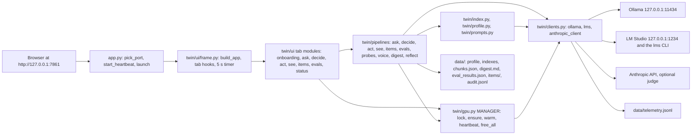

# Continue the digital twin on a MacBook

Written on 2026-09-14 on the Windows laptop, during `docs/PLAN_FINISH.md` phase P7. **No step in this guide has been run on a Mac yet.** Every macOS command is labeled "untested on macOS". Windows facts carry their source as `path:line`, relative to the project root.

This project is a local "answer as me" digital twin. It is a Gradio 6 web app (`app.py` plus the `twin/` package) that reads one markdown profile and uses small local models to do five things:

- chat in the owner's voice;
- predict the owner's decisions;
- run tools;
- react to images;
- score itself against the owner's own questionnaire answers.

The models are served by Ollama and LM Studio on 127.0.0.1. The twin was built and evidenced on a Windows 11 laptop with an 8 GB RTX 2070, using synthetic example profiles.

This guide starts from the three zips: the project without models, the Claude Code memory notes, and the Claude Code settings and skills. It takes a MacBook to the point where you, and Claude Code, can:

1. understand what the project does and where it stands;
2. set up the same Claude Code environment;
3. run the mocked test suite (598 tests on Windows);
4. boot the app without models;
5. find the seams to keep working on the pipeline logic and the model connections.

Anything that loads a model still needs the Windows laptop, or models you install on the Mac yourself. That covers the live demo, the evidence runs, and the index build for a real profile.

## Table of contents

- [1. What this project is](#1-what-this-project-is)
- [2. Where it stands (as of 2026-09-14)](#2-where-it-stands-as-of-2026-09-14)
- [3. The three zips and unpacking on the Mac](#3-the-three-zips-and-unpacking-on-the-mac)
- [4. Claude Code on the Mac](#4-claude-code-on-the-mac)
- [5. Repo map](#5-repo-map)
- [6. Architecture](#6-architecture)
- [7. The build-time pipeline](#7-the-build-time-pipeline)
- [8. Models and connections](#8-models-and-connections)
- [9. Setting up the Python project on the MacBook](#9-setting-up-the-python-project-on-the-macbook)
- [10. Windows-only pieces and Mac equivalents](#10-windows-only-pieces-and-mac-equivalents)
- [11. Working on logic and connections without models](#11-working-on-logic-and-connections-without-models)
- [12. Remaining work and how to continue](#12-remaining-work-and-how-to-continue)
- [13. Rules and gotchas](#13-rules-and-gotchas)
- [Appendix A: command cheat sheet](#appendix-a-command-cheat-sheet)
- [Appendix B: glossary](#appendix-b-glossary)

## 1. What this project is

### The idea in plain words

A "digital twin" here is a set of small local language models that answer questions as one specific person, in that person's texting voice, and predict what that person would decide. The twin knows only what one structured markdown profile says about the person, plus a redacted interview transcript and short expert "reflections" built from it. It is not a general chatbot.

- The original goal was a local web demo of an "answer as me" twin that gives every model in the folder a visible job (`docs/PLAN.md:15`).
- Everything runs on one laptop, and both model servers listen on 127.0.0.1 only (`docs/WINDOWS_SETUP.md:3-4`).
- The profile resolves in this order: the real profile `data/twin_profile.md`, then the Mara example, then the Ari example (`twin/profile.py:100-106`).
- The method adapts Park et al., "Generative Agent Simulations of 1,000 People" (arXiv 2411.10109) to an 8 GB GPU (`docs/PLAN2.md:15`).

### Who it serves

- **First audience:** one person demoing the twin to friends and reviewers on their own laptop.
- **Since PLAN_DEMO (2026-09-14):** businesses that want to capture the judgment of a founder or senior expert. The pitch and the disclosure that Mara is synthetic are in `docs/DEMO.md:16-34`.

### The eight tabs

The tab ids are in `twin/ui/frame.py:60`. The app opens on Onboarding while `data/twin_profile.md` is missing, which is the state in the zip (`twin/ui/frame.py:192-194`).

| Tab | What it does | Models (keys from `twin/config.py:85-114`) |
|---|---|---|
| Onboarding | Four-step walkthrough (interview, redact, index, items) with file checks and copyable commands. No model. | none |
| Ask | Chat as the twin: router, follow-up rewrite, retrieval, streamed voice reply, optional consistency checker, trace. | `llama32_1b`, `llama32_3b`, `nomic_ollama`, `stheno_q4` (or `stheno_q8`), `qwen25` |
| Decide | B1 "Would I do it?" and B2 "A or B?" as JSON with reasons and cited past decisions; "Say it in my voice". | `nomic_lms` (or `nomic_ollama`), `qwen3_8k`, then `stheno_q4` |
| Act | Tool-calling agent (search_profile, get_datetime, calculator, draft_message); "Polish with Stheno". | `hermes3`, `nomic_lms`, `stheno_q4` |
| See | Upload an image: a factual description, then a reaction in the twin's voice. | `qwen35_vision`, `nomic_ollama`, `stheno_q4` |
| Items | Self-report form for the item bank (IPIP-50, games, gold questions, GSS); "Run twin"; "Score (no model)". | `nomic_lms`, `qwen3_8k`, `stheno_q4`, `llama31`, `qwen25` |
| Eval | Cached voice and retrieval bake-off tables and the boundary-probe table; re-run buttons; a live one-candidate check. | the six candidates, `llama31` and `qwen25` judges, optional `claude` |
| Status | Server and GPU state, telemetry, audit tail, redaction report; Free GPU, Warm, Rebuild index and digest. | GETs only, except Free GPU (stops every Ollama model and runs `lms unload --all`, `twin/gpu.py:114-132`), Warm and the Rebuild buttons |

### The three conditions

The conditions are an ablation. Each one changes one thing about what the twin is given. They are defined in `twin/prompts.py:9-10`.

| Condition | What the model gets | Where it is built |
|---|---|---|
| `demographic` | The IDENTITY block only: no digest, no retrieval, no boundaries. | `twin/prompts.py:40-49` |
| `persona` | The static prefix (identity, style rules, 3 samples, boundaries, digest), no retrieval. | `twin/prompts.py:40-59`, `twin/prompts.py:62-68` |
| `interview` (default) | The persona prefix plus a numbered CONTEXT block of retrieved chunks. | `twin/prompts.py:62-74` |

The interview condition should beat the other two. The Items decision line tests exactly that (`twin/pipelines/items.py:79-81`).

Which endpoints take a condition:

- The condition dropdown is the last input of `/ask`, `/decide_b1`, `/decide_b2` and `/eval_live` (`twin/ui/frame.py:72`).
- See always uses the interview prompt (`twin/pipelines/see.py:139`).
- Act has no condition (`twin/pipelines/act.py:325`).

### The synthetic profiles and why they exist

The build never waits for inputs the user has not supplied: example files stand in for all of them (`docs/INPUTS.md:26`).

- **Ari** (`data/twin_profile.example.md`, schema v1): "Ari, early 30s", a backend developer (`data/twin_profile.example.md:1-9`). Phase-1 tests pin this path (`docs/INPUTS.md:14`).
- **Mara Ellison** (`data/twin_profile.example.v2.md`, schema v2): 29, a freelance illustrator (`data/twin_profile.example.v2.md:1-10`).
  - It parses to 61 chunks, 15 decisions, 20 eval items and 4 reflection lenses (`docs/INPUTS.md:13`).
  - The v2 build, the evidence, the scores and the demo all run on Mara.
- The demo discloses that Mara is invented and that every number comes from her example data (`docs/DEMO.md:24-27`).

## 2. Where it stands (as of 2026-09-14)

### Built and evidenced

- **Phase 1 (2026-09-13).** Built from `docs/PLAN.md`: six tabs and 215 mocked tests, all on Ari (`docs/PLAN_UNIFIED.md:7`). Live evidence is in `docs/EVIDENCE.md`.
- **PLAN_UNIFIED workflows A and B.** They produced:
  - the eight tabs and the conditions;
  - the interview transcript as a retrieval source, with redaction;
  - the expert reflections;
  - the item bank with retest normalization;
  - the audit log, the boundary probes and the delete script.

  Evidence: `docs/EVIDENCE2.md` stages 0-5 on Mara.
- **PLAN_UNIFIED workflows C and D (PLAN_FINISH P3-P5).**
  - C restyled the frame and all eight tabs.
  - D ran integration, live checks and critics.
  - Evidence: `docs/EVIDENCE2.md` stage 6 (14 rows) and stage 7 (8 rows), row ids at `docs/EVIDENCE2.md:46-67`.
  - `docs/PLAN_UNIFIED.md:195-213` marks that plan done.
- **PLAN_DEMO deliverables.**
  - `docs/DEMO.md` and `docs/demo/beats.json`;
  - `scripts/demo_prep.ps1` and `scripts/demo_rehearse.py`;
  - `docs/ARCHITECTURE.md` and `docs/CLIENT_TALKING_POINTS.md`.
  - Rehearsal evidence is in `scripts/dev/demo/`.
- **Tests.** 598 passed on Windows (`scripts/dev/finish/p6_snapshot.json:4-8`, `scripts/dev/finish/state.json:5`), run as `$env:TWIN_NO_WARM='1'; $env:PYTHONUTF8='1'; python -m pytest -q -p no:cacheprovider` (`docs/PLAN_FINISH.md:156`). `pytest.ini` sets `testpaths = tests`, so the pre-restyle copy in `scripts/dev/finish/backup_pre_c/` is not collected (`pytest.ini:1-4`).

### Phase status (PLAN_FINISH Progress log, `docs/PLAN_FINISH.md:44-54`)

| Phase | Result |
|---|---|
| P1 | Demo review and fix, docs re-check. Two approved app fixes with 8 regression tests (pytest 551). |
| P2 | Demo signed off; 17-item pre-show checklist added to `docs/DEMO.md` section 11; `pytest.ini` added. |
| P3 | Frame restyle (`twin/ui/frame.py` layout only, `static/twin.css`, `static/tabs/frame.css`); pytest 558. |
| P4 | Eight tab partials `static/tabs/<tab>.css`, layout-only changes in `twin/ui/<tab>.py`; pytest 598. |
| P5 | Stage 6-7 evidence; rehearsal run 12 on the restyled app: 14/14 ok in 93.7 s, with an Act draft (`scripts/dev/finish/state.json:22`). |
| P6 | Demo re-signed on the restyled UI in docs mode: S1 go, 0 must_fix, 7 should_fix (`scripts/dev/finish/p6_results.json:170-213`). Code frozen at `scripts/dev/finish/p6_snapshot.json`. |
| P7 | This guide. |
| P8 | The three v2 zips (`scripts/dev/finish/build_zips.py`), then the final updates to CLAUDE.md, memory and the plan status lines (`docs/PLAN_FINISH.md:318-338`). |

The frame contract is in `scripts/dev/finish/p3_results.json`, and the lane results are in `scripts/dev/finish/c_results.json`. The view_api names, parameters and returns are unchanged by the restyle (`docs/PLAN_UNIFIED.md:202`). Ask fits a true 400 px viewport, measured with `scripts/dev/finish/cdp_shot.py` (`docs/PLAN_UNIFIED.md:202`).

### App fixes (approved, each with regression tests)

- **`twin/pipelines/act.py`: `DRAFT_WRITE_NOW`** (`twin/pipelines/act.py:32-34`, applied at `twin/pipelines/act.py:395-398`).
  - Once `search_profile` or an earlier `draft_message` has run, the tool's next_step tells hermes3 to write the message now.
  - Before the fix Act drafted in 0 of 6 attempts; since then it has drafted in 5 of 5 (runs 8-12, `docs/EVIDENCE2.md:248-249`).
- **`twin/pipelines/ask.py`: sentence trim.** A reply that used the whole `VOICE_TOKENS` budget (300) is trimmed to its last full sentence (`twin/pipelines/ask.py:57`, `twin/pipelines/ask.py:492-502`). Tests are listed in `docs/DEMO.md:471`.

### Measured results (synthetic Mara data; caveats below)

- **Items decision line** (`data/items/scores.json:1377`): "partial (yes on ipip50 acc, ipip50 r, gold judge_overall; no on gss accuracy, game acc)".
  - Interview wins IPIP (acc 0.88, r 0.775) and the gold judges (0.81).
  - It loses GSS accuracy to demographic (0.486 vs 0.568) and the games to persona (0.80 vs 0.825).
  - Prisoner's dilemma accuracy is 0 under every condition (`docs/EVIDENCE2.md:169-172`).
- **Voice bake-off:** persona overall 4.40 beats interview 3.80 (`docs/EVIDENCE2.md:173-174`).
- **Retrieval recall@5:** nomic 0.65, gemma 0.80, lms_nomic 0.65, lower than Ari's 0.9 / 0.95 / 0.9 (`docs/EVIDENCE2.md:175-177`).
- **Caveats that travel with every number** (`docs/DEMO.md:288-296`):
  - (a) The retest ceilings come from synthetic example waves.
  - (b) Only local judges ran; the Claude ceiling judge never ran.
  - (c) The interview, items and retest protocol has never run with a real person.

### Decisions made

- **Build decisions** (`docs/PLAN_UNIFIED.md:9`):
  - Opus in claude.ai conducts the interview.
  - Politics stays out.
  - IPIP-50 (public domain) rather than BFI-44.
  - One session for the whole build.
  - The impeccable skill is skipped (no Node.js).
- **Order and session setup** (`docs/PLAN_FINISH.md:11-18`):
  - Order: finish the demo, then restyle and integrate, then the Mac guide and zips.
  - Session: Opus 5 with 1M context, ultracode on, fast mode off.
  - Advisors and critics on Opus 5, because Fable 5.1 was over its monthly spend limit.
- **"Complete, not perfect"** (`docs/PLAN_FINISH.md:19-23`): one review plus at most one fix per cycle, must_fix only for real blockers, mechanical gates.
- **The DEMO CONTRACT** (`docs/PLAN_FINISH.md:358-370`): the api_names, the quoted output strings, the bold labels, the deep links and the elem_ids stay unchanged.

### Still blocked on the user (`docs/PLAN_UNIFIED.md:214-219`, `docs/EVIDENCE2.md:255-272`)

- The real profile and interview transcript (`docs/opus_interview_prompt.md`).
- Day-0 and day-14 item answers.
- `ANTHROPIC_API_KEY` for the Claude ceiling judge.
- Claude Design exports (`docs/design/tokens.md`), optional.
- The decision on enforcing politics deflection in code.

### Open gaps and known issues

- **Politics deflection is not enforced in code.**
  - `twin/prompts.py` and `twin/pipelines/ask.py` have no politics rule.
  - Mara's profile holds political views: the `Society and politics` chunk (`data/twin_profile.example.v2.md:67-68`) and the `Political scientist` reflection (`data/twin_profile.example.v2.md:231-232`).
  - Her boundaries don't mention politics (`data/twin_profile.example.v2.md:240`).
  - Only the item bank and the probes filter politics (`twin/pipelines/items.py:73-74`, `twin/pipelines/probes.py:55-57`).
  - The lint text still claims the twin "deflects politics in chat" (`twin/profile.py:303-305`), which the code does not do.
  - **Never take a politics question in a demo** (`docs/DEMO.md:128`).
- **Boundaries are prompt-only.** The P-02 income probe held in 1 of 2 rehearsal runs (`docs/DEMO.md:472`).
  - The demographic prompt carries no BOUNDARIES block (`twin/prompts.py:48-49`).
  - The Act agent prompt carries none either (`twin/prompts.py:206`).
- **Gradio is not pinned.** `requirements.txt:1` allows `gradio>=6,<7`, but the restyled CSS depends on the Gradio 6.27.0 DOM (`docs/CONTRACTS.md:811`, `scripts/dev/finish/p5_results.json:299`). Install 6.27.0 exactly (section 9).
- **Deferred UI follow-ups** (`scripts/dev/finish/p5_results.json:300-310`):
  - The status strip shows its boot value until the first 5 s tick.
  - `color-scheme: dark` is set only on `body.dark`.
  - The dark slider track stays light.
  - A `?tab=` deep link fires two pre-warms.
  - **Polish with Stheno** sits right above the Act Trace header.
  - The Status audit tail clips its chunks column at 1440 px.
  - Some web-design-guidelines cleanups (h1, skip link, aria-live, confirmations on data-rewriting buttons) are frozen by the DEMO CONTRACT.
- **Gradio's Walkthrough disables Onboarding steps 2-4** until step 1 is done. The demo narrates the labels instead of clicking them (`docs/DEMO.md:155`).
- **Audit gaps.** See, Act polish, rebuilds and warms write no audit line (`docs/ARCHITECTURE.md:577`).
- **Redaction** misses third-party names written entirely in lowercase, and the profile itself is not machine-redacted (`docs/ARCHITECTURE.md:578`).
- **Hidden writes.**
  - Items "Run twin" and "Score (no model)" rewrite `data/items/twin_answers.json` and `data/items/scores.json`.
  - "Save answers" writes a real wave-1 file (`docs/DEMO.md:118-120`).
- **No authentication** on the app (`docs/ARCHITECTURE.md:588`).
- **Stale text in code comments.** `app.py:77` and `twin/ui/frame.py:37-43` say Ask is shown first and that Items and Onboarding are placeholders. The code opens Onboarding and both tabs are live (`twin/ui/frame.py:192-194`, `twin/ui/onboarding.py:16`). Trust the code.
- **Doc drift to fix after P8.**
  - `scripts/dev/finish/state.json` was updated to the finished state in P8.
  - `docs/ARCHITECTURE.md:538` and `docs/ARCHITECTURE.md:551` still list workflow D and P6 as future work.
  - `docs/CLIENT_TALKING_POINTS.md:446` says the restyle and the final live check are deferred.
  - `docs/items_licensing.md:5` says 113 items and 38 GSS; `data/items/bank.json` has 112 items and 37 GSS (checked with a count of `"instrument"` entries).
  - `docs/talk_about_it_prompt.md` still describes Ari and an older setup (`docs/talk_about_it_prompt.md:11`).
  - `docs/claude_design_prompt.md:3` still asks for the six old `scripts\dev\shot_*.png` screenshots.

## 3. The three zips and unpacking on the Mac

P8 builds the zips with `scripts/dev/finish/build_zips.py` right after this guide (`scripts/dev/finish/build_zips.py:1-18`). The older 2026-09-14 zips stay on disk and are stale (`scripts/dev/finish/state.json:52-56`).

| Zip (built on Windows in `C:/Users/Adity/`) | Top folder | What it holds |
|---|---|---|
| `Personal_digital_twin_no_models_v2.zip` | `Personal_digital_twin/` | The whole project, with these exceptions (`scripts/dev/finish/build_zips.py:39-44`, `scripts/dev/finish/build_zips.py:55-74`): **no files under `models/`**, but the empty `models/ollama/` and `models/lmstudio/` folders are kept; no `__pycache__`, `.pytest_cache` or `.pyc`; never `.credentials.json` or `.claude.json`. It includes `.claude/skills`, `docs/skills-not-used`, `scripts/dev/workflows`, `scripts/dev/finish`, `data/` with every example and generated artifact, and this guide. |
| `Personal_digital_twin_claude_memory_v2.zip` | `memory/` | `MEMORY.md` and the note files from `C:/Users/Adity/.claude/projects/C--Users-Adity-Personal-digital-twin/memory` (`scripts/dev/finish/build_zips.py:34`), taken after P8's final memory update. |
| `Personal_digital_twin_claude_env_v2.zip` | `claude_env/` | `claude_env/user-config/settings.json` (a copy of the Windows `~/.claude/settings.json`), `claude_env/skills` (a copy of `.claude/skills`) and `claude_env/skills-not-used` (a copy of `docs/skills-not-used`) (`scripts/dev/finish/build_zips.py:89-93`). |

P8's checks, before the zips are sent (`scripts/dev/finish/build_zips.py:16-17`):

- `testzip()` passes;
- the file counts match the disk;
- no credential files and no real `sk-ant-` keys;
- pytest on an extracted copy gives the same count.

### Quick start with `./start.sh` (added in P8; reviewed, not yet run)

P8 added `start.sh` at the project root, at the user's request. `build_zips.py` stores it with an executable mode, so `./start.sh` runs straight after `unzip` (`scripts/dev/finish/build_zips.py`). If the executable bit got lost (Safari or Finder extraction), run `chmod +x start.sh` or `bash start.sh`.

```zsh
# untested on macOS
cd ~/Personal_digital_twin
./start.sh --help
./start.sh --dry-run    # prints each step, changes nothing
./start.sh --open       # sets up .venv on the first run, starts the app, opens the browser
```

What it does, in order (read `start.sh`, it is short):
1. Finds Python 3.10 or newer (`python3.13` down to `python3`).
2. Creates `.venv` inside the project, or recreates it when its Python is gone or has no pip.
3. Runs `pip install -r requirements.txt` on the first run and whenever that file changes, tracked by a hash in `.venv/.requirements.sha256`.
4. Exports `PYTHONUTF8=1` and `GRADIO_ANALYTICS_ENABLED=False`.
5. Checks Ollama on 127.0.0.1:11434 and LM Studio on 127.0.0.1:1234. When neither answers, it sets `TWIN_NO_WARM=1` (section 9.4 describes what works then).
6. Runs `exec python app.py --port 7861`, so Ctrl+C stops the app.

Flags: `--port N`, `--no-warm`, `--warm`, `--test` (pytest first), `--open`, `--dry-run`, `--help`.

**Versions.** `requirements.txt` pins only `gradio>=6,<7` (`requirements.txt:1-9`), so a fresh `.venv` may get a newer Gradio than the 6.27.0 the UI was built and tested on, and `static/tabs/frame.css` relies on some 6.27.0 internals. To match Windows exactly, install the section 9.2 pins into the project's own `.venv` first (`python3 -m venv .venv` inside `~/Personal_digital_twin`), then run `./start.sh`. Its `pip install -r requirements.txt` keeps packages that already satisfy the requirements. **Unverified:** `start.sh` was reviewed by reading (bash 3.2 and macOS specifics) but has never been run, because the Windows laptop has no bash. The section 9 steps stay the reference.

### Unpack (zsh, untested on macOS)

These commands assume the zips are in `~/Downloads`. Unzip on the command line so the top folder lands at `~/Personal_digital_twin`.

Safari's "Open safe files after downloading" option (standard macOS behaviour, not checked on this Mac) unzips a downloaded `.zip` and moves the archive to the Trash, so the `unzip` lines below would fail with "cannot find or open". Transfer the zips with AirDrop, download them with Chrome, or turn that Safari option off. If Safari already extracted them, use the extracted folders and check that `ls -a ~/Personal_digital_twin` shows `.claude`.

```zsh
# untested on macOS
ls ~/Personal_digital_twin 2>/dev/null && echo "~/Personal_digital_twin already exists: move it aside first"
unzip -q ~/Downloads/Personal_digital_twin_no_models_v2.zip -d ~
ls ~/Personal_digital_twin                      # app.py, twin/, tests/, docs/, data/, ...
ls ~/Personal_digital_twin/.claude/skills       # frontend-design redesign-existing-projects web-design-guidelines
ls ~/Personal_digital_twin/models               # lmstudio ollama (both empty)

# Keep the other two zips unpacked beside the project for section 4.
mkdir -p ~/twin_zips
unzip -q ~/Downloads/Personal_digital_twin_claude_memory_v2.zip -d ~/twin_zips
unzip -q ~/Downloads/Personal_digital_twin_claude_env_v2.zip -d ~/twin_zips
ls ~/twin_zips/memory ~/twin_zips/claude_env
```

`.claude` is a hidden folder. Finder hides it, but `ls -a` shows it. The empty `models/` folders are not used on the Mac: they were LM Studio's and Ollama's model stores on Windows (`docs/WINDOWS_SETUP.md:56-73`).

## 4. Claude Code on the Mac

### 4.1 Install and sign in

These commands are confirmed in the official docs (https://code.claude.com/docs/en/setup). They are untested on this user's Mac.

```zsh
# untested on macOS; commands from https://code.claude.com/docs/en/setup
curl -fsSL https://claude.ai/install.sh | bash      # native install (recommended, auto-updates)
# or: brew install --cask claude-code               # Homebrew (stable cask; does not auto-update, so it can lag the Windows "latest" channel)
# The native installer puts claude in ~/.local/bin, which a stock zsh PATH may lack ("command not found: claude").
# Fix from https://code.claude.com/docs/en/troubleshoot-install:
echo $PATH | tr ':' '\n' | grep -Fx "$HOME/.local/bin" || { echo 'export PATH="$HOME/.local/bin:$PATH"' >> ~/.zshrc; source ~/.zshrc; }
claude --version
claude doctor                                         # read-only install and settings diagnostics
```

The docs list macOS 13.0 or later. Run `claude` in a terminal and follow the browser login (https://code.claude.com/docs/en/authentication). On macOS, Claude Code stores the login in the encrypted macOS Keychain. It falls back to `~/.claude/.credentials.json` only when the Keychain rejects the write. You sign in again on the Mac: the Windows login files are never copied (section 4.5).

### 4.2 Apply the Windows settings

The Windows `~/.claude/settings.json` held these keys on 2026-09-14 (`C:/Users/Adity/.claude/settings.json`, copied into the env zip):

```json
{
  "model": "opus[1m]",
  "autoUpdatesChannel": "latest",
  "tui": "fullscreen",
  "theme": "dark",
  "agentPushNotifEnabled": false
}
```

It has no `fastMode` key, so new sessions start with fast mode off (`docs/PLAN_FINISH.md:28-30`). User settings live at `~/.claude/settings.json` (https://code.claude.com/docs/en/settings).

If the file does not exist on the Mac, copy it. If it does exist, add only the keys it lacks, keep a backup, and never overwrite your own values blindly.

The merge branch uses `python3`. On a Mac without the Xcode Command Line Tools, `/usr/bin/python3` is only a stub that opens the tools installer, so run `xcode-select --install` first (Homebrew needs it too), or do section 9.2 before this step.

```zsh
# untested on macOS
mkdir -p ~/.claude
WIN=~/twin_zips/claude_env/user-config/settings.json
if [[ ! -f ~/.claude/settings.json ]]; then
  cp "$WIN" ~/.claude/settings.json
else
  cp ~/.claude/settings.json ~/.claude/settings.json.bak
  python3 - ~/.claude/settings.json "$WIN" <<'EOF'
import json, sys
mine_path, win_path = sys.argv[1], sys.argv[2]
mine, win = json.load(open(mine_path)), json.load(open(win_path))
added = {k: v for k, v in win.items() if k not in mine}
mine.update(added)
json.dump(mine, open(mine_path, "w"), indent=2)
print("added:", added or "nothing")
print("kept your own value for:", [k for k in win if k not in added])
EOF
fi
cat ~/.claude/settings.json
```

On the Mac, `python3 -` with a here-document is fine. The rule against `python -` applies to Windows PowerShell, where stdin is the null device (`docs/PLAN_FINISH.md:348`).

### 4.3 Skills

- **The three active skills are project skills.** They arrive with the project in `.claude/skills/`: `frontend-design`, `redesign-existing-projects` and `web-design-guidelines`. Their front matter is at `.claude/skills/*/SKILL.md:2-3`.
  - Claude Code loads project skills from `.claude/skills/<skill-name>/SKILL.md` in the directory where the session starts, and in its parents (https://code.claude.com/docs/en/skills).
  - Start `claude` in `~/Personal_digital_twin` and they load with no copying. Check with `/skills`.
- **What each is for** (`CLAUDE.md:43`):
  - `frontend-design`: invoke before writing any theme or CSS.
  - `redesign-existing-projects`: the audit checklist for restyling.
  - `web-design-guidelines`: the reviewer rubric. It fetches Vercel's rules from GitHub at review time, so it needs network access (`.claude/skills/web-design-guidelines/SKILL.md`).
- **Optional: make them available in every project.** Personal skills live in `~/.claude/skills/<skill-name>/SKILL.md` (https://code.claude.com/docs/en/skills). Not needed for this project. If a skill exists in both places, the personal copy in `~/.claude/skills` wins and the project copy is shadowed (the skills docs: "personal over project").

  ```zsh
  # optional, untested on macOS
  mkdir -p ~/.claude/skills
  cp -R ~/twin_zips/claude_env/skills/. ~/.claude/skills/
  ```

- **Keep the two parked skills out** unless you decide otherwise. `design-taste-frontend` and `high-end-visual-design` are in `docs/skills-not-used/` and `claude_env/skills-not-used/`.
  - Why they are parked: the first targets landing pages with React, Tailwind and Motion and says it is not for product UI. The second pushes glass, mesh gradients and scroll animations that Gradio cannot build and that contradict `frontend-design` (`docs/skills-not-used/README.md:1`).
  - Skills auto-load for every agent in the project, so only skills that fit a Gradio product console were activated. Re-evaluate the parked ones only for a marketing page (memory note `design-skills-policy.md:13-15`).
  - To activate one anyway, move its folder into `.claude/skills/`.

### 4.4 Memory (auto-memory notes)

Claude Code keeps each project's auto memory in `~/.claude/projects/<project>/memory/`. `MEMORY.md` is the index, and its first 200 lines or 25KB load into every session. The `<project>` name is derived from the git repository, or from the project root outside a git repo (https://code.claude.com/docs/en/memory). This project is not a git repo, so the name comes from the folder path.

On Windows the folder is `C--Users-Adity-Personal-digital-twin`: `C:\Users\Adity\Personal_digital_twin` with every non-alphanumeric character (`:`, `\`, `_`) turned into `-`. On the Mac the path is different, so the folder name is too. By the same rule it would be `-Users-<your-user>-Personal-digital-twin`. **Unverified:** the block computes the name from the path instead of guessing the newest folder, then you confirm it with `/memory`.

```zsh
# untested on macOS
P=~/.claude/projects/$(cd ~/Personal_digital_twin && pwd -P | sed 's/[^A-Za-z0-9]/-/g')
echo "$P"
mkdir -p "$P/memory"
cp -Rn ~/twin_zips/memory/. "$P/memory/"   # -n: never overwrite a note Claude already wrote on the Mac
ls "$P/memory"
```

Then start `claude` in `~/Personal_digital_twin`, send one message, and check that `/memory` opens that same folder and `ls "$P"` shows the session files next to `memory/`. If `/memory` points to a different folder, move the notes there.

The zip holds seven files: `MEMORY.md` plus `digital-twin-build-state.md`, `twin-workflow-lessons.md`, `checkpoint-and-ask.md`, `complete-not-perfect.md`, `design-skills-policy.md` and `run-plans-in-new-sessions.md`. P8 may update or add notes before zipping.

The notes describe the Windows laptop, so their Windows paths (`C:\...`, `scripts\*.ps1`, `nvidia-smi`) are Windows-only facts. If `MEMORY.md` already existed in that folder, merge the index lines by hand.

### 4.5 What does not transfer, and why

- **`~/.claude/.credentials.json` and `~/.claude.json`.** They hold login tokens and account and machine ids. They are never exported (`scripts/dev/finish/build_zips.py:40`, `docs/PLAN_FINISH.md:329`). `~/.claude.json` also holds per-project state and MCP configuration that Claude Code writes for itself (https://code.claude.com/docs/en/settings). Sign in again on the Mac, and never copy or share either file.
- **claude.ai connectors** come with the account login, not with files (https://code.claude.com/docs/en/authentication).
- **Plugins.** Windows had none beyond the official marketplace. Claude Code adds the official Anthropic marketplace (`claude-plugins-official`) automatically the first time it starts interactively (https://code.claude.com/docs/en/discover-plugins).
- **MCP servers, saved tool permissions, hooks, agents, commands, output styles, keybindings.** Windows had none at user or project level, so there is nothing to carry.
- **Claude in Chrome.** It needs the Claude in Chrome extension (version 1.0.36 or later) in the Mac's Chrome or Edge, a direct Anthropic plan and a `/login` sign-in; start with `claude --chrome` or `/chrome` (https://code.claude.com/docs/en/chrome). On Windows the extension's browser could not open `http://127.0.0.1:7861`, so app screenshots used headless Chrome instead (memory note `twin-workflow-lessons.md:13`). Untested on macOS.

### 4.6 Optional: Node.js (untested)

Node.js was never installed on Windows, so `npx skills add` never ran. The `impeccable` and `ui-ux-pro-max` skills were not installed (memory note `design-skills-policy.md:11`). The policy says to add `impeccable` once Node exists (`design-skills-policy.md:15`). On a Mac that could start with `brew install node` (Homebrew itself comes from https://brew.sh; see section 9.2). Untested on macOS, and not needed for anything in this project.

### 4.7 Session habits (from Windows)

1. Start `claude` in the project folder with the venv active, so Claude Code's shell tool inherits it (macOS has no unversioned `python` outside a venv): `cd ~/Personal_digital_twin && source ~/.venvs/twin/bin/activate && claude` (section 9.2 creates the venv). The default model is Opus 5 with 1M context (`"model": "opus[1m]"`); confirm with `/model` (`docs/PLAN_FINISH.md:27`).
   - **Add a Mac-only `CLAUDE.local.md`.** The zipped `CLAUDE.md` tells every session that the shell is Windows PowerShell 5.1 and to run `$env:PYTHONUTF8=1; python app.py --port 7861` (`CLAUDE.md:3`, `:41`). `CLAUDE.local.md` at the project root loads after `CLAUDE.md` (https://code.claude.com/docs/en/memory). Create it on the Mac (it is not in the zip, and it should not travel back to Windows):

     ```zsh
     # untested on macOS
     cat > ~/Personal_digital_twin/CLAUDE.local.md <<'EOF'
     # This machine: MacBook (overrides the Windows facts in CLAUDE.md)
     - Shell is zsh, not PowerShell. CLAUDE.md's PowerShell commands, C:\ paths, .exe tools and nvidia-smi apply only to the Windows laptop.
     - Python venv: ~/.venvs/twin (source ~/.venvs/twin/bin/activate). Never pip-install an unpinned gradio; it stays 6.27.0.
     - No local models on this Mac unless docs/REPLICATE_ON_MAC.md section 9.5 was done. Never click model buttons.
     - Tests: TWIN_NO_WARM=1 python -m pytest -q -p no:cacheprovider (expect 596 passed, 2 skipped).
     - Boot without models: TWIN_NO_WARM=1 python app.py --port 7871
     EOF
     ```
2. Keep fast mode off. `/fast` is a toggle: run it only if the status line shows fast mode (`docs/PLAN_FINISH.md:28-30`).
3. For multi-agent workflows, run `/effort ultracode`. The `--effort` CLI flag does not accept ultracode (`docs/PLAN_FINISH.md:31`).
4. Advisors and critics run on Opus 5 with an adversarial note. On 2026-09-14 this was because Fable 5.1 was over its monthly spend limit (`docs/PLAN_FINISH.md:18`, `docs/PLAN_FINISH.md:342`).
5. Work from a runbook with a Progress log, a `state.json` and one repeatable kickoff line, as `docs/PLAN_FINISH.md` does. Checkpoint after each phase, and ask before the next phase unless the user said "continue with the rest" (memory note `checkpoint-and-ask.md:16-20`).
6. Complete, not perfect: one review plus at most one fix per cycle (memory note `complete-not-perfect.md:15-18`).

### 4.8 Checklist: is the environment right?

Run these inside `claude` started in `~/Personal_digital_twin`. All are untested on macOS.

- [ ] `claude --version` prints a version, and `claude doctor` shows no settings errors.
- [ ] `/model` shows Opus 5 with 1M context. The status line does not show fast mode.
- [ ] `/skills` lists `frontend-design`, `redesign-existing-projects` and `web-design-guidelines` as project skills, and not the two parked skills.
- [ ] `/context` lists `CLAUDE.md` and `CLAUDE.local.md` under **Memory files** (https://code.claude.com/docs/en/memory).
- [ ] Claude itself can run the tests. Ask it to run the test suite; expect `596 passed, 2 skipped` (section 9.3). A `command not found: python` means `claude` was started without the venv active (section 4.7).
- [ ] `/memory` offers the auto memory folder, and opening it shows `MEMORY.md` and the notes.
- [ ] Memory recall works. Ask "What does my memory say about the next PLAN_FINISH phase and the politics gap?" The answer should mention the Progress log, `scripts/dev/finish/state.json`, and that politics deflection is not enforced in code.
- [ ] Ask "Which design skills are active here and why are two parked?" The answer should match section 4.3.

## 5. Repo map

```text
Personal_digital_twin/
  CLAUDE.md                  project instructions Claude Code loads (written for the Windows laptop)
  docs/WINDOWS_SETUP.md                  Windows model setup, measured numbers, run line, UI styling notes
  app.py                     assembler: port probing, heartbeat, build_app, queue, launch
  requirements.txt           gradio>=6,<7 plus eight unpinned packages
  pytest.ini                 testpaths = tests
  modelfiles/qwen3-8b-8k.Modelfile   FROM qwen3:8b, PARAMETER num_ctx 8192
  models/ollama/ models/lmstudio/     empty in the zip (the Windows model stores)
  twin/
    config.py                data paths, TWIN_NO_WARM and TWIN_THEME, server URLs, CLI paths, MODELS registry
    clients.py               OllamaClient, LMSClient, AnthropicClient and their module singletons
    gpu.py                   ModelManager (MANAGER), TAB_MODEL, gpu_line (nvidia-smi)
    telemetry.py             in-memory ring buffer plus data/telemetry.jsonl
    audit.py                 data/audit.jsonl (request text stored as sha256 only)
    profile.py               profile parser (schema v1 and v2), chunks, --lint CLI
    transcript.py            interview transcript parser and chunker, CLI
    redact.py                regex rules, name heuristic, optional qwen3_8k names pass, CLI
    index.py                 chunk collection, containment check, three .npz indexes, search, CLI
    prompts.py               system prompts, JSON schemas, the conditions, postprocess_voice
    pipelines/
      ask.py decide.py act.py see.py     the four chat tabs
      voice.py               shared voice calls (Stheno Q4, Stheno Q8, llama3.2:3b fallback)
      digest.py reflect.py   build-time qwen3:8b calls (digest, expert reflections)
      evals.py probes.py items.py        evaluation (bake-offs, boundary probes, item bank)
    ui/
      frame.py               masthead, gpu note, status strip, tab shell, hooks, TAB_JS, api-name constants
      theme.py               token sheet -> TwinTheme and css_text()
      state.py               shared profile, header, error helpers
      onboarding.py ask.py decide.py act.py see.py items.py evals.py status.py   one module per tab
  static/twin.css            default tokens, base rules, shared classes (all under #twin-tabs)
  static/tabs/*.css          frame.css plus one partial per tab
  tests/                     conftest.py plus 27 test_*.py files (mocked: no network, no GPU)
  data/                      examples and generated artifacts (table below)
  docs/
    PLAN_FINISH.md           the runbook (Progress log, kickoff line, phase specs, rules, DEMO CONTRACT)
    PLAN.md PLAN2.md PLAN3_UI.md PLAN_UNIFIED.md PLAN_DEMO.md   earlier plans (specs and history)
    CONTRACTS.md             module API, per module; UI styling rules; tests
    ARCHITECTURE.md          diagrams, run-time sequences, model routing, known limits
    EVIDENCE.md EVIDENCE2.md evidence tables (phase 1; v2 stages 0-7)
    DEMO.md demo/beats.json  demo run sheet and its machine-readable beats
    CLIENT_TALKING_POINTS.md INPUTS.md items_licensing.md
    opus_interview_prompt.md the interview prompt that produces the real transcript and profile
    opus_profile_prompt.md   superseded (schema v1 reference)
    research_profile_prompt.md talk_about_it_prompt.md (stale) claude_design_prompt.md
    research/D1..D4          profile ground rules, schema v2, interview protocol, item bank and scoring
    design/tokens.default.md the token sheet in use (no tokens.md export exists)
    skills-not-used/         the two parked skills and their README
    REPLICATE_ON_MAC.md      this guide
  scripts/
    check_servers.ps1 free_gpu.ps1 delete_twin.ps1 screenshot_tabs.ps1 demo_prep.ps1   Windows PowerShell
    demo_rehearse.py         --run N, --dry-run, --check-profile, --smoke
    dev/
      live_drive.py          drives a running app through gradio_client
      view_api_baseline.json the phase-1 api-name baseline (read by the tests)
      test_photo.jpg         the See test image
      evidence/ demo/ shots/ evidence scripts, rehearsal runs and logs, screenshots
      finish/                PLAN_FINISH helpers, state.json, p*_results.json, snapshots, backup_pre_c/
      workflows/             finish-p1 ... finish-p7 workflow scripts
  .claude/skills/            the three active project skills
```

### data/: inputs and generated files

The data paths are defined in `twin/config.py:8-39`. The 20-file baseline is `scripts/dev/demo/data_files_before.txt`.

| File | Kind | Written by | Read by |
|---|---|---|---|
| `twin_profile.example.v2.md` (Mara) | input | research deliverable D5 | `profile.resolve_profile_path()` |
| `twin_profile.example.md` (Ari) | input | phase 1 | the phase-1 tests |
| `interview_transcript.example.md` | input | stage 0 | the index, when no valid redacted copy exists |
| `items/bank.json` | input (frozen v1.0) | stage 0 | `twin/pipelines/items.py` |
| `items/self_answers.example.json`, `items/self_answers_retest.example.json` | input | stage 0 | Items scoring, until the real waves exist |
| `interview_transcript.example.redacted.md` | generated | `python -m twin.redact` | the index, when its `source_sha` matches (`twin/index.py:160-162`) |
| `redaction_report.json` | generated | `twin.redact` (`twin/redact.py:409-410`) | Status tab |
| `reflections.md` | generated | `twin.pipelines.reflect` (qwen3:8b) | the index, only while the profile has no `# Expert reflections` (`twin/index.py:200-205`) |
| `index_nomic.npz`, `index_gemma.npz`, `index_lms_nomic.npz`, `chunks.json` | generated | `twin.index` | retrieval in every pipeline |
| `digest.md` | generated | `twin.pipelines.digest` (qwen3:8b) | every persona and interview prompt |
| `eval_results.json` | generated | the Eval bake-offs, live check and probes | Eval tab |
| `probes.json` | generated | `python -m twin.pipelines.probes --derive --write` | fallback probe list |
| `items/twin_answers.json`, `items/scores.json` | generated | Items **Run twin** and **Score** | Items tab (`scores.json` SHA-256 pinned in `scripts/dev/finish/state.json:8`) |
| `audit.jsonl`, `telemetry.jsonl` | appended | `twin/audit.py:26-45`, `twin/telemetry.py:32-39` | Status (audit); telemetry is shown from memory only (`twin/telemetry.py:42-62`) |

These user-supplied files are absent: `twin_profile.md`, `interview_transcript.md`, `interview_transcript.redacted.md`, `items/self_answers.json` and `items/self_answers_retest.json` (`twin/config.py:12`, `twin/config.py:21-22`, `twin/config.py:30-31`).

Caches are keyed by content hashes, not by paths:

- The digest's first line stores the profile sha (`twin/pipelines/digest.py:60-67`).
- Index freshness hashes the profile, transcript and reflections (`twin/index.py:209-222`).

So an unzipped copy stays fresh on the Mac as long as the bytes don't change. Editing the profile, or re-running `twin.redact` in place, makes the caches and indexes stale, and rebuilding them needs the models.

### scripts/dev/workflows/ and the GPU

These are Claude Code Workflow scripts. They embed Windows paths and PowerShell commands (for example `scripts/dev/workflows/finish-p7-mac-guide.js:19` and `:203`), and their launch args are recorded in `scripts/dev/finish/state.json`. On the Mac they are templates for a runbook session, not something to rerun as-is.

| Script | Phase | GPU needed on Windows (`docs/PLAN_FINISH.md:131-141`) |
|---|---|---|
| `finish-p1-demo-ab.js` | P1 demo review and fix, docs re-check | yes, the Fix agent's live re-rehearsal |
| `finish-p2-demo-signoff.js` | P2 sign-off | none in the workflow (Verification boots `demo_prep.ps1`) |
| `finish-p3-ui-frame.js` | P3 frame restyle | no GPU, but boots the app through Windows-only `ui_check.ps1` |
| `finish-p4-ui-tabs.js` | P4 tab lanes | no GPU, `ui_check.ps1` |
| `finish-p5-integrate.js` | P5 integration and live checks | yes, the Live agent |
| `finish-p6-demo-regression.js` | P6 demo regression | yes in gpu mode; docs mode needs none |
| `finish-p7-mac-guide.js` | P7 this guide | no; verifier V2 runs `ui_check.ps1` on Windows |

## 6. Architecture



Wiring that applies to every tab:

- **Serial GPU work.** Every model endpoint runs with `concurrency_id="gpu"`, and the queue has `default_concurrency_limit=1` (`app.py:79`). Model work is therefore serial, and one `threading.RLock` in `MANAGER` sequences loads (`twin/gpu.py:33-42`).
- **Tab-select hooks.** Selecting Ask, Decide, Act, See or Eval runs a private pre-warm on the gpu queue (`twin/ui/frame.py:66`, `twin/ui/frame.py:229-231`). Selecting Status only reports (`twin/ui/frame.py:233`).
- **Private hooks.** One 5 s `gr.Timer` feeds the sidebar strip and the Status tab (`twin/ui/frame.py:223`, `twin/ui/frame.py:241`, `twin/ui/status.py:444`). The hooks use `api_name=False`.
- **Frozen API.** `view_api` must equal the 17 baseline names in `scripts/dev/view_api_baseline.json` plus the six in `NEW_API_NAMES` (`twin/ui/frame.py:69-70`). The offline UI tests enforce this.
- **Theme.** `app._theme_and_css()` passes `twin.ui.theme.build_theme()` and `css_text()` to `demo.launch` (`app.py:51-61`, `app.py:81-82`).
  - `css_text()` is `static/twin.css` followed by the sorted `static/tabs/*.css` (`docs/CONTRACTS.md:806`).
  - The token sheet is `docs/design/tokens.md` when it exists, otherwise `docs/design/tokens.default.md` (`twin/ui/theme.py:176`).

### Onboarding

- **UI:** `twin/ui/onboarding.py`, `build` at `:176`, a `gr.Walkthrough` with four steps, `READY = True` at `:16`.
- **Pipeline:** none. File checks only: `interview_status` `:59`, `redact_status` `:74`, `index_status` `:101`, `items_status` `:131`.
- **api_name:** `onboarding_check` () -> four status markdowns (`:196`); not on the gpu queue.
- **Models:** none.
- **Reads:** `data/twin_profile.md`, the transcripts and their redacted copies, `redaction_report.json`, the index and digest shas, and the self-answer files.
- **Writes:** nothing.
- **Commands:** the copyable commands are PowerShell (`:37-42`).

### Ask

- **UI:** `twin/ui/ask.py`: `ask_send` (a generator) at `:88`, `ask_clear` at `:142`, wiring at `:209-211`. `ask_send` sets the heartbeat model to `stheno_q8` or `stheno_q4` (`:104`).
- **Pipeline:** `twin.pipelines.ask.ask_turn` (`twin/pipelines/ask.py:586`) runs `_turn` (`:408`) on one worker thread through `_relay` (`:545`), because the RLock must be released by the thread that took it.
- **api_names:**
  - `ask` (message, history, use_q8, temperature, use_checker, condition) -> chatbot, trace_md, checker_md, hint_md, textbox. On the gpu queue.
  - `ask_clear` () -> empty outputs.
- **Model calls, in order:**
  1. Router `llama32_1b`: `ROUTER_SCHEMA`, temperature 0, 40 tokens. Any failure falls back to `about_me` (`:273-287`).
  2. Rewrite `llama32_3b`, only when there is history (`:295-310`).
  3. Retrieval, interview only: `nomic_ollama` through `index.search_chunks`, k=5 (`:321-324`). A failure answers without context (`:456-464`).
  4. Voice through `voice.pick_voice` (`twin/pipelines/voice.py:53-60`), streamed with a 300-token budget. It uses `stheno_q4` on LM Studio, `stheno_q8` on Ollama when Q8 is ticked, or `llama32_3b` at 0.8 when the LM Studio probe fails (`twin/pipelines/voice.py:47-50`).
  5. Post-processing and the trim to the last full sentence (`:492-502`).
  6. Optional `qwen25` checker, interview only (`:504-515`).
- **Reads:** the profile, `data/digest.md`, `data/index_nomic.npz`, `data/chunks.json`.
- **Writes:** one `data/audit.jsonl` line per turn (`:384`), plus telemetry.

### Decide

- **UI:** `twin/ui/decide.py`: `decide_b1_handler` `:28`, `decide_b2_handler` `:38`, `say_it_handler` `:48`. The wiring is near `:120-127`; the private `decide_json.change` meter hook calls no model.
- **Pipeline:** `decide.decide_b1` (`twin/pipelines/decide.py:363`) and `decide_b2` (`:369`) call `_decide` (`:301`); `say_it` is at `:392`.
- **api_names:**
  - `decide_b1` (situation, condition) -> result_md, result_json.
  - `decide_b2` (situation, option_a, option_b, condition) -> result_md, result_json.
  - `say_it` (the state from the last B1 or B2) -> text.
  - All three are on the gpu queue.
- **Model calls, in order:**
  1. Interview only: retrieval with `decision_index_key()`, which is `lms_nomic` when `data/index_lms_nomic.npz` exists and `nomic` otherwise (`:102-105`). It keeps the Decisions, Values, Preferences, Boundaries and reflection sections, then appends every reflection chunk (`:113-139`).
  2. `qwen3_8k` with `B1_SCHEMA` or `B2_SCHEMA`, temperature 0.2, 600 tokens. It retries once at 1200 tokens on a `length` stop and once on invalid JSON (`:191-222`).
  3. Say it: `stheno_q4` through `voice.reply_in_voice`, 120 tokens at temperature 1.0, with `llama32_3b` as the fallback (`:414`).
- **Reads:** the profile, digest, `chunks.json`, `index_lms_nomic.npz` (or `index_nomic.npz`).
- **Writes:** audit lines (`:345`, `:358`, `:416-418`), plus telemetry.

### Act

- **UI:** `twin/ui/act.py`: `act_run_handler` `:10`, `act_polish_handler` `:20`, wiring `:58-61`.
- **Pipeline:** `act.run_agent` (`twin/pipelines/act.py:331`) calls `_agent_loop` (`:345`); `polish` is at `:410`.
- **api_names:** `act` (request) -> answer, trace_md; `polish` (text) -> text. Both are on the gpu queue.
- **Model calls:**
  - `hermes3` inside one GPU session, for up to 5 steps plus 1 after a get_datetime nudge. Each step sends `AGENT_TOOLS`, temperature 0.3 and 500 tokens (`:272-285`).
  - The tool `search_profile` embeds with LM Studio `nomic_lms` (`:163-178`). `get_datetime`, `calculator` and `draft_message` are plain Python (`:181-228`).
  - Polish: `stheno_q4`, 250 tokens at temperature 1.0, with the `llama32_3b` fallback (`:422`).
- **Reads:** the profile, `chunks.json`, `index_lms_nomic.npz`, and the digest (for polish).
- **Writes:** one audit line from `run_agent` (`:320-328`, always condition `interview`). Polish writes no audit line.

### See

- **UI:** `twin/ui/see.py`: `see_handler` `:10`, wiring `:47-48`.
- **Pipeline:** `see.see_turn` (`twin/pipelines/see.py:164`) holds `MANAGER.lock` for the whole turn (`:171`).
- **api_name:** `see` (image) -> description, reaction, trace_md. On the gpu queue.
- **Model calls, in order:**
  1. `qwen35_vision` with a base64 JPEG (longest side 1024 px or less, quality 85), temperature 0.7, 300 tokens (`:95-131`).
  2. A stop of qwen3.5, always (`:125`).
  3. A `nomic_ollama` search on the description, k=5 (`:138`).
  4. `stheno_q4`, 150 tokens at temperature 1.0, with the `llama32_3b` fallback (`:151`).
- **Reads:** the profile, digest, `index_nomic.npz`, `chunks.json`.
- **Writes:** telemetry only; no audit line.

### Items

- **UI:** `twin/ui/items.py`: `items_save` `:179`, `load_wave` `:213`, `items_run` `:242`, `items_score` `:273`, wiring `:340-343`.
- **Pipeline:** `items.run_items` (`twin/pipelines/items.py:569`), `score` (`:853`), `decision_line` (`:940`), `save_scores` (`:982`).
- **api_names:**
  - `items_save` (wave, date, one value per bank item) -> note, files. Not on the gpu queue.
  - `items_run` (condition) -> note, rows. On the gpu queue. Under `TWIN_NO_WARM=1` it returns a "skipped" note (`twin/ui/items.py:246-248`).
  - `items_score` () -> rows, decision. No model.
- **Model calls (run_items), model-outer:**
  1. `nomic_lms` retrieval for interview items.
  2. `qwen3_8k` for every closed item, with a per-item schema, temperature 0.2 and 80 tokens.
  3. `stheno_q4` for the open gold items, 300 tokens at 1.15.
  4. The `llama31` judge, then the `qwen25` judge.
  5. `MANAGER.free_all()` (`:618-689`).
- **Reads:** `data/items/bank.json`, the profile, digest, `chunks.json`, `index_lms_nomic.npz`, and the answer waves.
- **Writes:** `items/twin_answers.json` after every call, `items/scores.json`, `items/self_answers*.json` (Save), and one audit line per condition (`:690-694`).

### Eval

- **UI:** `twin/ui/evals.py`: `eval_tables` `:27`, `eval_voice_rerun` `:60`, `eval_retrieval_rerun` `:77`, `eval_live_handler` `:90`, wiring `:150-160`.
- **Pipeline:** `evals.run_voice_bakeoff` (`twin/pipelines/evals.py:397`), `run_retrieval_bakeoff` (`:634`), `live_one` (`:539`), and `probes.run_probes` (`twin/pipelines/probes.py:272`).
- **api_names:**
  - `eval_show` () -> tables. Cached, no model.
  - `eval_voice_rerun` (use_claude) -> tables, note. On the gpu queue; runs the probes after the bake-off.
  - `eval_retrieval_rerun` () -> tables, note. On the gpu queue.
  - `eval_live` (candidate, qid, condition) -> dict. On the gpu queue.
- **Model calls:**
  - Voice bake-off: the candidates are `stheno_q4`, `stheno_q8`, `llama31`, `qwen25`, `hermes3` and `qwen3_8k` (`:38`). Stheno runs at 1.15 and the others at 0.7, with 300 tokens (`:45-52`). Then the `llama31` and `qwen25` judges, and the `qwen25` checker on interview cells.
  - The optional Claude judge runs only when the box is ticked and a key is set (`twin/ui/evals.py:65`).
  - Probes: one Ask per probe, then the `qwen25` judge.
  - Retrieval bake-off: embeddings only, on nomic, gemma and lms_nomic.
  - Live check: embed (interview only), then the candidate, then the `llama31` judge, then the `qwen25` checker (interview only) (`:556-567`).
- **Reads and writes:** `data/eval_results.json`, with the probes under `results[sha]["probes"]` (`twin/pipelines/probes.py:36`). Audit lines for generations, live checks and probes.

### Status

- **UI:** `twin/ui/status.py`, wiring at `:433-444`. There is no pipeline module of its own.
- **api_names:**
  - `status`, `audit_tail` and `redaction_report`: not on the gpu queue.
  - `free_gpu`, `warm` (tab), `rebuild_index` and `rebuild_digest`: on the gpu queue.
- **Server calls:**
  - `status` makes GETs only: Ollama `/api/ps` and `/api/tags`, LM Studio `/api/v0/models` and `/v1/models`, plus `nvidia-smi` (`twin/gpu.py:188-207`).
  - `free_gpu` stops every Ollama model, then runs `lms unload --all` (`twin/gpu.py:114-132`).
  - `rebuild_index` runs `index.build_all(profile, True, with_reflections=True)` (`twin/ui/status.py:341-368`).
  - `rebuild_digest` forces qwen3:8b (`twin/ui/status.py:371-387`).
  - `warm` and both rebuilds skip under `TWIN_NO_WARM=1` (`twin/ui/status.py:329-330`, `:347-348`, `:374-375`).
- **Reads:** the in-memory telemetry, `audit.jsonl`, `redaction_report.json`, `reflections.md`, and the shas.
- **Writes:** the rebuilds rewrite the indexes, `chunks.json`, `reflections.md` and `digest.md`.

## 7. The build-time pipeline

This is the path from a real interview to a working twin. The same steps are in `docs/INPUTS.md:39-45`, `docs/opus_interview_prompt.md:1-7`, and the Onboarding tab (`twin/ui/onboarding.py:37-42`, written in PowerShell). The commands below are the zsh forms; they are untested on macOS. Run them from the project root.

| Step | Command | Model needed | Writes |
|---|---|---|---|
| 0. Interview | Paste `docs/opus_interview_prompt.md` into claude.ai with Claude Opus. Save the transcript blocks as `data/interview_transcript.md` and the profile as `data/twin_profile.md` (`docs/opus_interview_prompt.md:3-5`). | Claude Opus in claude.ai | the two files, by hand |
| 1. Check the transcript parses | `python -m twin.transcript data/interview_transcript.md` (optional `--max-tokens 300`, `twin/transcript.py:220-223`) | none | nothing |
| 2. Redact | `PYTHONUTF8=1 python -m twin.redact data/interview_transcript.md` (`twin/redact.py:438-465`). Removed strings print to the console only, never to a file (`twin/redact.py:464`). `--no-llm` skips the model pass. | `qwen3_8k` names pass, one call per turn (`twin/redact.py:22`, `:203`) | `data/interview_transcript.redacted.md` with `source_sha` (`twin/redact.py:328-332`, `:401-404`) and `data/redaction_report.json` (`:409-410`) |
| 3. Build | `PYTHONUTF8=1 python -m twin.index --build all --digest --reflect` (flags at `twin/index.py:517-531`; add `--force` to rebuild cached parts) | `qwen3:8b` (reflections, digest), `nomic-embed-text` and `embeddinggemma` on Ollama, `text-embedding-nomic-embed-text-v1.5` on LM Studio | `data/reflections.md`, the three `data/index_*.npz`, `data/chunks.json`, `data/digest.md` |
| 4. Lint | `PYTHONUTF8=1 python -m twin.profile --lint` (or `--lint PATH`, `twin/profile.py:377-393`) | none | nothing (a report) |
| 5. Spot-check retrieval | `python -m twin.index --search "What did you learn from quitting?" --index nomic --k 5 --sources profile,transcript` (`twin/index.py:527-531`, `:567-577`) | the chosen index's embedder | nothing |

What `build_all` does, in order (`twin/index.py:476-496`):

1. **Resolve the transcript.** A real transcript is read only through a redacted copy whose `source_sha` matches its bytes. Otherwise it raises `RedactionRequired`, unless you pass `--no-redact` (`twin/index.py:143-159`).
2. **Reflections (with `--reflect`).** A containment pre-check runs first, then one `qwen3:8b` call per reflection lens. The "Political scientist" lens runs only when the profile has the `Beliefs and attitudes/Society and politics` chunk (`twin/pipelines/reflect.py:42-45`).
3. **Collect the chunks** from the profile, the transcript and the reflections draft. Transcript turns in excluded blocks (block 7, the gold Eval answers) are never chunked. The reflections draft is indexed only while the profile lacks `# Expert reflections` (`twin/index.py:183-206`).
4. **Containment check.** If any transcript chunk holds more than 60% of a gold Eval answer's words, it raises `LeakError` before anything is embedded (`twin/index.py:31`, `:38-39`).
5. **Build** the `nomic`, `gemma` and `lms_nomic` indexes, then write `chunks.json` (`twin/index.py:487-490`).
6. **Digest (with `--digest`).** Cached by the profile sha; `--force` rebuilds it (`twin/pipelines/digest.py:64-67`).
7. **Stop** every Ollama model (`twin/index.py:496`).

The lint is not part of `build_all`; run it afterwards. The Status tab's **Rebuild index + digest** runs `build_all(profile, True, with_reflections=True)` without `--force` (`twin/ui/status.py:341-368`). Expert reflections alone: `python -m twin.pipelines.reflect [--force] [--no-redact]` (`twin/pipelines/reflect.py:178-207`).

What the real-profile follow-up means for the caches:

- The cached items, probes, bake-off and scores are keyed by the example profile's sha, so a real profile starts from an empty cache.
- Running `items --run --condition all` takes about 15 min on the RTX 2070 (`docs/EVIDENCE2.md:257-262`).

What runs on a Mac without models: steps 1 and 4, and step 2 with `--no-llm` on a scratch copy. Before the real interview exists, run step 1 as `python -m twin.transcript` with no path: it then parses the example transcript (`twin/transcript.py:222`), while a path to the missing `data/interview_transcript.md` prints "parse failed" (`:225-229`). Two traps:

- **`twin.redact` always rewrites `data/redaction_report.json`** (`twin/redact.py:409-410`). Back it up first.
- **Never run `twin.redact` in place on the example transcript.** The default output `data/interview_transcript.example.redacted.md` gets a new `redacted_at` (`twin/redact.py:328-332`, `:401-404`). The index hashes those bytes (`twin/index.py:160-162`, `:209-222`), so all three indexes turn stale, and only the embedders can rebuild them.

```zsh
# untested on macOS: model-free redaction check on a scratch copy
cd ~/Personal_digital_twin
cp data/redaction_report.json /tmp/redaction_report.bak.json
mkdir -p /tmp/twin_scratch && cp data/interview_transcript.example.md /tmp/twin_scratch/transcript.md
PYTHONUTF8=1 python -m twin.redact /tmp/twin_scratch/transcript.md --out /tmp/twin_scratch/transcript.redacted.md --no-llm
cp /tmp/redaction_report.bak.json data/redaction_report.json
PYTHONUTF8=1 python -m twin.profile --lint
```

## 8. Models and connections

### 8.1 The MODELS registry

The registry is `twin/config.py:85-114`. Callers name a registry key, and the client builds the request from the spec:

- For Ollama, `options.num_ctx` always comes from the spec and overrides any caller value. `keep_alive` rides on every chat, embed and warm request. `think: false` is added when the spec says so (`twin/clients.py:48-77`).
- `stheno_q8` without a system message raises before any HTTP call (`twin/clients.py:53-54`).

| Key | Model name | Runtime | Endpoint | Request settings from the spec | Used by |
|---|---|---|---|---|---|
| `stheno_q4` | `l3-8b-stheno-v3.2` | LM Studio | `POST /v1/chat/completions` (OpenAI SDK) | min_p 0.075, top_k 50, repeat_penalty 1.1 in `extra_body`; temperature from the caller (spec 1.15); no num_ctx or keep_alive | Ask voice, Say it, See reaction, Act polish, Items open items, Eval candidate |
| `stheno_q8` | `fluffy/l3-8b-stheno-v3.2:q8_0` | Ollama | `POST /api/chat` | num_ctx 8192, keep_alive 10m, Stheno samplers, system message required | Ask Q8 toggle, Eval candidate |
| `qwen3_8k` | `qwen3-8b-8k` | Ollama | `POST /api/chat` | num_ctx 8192, keep_alive 10m, think false, temperature 0.2 | Decide B1/B2, Items closed items, redaction names pass, Eval candidate |
| `qwen3_long` | `qwen3:8b` | Ollama | `POST /api/chat` | num_ctx 40960, keep_alive 0, think false, temperature 0.3 | digest, reflections |
| `hermes3` | `hermes3:8b` | Ollama | `POST /api/chat` with `tools` | num_ctx 8192, keep_alive 10m, temperature 0.3 | Act agent, Eval candidate |
| `qwen25` | `qwen2.5:7b` | Ollama | `POST /api/chat` | num_ctx 8192, keep_alive 10m, temperature 0 | consistency checker, second judge, probe judge, Eval candidate |
| `llama31` | `llama3.1:8b` | Ollama | `POST /api/chat` | num_ctx 8192, keep_alive 10m, temperature 0 | primary judge, Eval candidate |
| `qwen35_vision` | `qwen3.5:4b-q8_0` | Ollama | `POST /api/chat` with `images` | num_ctx 8192, keep_alive 10m, think false, temperature 0.7 | See |
| `llama32_3b` | `llama3.2:3b` | Ollama | `POST /api/chat` | num_ctx 4096, keep_alive 30m | Ask rewrite, fallback voice |
| `llama32_1b` | `llama3.2:1b` | Ollama | `POST /api/chat` | num_ctx 4096, keep_alive 30m, temperature 0 | Ask router |
| `nomic_ollama` | `nomic-embed-text` | Ollama | `POST /api/embed` | num_ctx 2048, keep_alive 30m, batches of 32 | index `nomic`: Ask, See, Eval, Decide fallback |
| `embeddinggemma` | `embeddinggemma:300m-qat-q4_0` | Ollama | `POST /api/embed` | num_ctx 2048, keep_alive 30m | index `gemma`: retrieval bake-off |
| `nomic_lms` | `text-embedding-nomic-embed-text-v1.5` | LM Studio | `POST /v1/embeddings` | batches of 32 | index `lms_nomic`: Act, Decide, Items, retrieval bake-off |
| `claude` | `claude-sonnet-5` | Anthropic API | Messages API | max_tokens 600, temperature 0 | optional Eval ceiling judge |

`qwen3-8b-8k` is built from `modelfiles/qwen3-8b-8k.Modelfile`: `FROM qwen3:8b` plus `PARAMETER num_ctx 8192` (`modelfiles/qwen3-8b-8k.Modelfile:4-5`). The index key to model key mapping is `INDEX_KEYS` (`twin/index.py:27`).

Models the demo needs, versus the evaluations (the per-model smoke test `scripts/dev/demo/model_smoke.md:7-16`; `docs/DEMO.md:141-145`):

- **Demo:** `nomic-embed-text`, `llama3.2:1b`, `llama3.2:3b`, `qwen3-8b-8k`, `hermes3:8b`, `qwen3.5:4b-q8_0`, and on LM Studio `l3-8b-stheno-v3.2` and `text-embedding-nomic-embed-text-v1.5`.
- **Evaluations and builds only:**
  - `llama3.1:8b` and `qwen2.5:7b` (judges and checker);
  - `embeddinggemma:300m-qat-q4_0` (retrieval bake-off and the index build);
  - `fluffy/l3-8b-stheno-v3.2:q8_0` (the Q8 toggle);
  - `qwen3:8b` (digest, reflections, and the base that `qwen3-8b-8k` is created from).
- The eleven Ollama models installed on Windows are exactly the registry's Ollama entries: compare the fallback list in `scripts/free_gpu.ps1:16-28` with `twin/config.py:88-109`. Nothing else needs pulling.

### 8.2 Client functions (`twin/clients.py`)

| Endpoint | Function |
|---|---|
| Ollama `POST /api/chat` | `OllamaClient.chat` `:79-100`, streaming `_chat_stream` `:102-132`; body built by `_chat_body` `:48-77` |
| Ollama `POST /api/embed` | `OllamaClient.embed` `:135-165` |
| Ollama `POST /api/generate` | `warm` `:168-182` (no prompt), `stop` `:184-193` (keep_alive 0) |
| Ollama `GET /api/ps`, `GET /api/tags` | `ps` `:195-198`, `tags` `:200-203` |
| LM Studio `POST /v1/chat/completions` | `LMSClient.chat` `:246-276` (OpenAI SDK, api_key "lm-studio", base `LMS_URL + "/v1"` at `:227-229`) |
| LM Studio `POST /v1/embeddings` | `LMSClient.embed` `:278-299` |
| LM Studio `GET /api/v0/models`, `GET /v1/models` | `_is_loaded` `:231-244`, `models_v0` `:301-304`, `models_v1` `:306-310`, `loaded` `:312-313`, `alive` `:320-325` (2 s timeout) |
| LM Studio CLI | `unload_all` `:315-318` runs `lms.exe unload --all` from `twin/config.py:60` |
| Anthropic Messages | `AnthropicClient.available` `:329-336`, `chat` `:338-355` (the SDK reads the key; never passed or logged) |

The module singletons `clients.ollama`, `clients.lms` and `clients.anthropic_client` (`twin/clients.py:358-360`) are what the pipelines call and what the tests replace. The server URLs are constants: `OLLAMA_URL = "http://127.0.0.1:11434"` and `LMS_URL = "http://127.0.0.1:1234"` (`twin/config.py:56-57`). No environment variable overrides them. Every chat, chat stream, embed, warm and stop call, and the Anthropic chat, records telemetry whether it succeeds or not (`twin/clients.py:24-29`, `:94-99`, `:160`, `:182`, `:193`, `:262-294`, `:349-353`); the status GETs (`ps`, `tags`, `show`, `alive`, `models_v0`, `models_v1`, `loaded`) record nothing (`:195-215`, `:301-325`).

### 8.3 GPU sequencing and keep-alive

- **`ModelManager.ensure(key)`** (`twin/gpu.py:57-86`):
  - Before a big LM Studio model loads, it stops every big Ollama model. Names not in the registry count as big.
  - Before a big Ollama model loads, it runs `lms unload --all` if LM Studio has any non-embedding model loaded.
  - Small models, the LM Studio embedder and Anthropic trigger nothing.
  - Every failure inside `ensure` is swallowed.
- **Lock.** `session(key)` and `warm(key)` take the one RLock and call `ensure` first (`twin/gpu.py:88-112`). `free_all` stops every Ollama model and then runs `lms unload --all` (`twin/gpu.py:114-132`).
- **Pre-warm on tab select.** `TAB_MODEL` maps ask to `stheno_q4`, decide to `qwen3_8k`, act to `hermes3` and see to `qwen35_vision` (`twin/gpu.py:11`). The Ask Q8 box overrides ask to `stheno_q8` (`twin/gpu.py:139-150`). Selecting a model tab warms its model (`twin/ui/frame.py:167-189`).
- **Heartbeat.** One daemon thread re-warms the active tab's model every 240 s (`twin/gpu.py:155-186`). It skips while the lock is busy, and no thread is started under `TWIN_NO_WARM`.
- **Keep-alive values** (`twin/config.py:88-111`): the app sends `keep_alive` per model:
  - `"10m"` for the 8B models and qwen3.5;
  - `"30m"` for llama3.2 and both Ollama embedders;
  - `0` for `qwen3:8b`.
  
  CLAUDE.md's "Ollama after 5 min" (`CLAUDE.md:24`) is Ollama's own default for requests without keep_alive. The code wins. LM Studio requests carry no TTL; on Windows LM Studio's JIT TTL was set to 600 s (`docs/WINDOWS_SETUP.md:202`).
- **One Ollama model at a time.** Windows sets `OLLAMA_MAX_LOADED_MODELS=1` for the Ollama app (`docs/WINDOWS_SETUP.md:156`), and Decide's index choice relies on it (`twin/pipelines/decide.py:102-105`). With that setting, the router and the Ollama embedder evict each other on every interview Ask turn (`docs/DEMO.md:141-145`).

### 8.4 Environment variables

| Variable | Default | Effect | Source |
|---|---|---|---|
| `TWIN_NO_WARM` | unset (warming on) | Any value except `''`, `0`, `false` or `no` turns it on. Read at call time. It turns off: tab pre-warm, the heartbeat thread, `/warm`, `/rebuild_index`, `/rebuild_digest` and `/items_run`. It does **not** gate `/ask`, `/decide_*`, `/say_it`, `/act`, `/polish`, `/see` or `/eval_*`. | `twin/config.py:41-48`, `twin/ui/frame.py:176-177`, `twin/gpu.py:158-159`, `twin/gpu.py:175-176`, `twin/ui/status.py:329-330`, `twin/ui/items.py:246-248` |
| `TWIN_THEME` | unset | `light` or `dark` forces the theme when the URL has no `__theme`. Baked into `TAB_JS` when `twin.ui.frame` is imported, so set it before starting the app. | `twin/config.py:51-54`, `twin/ui/frame.py:318-325` |
| `ANTHROPIC_API_KEY` | unset | Only its presence is checked. The Claude judge is available when it is set and `anthropic` imports. Never print it. | `twin/clients.py:329-336` |
| `LOCALAPPDATA` | `~/AppData/Local` | Builds the Windows `lms.exe` and `ollama.exe` paths. `OLLAMA_CLI` has no Python user. | `twin/config.py:59-61` |
| `PYTHONUTF8` | unset | Set to 1 on Windows for UTF-8 I/O. Harmless on macOS, which already defaults to UTF-8. | `app.py:7` |
| `GRADIO_ANALYTICS_ENABLED` | Gradio default | Set to `False` in the run line. | `docs/WINDOWS_SETUP.md:166` |
| `TWIN_OLLAMA_URL` | `http://127.0.0.1:11434` | Overrides `config.OLLAMA_URL` (added for the Docker image, section 3: lets a containerized app reach an Ollama server on the host via `http://host.docker.internal:11434`). | `twin/config.py:56` |
| `TWIN_LMS_URL` | `http://127.0.0.1:1234` | Overrides `config.LMS_URL`, same reason (`http://host.docker.internal:1234`). | `twin/config.py:57` |

The Python code reads no `OLLAMA_*` variable; those only configure the Ollama server (`docs/WINDOWS_SETUP.md:156-157`).
`TWIN_OLLAMA_URL`/`TWIN_LMS_URL` are twin's own variables, unrelated to Ollama's own `OLLAMA_*` set.

### 8.5 Telemetry and audit

- **Telemetry.** Every chat, embed, warm and stop client call (not the status GETs, section 8.2) appends a `CallRecord` to a 500-entry in-memory deque and to `data/telemetry.jsonl` (`twin/telemetry.py:28-39`).
  - Fields: ts, tab, model, runtime, load_ms, prompt_tokens, eval_tokens, tok_s, wall_ms, ok, error.
  - The Status table shows the in-memory records only, so it is empty after a restart (`twin/telemetry.py:42-62`).
  - A streamed LM Studio reply is recorded when the stream opens (`twin/clients.py:264-269`).
- **Audit.** `audit.record` writes one JSON line to `data/audit.jsonl` with ts, date, tab, condition, the sha256 of the request text, chunk ids, model keys, ok and extra. The text itself is never written (`twin/audit.py:1-6`, `twin/audit.py:26-45`).
  - Writers: Ask (`twin/pipelines/ask.py:384`), Decide and Say it (`twin/pipelines/decide.py:291`), Act (`twin/pipelines/act.py:320-328`), Eval (`twin/pipelines/evals.py:366`, `:570`), Items (`twin/pipelines/items.py:690-694`) and probes.
  - Not audited: See, Act polish, judges, rebuilds, the redaction names pass, warms.

### 8.6 Rules learned on Windows

| Rule | Status on macOS | Source |
|---|---|---|
| The Ollama desktop app ignores `OLLAMA_MODELS` and `OLLAMA_CONTEXT_LENGTH=8192`, and forces a 65536 context. | **Observed on Windows.** Ollama's docs give a 4096 default context and `~/.ollama/models` as the Mac store (https://docs.ollama.com/faq); untested on this Mac. The app sends `num_ctx` on every Ollama request anyway (`twin/clients.py:60-61`), so its calls don't depend on the default. | `CLAUDE.md:21`, `docs/WINDOWS_SETUP.md:157` |
| `C:\Users\Adity\.ollama\models` is a junction to `models\ollama`. **Never delete or replace it on Windows.** | **Windows only.** A Mac install needs no junction. | `CLAUDE.md:30`, `docs/WINDOWS_SETUP.md:73` |
| Request LM Studio's Stheno as `l3-8b-stheno-v3.2`; the identifier `stheno-8b` returns HTTP 400 once the model has idled out. | **Observed on Windows.** Confirm the id your Mac LM Studio lists (`curl -s http://127.0.0.1:1234/v1/models`) matches `twin/config.py:86`. | `CLAUDE.md:19`, `docs/WINDOWS_SETUP.md:37` |
| Use `qwen3-8b-8k`, not `qwen3:8b`, for decisions. | Observed on Windows (VRAM). Keep it: the registry names `qwen3-8b-8k`. | `CLAUDE.md:20`, `docs/WINDOWS_SETUP.md:32` |
| Turn Qwen3 thinking off (`think: false` on `/api/chat`, `reasoning_effort: "none"` on `/v1`), or replies can come back empty. | An API behaviour; the code sends `think: false` for `qwen3_8k`, `qwen3_long` and `qwen35_vision` (`twin/clients.py:71-72`). | `CLAUDE.md:22`, `docs/WINDOWS_SETUP.md:33-35` |
| Always send a system message to the Q8_0 Stheno; its built-in default has unfilled `{{char}}`/`{{user}}`. | A model property, enforced in code (`twin/clients.py:53-54`). | `CLAUDE.md:23`, `docs/WINDOWS_SETUP.md:31` |
| Stheno samplers: temperature 1.12 to 1.22, min_p 0.075, top_k 50, repeat penalty 1.1. | The code sends min_p, top_k and repeat_penalty. Temperature is 1.15 in Eval and Items, but 1.0 in Ask (slider default), Say it, See and polish (`twin/pipelines/decide.py:414`, `twin/pipelines/act.py:422`, `twin/pipelines/see.py:151`). | `CLAUDE.md:25`, `twin/config.py:64` |
| 8 GB VRAM holds only one of these models fully at a time. | **Windows hardware.** Apple Silicon has unified memory; the sequencing rules still run: the Ollama stops work, but the LM Studio unload fails silently (`twin/gpu.py:82-85`, section 10). | `CLAUDE.md:24`, `docs/WINDOWS_SETUP.md:40-47` |
| Some `lms` commands (for example `lms import`) prompt Y/n even with `--yes`; feed them `y`. | **Observed on Windows**; untested on macOS. | `CLAUDE.md:35` |
| In PowerShell use `curl.exe`, not `curl`. | **Windows only.** On macOS, `curl` is the real curl. | `CLAUDE.md:34` |

## 9. Setting up the Python project on the MacBook

### 9.1 Versions on the Windows machine

These were read with `python --version` and `python -m pip show` on 2026-09-14, during P7:

| Package | Windows version |
|---|---|
| Python | 3.13.9 (anaconda3) |
| gradio | 6.27.0 |
| gradio_client | 2.7.0 |
| openai | 2.15.0 |
| httpx | 0.28.1 |
| numpy | 2.3.5 |
| anthropic | 1.5.0 |
| pillow | 11.3.0 |
| pypdf | 6.18.1 |
| pytest | 8.4.2 |

`requirements.txt` pins none of these exactly; it has only `gradio>=6,<7` (`requirements.txt:1-9`). Install the exact versions instead. The restyled CSS keys on Gradio 6.27.0's DOM, and a newer 6.x can quietly drop the styling (`docs/CONTRACTS.md:811`, `docs/EVIDENCE2.md:208-209`).

### 9.2 A virtual environment with the exact packages (untested on macOS)

Put the venv outside the project folder, because Claude Code's search tools would otherwise walk it. (`build_zips.py` skips `__pycache__`, `.pytest_cache`, `.venv` and `.pyc` files, so only a venv named `.venv` would stay out of a future zip: `scripts/dev/finish/build_zips.py:39`, `:55-74`.)

Homebrew is not preinstalled on macOS. Install it from https://brew.sh and follow its `brew shellenv` PATH step, or use the python.org 3.13 installer instead.

```zsh
# untested on macOS
brew install python@3.13            # or the python.org 3.13 installer
python3.13 -m venv ~/.venvs/twin
source ~/.venvs/twin/bin/activate
python -m pip install --upgrade pip
python -m pip install "gradio==6.27.0" "gradio_client==2.7.0" "openai==2.15.0" "httpx==0.28.1" \
  "numpy==2.3.5" "anthropic==1.5.0" "pillow==11.3.0" "pypdf==6.18.1" "pytest==8.4.2"
python -m pip install -r ~/Personal_digital_twin/requirements.txt   # should report everything already satisfied
python --version && python -m pip show gradio | grep -i '^version'
```

### 9.3 Run the tests (no models)

```zsh
# untested on macOS
cd ~/Personal_digital_twin
source ~/.venvs/twin/bin/activate
TWIN_NO_WARM=1 PYTHONUTF8=1 python -m pytest -q -p no:cacheprovider
# one file or one test:
TWIN_NO_WARM=1 PYTHONUTF8=1 python -m pytest -q -p no:cacheprovider tests/test_act.py -k draft_message
```

- **Windows result:** `598 passed, 2 warnings in 23.20s` (`scripts/dev/finish/p6_snapshot.json:4-8`).
- **Expected on a Mac (inferred, untested on macOS):** `596 passed, 2 skipped`. The two `scripts/delete_twin.ps1` tests are skipped when neither `powershell.exe` nor `powershell` is on PATH (`tests/test_audit.py:329-341`, `:375`). PowerShell 7 usually installs as `pwsh`, which the tests do not look for.
- **Other skips.** `tests/test_probes.py:151` skips one test when `data/probes.json` is missing, so don't delete data files.
- **Don't trim `scripts/dev`.** `tests/test_ui_build.py:19` reads `scripts/dev/view_api_baseline.json`.
- **`TWIN_NO_WARM=1` on the command line is only a habit.** `tests/conftest.py:12-16` removes `TWIN_NO_WARM` and `TWIN_THEME` for every test, and tests that need the switch set it themselves.

### 9.4 Boot the app without model servers

```zsh
# untested on macOS
cd ~/Personal_digital_twin
source ~/.venvs/twin/bin/activate
TWIN_NO_WARM=1 PYTHONUTF8=1 GRADIO_ANALYTICS_ENABLED=False python app.py --port 7871
# open http://127.0.0.1:7871 in a browser; stop with Ctrl+C
```

- **Flags and output.** `--port` is the first port tried, and the next nine are probed when it is busy. `--host` defaults to 127.0.0.1 (`app.py:38-48`, `app.py:66-69`). The console prints `[app] serving on http://127.0.0.1:<port>` and the `TWIN_NO_WARM=1` note (`app.py:74-76`).
- **Why port 7871.** Ports 7871-7879 were the UI-agent ports on Windows (`docs/PLAN_FINISH.md:346`). Using one leaves 7861 free for an SSH tunnel (section 9.6).

**What works with no server running:**

- **The page.** It renders and opens on Onboarding (`twin/ui/frame.py:192-194`). The header comes from the Mara example. Onboarding's check reads files only.
- **The status strip:**
  - `GPU: n/a`, because there is no `nvidia-smi` (`twin/ui/frame.py:146-150`);
  - "nothing loaded" for LM Studio and Ollama;
  - `Heartbeat: idle (TWIN_NO_WARM=1)` (`twin/ui/frame.py:160`).
- **Tab selects.** They show "Pre-warm skipped (TWIN_NO_WARM=1)" (`twin/ui/frame.py:176-177`).
- **The Status tab:**
  - `- error: ...` under each server heading (`twin/ui/status.py:244-249`, `:266-268`);
  - `nvidia-smi (used, total, util): n/a` (`:237`);
  - models marked "not pulled", "not listed" or "no key" (`:185-198`);
  - the audit tail and the redaction report.
- **Warm and both Rebuild buttons** return `skipped: TWIN_NO_WARM=1` (`twin/ui/status.py:24`, `:329-330`, `:347-348`, `:374-375`).
- **The Eval tab** shows its cached tables (`twin/ui/evals.py:27-34`).
- **Items.** The form and the wave dropdown work. **Run twin** returns the skipped note (`twin/ui/items.py:246-248`). **Score (no model)** works too, but it rewrites `data/items/scores.json`.

**What still tries a server and shows an error.** `TWIN_NO_WARM` does not gate these:

- **Ask.** The router falls back to `about_me` (`twin/pipelines/ask.py:280-281`), and retrieval answers without context (`:461-463`). The LM Studio probe fails, so the voice falls back to `llama3.2:3b` on Ollama (`twin/pipelines/voice.py:53-60`). That call fails too, and the chat shows `Error: OllamaError: ...` (`twin/ui/ask.py:129-133`, `twin/ui/state.py:46-48`).
- **Decide.**
  - Under interview, the LM Studio embedding fails before the guarded model call (`twin/pipelines/decide.py:327-328`), so the result shows a `**Error:**` line (`twin/ui/decide.py:32-35`, `twin/ui/state.py:51-53`).
  - Under persona and demographic, retrieval is skipped and the result carries `ollama: ...` (`twin/pipelines/decide.py:206-208`).
- **Act, See, Polish, Say it and the Eval re-runs** show `Error: ...` text or a `**Error:**` note (`twin/ui/act.py:10-26`, `twin/ui/see.py:18-20`, `twin/ui/evals.py:60-98`).
- **Side effects.** Failed chat and embed calls still append to `data/telemetry.jsonl` (`twin/clients.py:24-29`). Ask, Act, the Eval live check, Decide under persona or demographic (an `ok=false` line, `twin/pipelines/decide.py:358`; `_chat_json` catches the `OllamaError` at `:206-208`, so the call does not raise) and Say it (`:416`) still write `data/audit.jsonl` lines (`twin/pipelines/ask.py:384`, `twin/pipelines/act.py:331-342`, `twin/pipelines/evals.py:569-570`). Decide under interview fails at the LM Studio embed (`:328`) before any audit line. Don't click model buttons on a Mac without servers, or back up those two files first.

**More checks that need no model** (untested on macOS):

```zsh
PYTHONUTF8=1 python scripts/demo_rehearse.py --dry-run          # validates docs/demo/beats.json, no app contact
PYTHONUTF8=1 python scripts/demo_rehearse.py --check-profile    # lint + index and digest freshness, JSON; exit 0 when fresh
python -m twin.ui.theme                                         # token contrast table; exit 1 when a body-text pair is under 4.5:1
python -m twin.pipelines.evals --show                           # cached bake-off tables
python -m twin.pipelines.items --show                           # cached scores and coverage
python -m twin.pipelines.probes --show                          # cached probe table
# with the app running on 7871, in a second terminal:
python scripts/dev/finish/view_api_check.py 7871 /tmp/view_api.json --snapshot scripts/dev/finish/view_api_pre_c.json
PYTHONUTF8=1 python scripts/dev/live_drive.py view_api --port 7871
```

Sources for these: `scripts/demo_rehearse.py:7-14` and `:1513-1521`, `docs/WINDOWS_SETUP.md:187`, `twin/pipelines/evals.py:777`, `twin/pipelines/items.py:1063`, `twin/pipelines/probes.py:387`, `scripts/dev/finish/view_api_check.py:1-11` and `scripts/dev/live_drive.py:4`, `:47`. `view_api_check.py` compares the api names with the baseline plus the six new names, and the parameters and returns with the pre-restyle snapshot. It calls no model.

### 9.5 Optional: Ollama and LM Studio on the Mac (untested on macOS)

- **Ollama for macOS.** Ollama's docs require macOS Sonoma (14) or newer, with Apple M series (CPU and GPU) or x86 (CPU only). You install it from the dmg, models are stored in `~/.ollama`, and the app links the `ollama` CLI into PATH (https://docs.ollama.com/macos). Server variables are set with `launchctl setenv NAME value`, then restart the Ollama app (https://docs.ollama.com/faq).

  ```zsh
  # untested on macOS
  cd ~/Personal_digital_twin
  # demo set (plus qwen3:8b, the base of qwen3-8b-8k and the digest/reflections model)
  for m in nomic-embed-text llama3.2:1b llama3.2:3b qwen3:8b hermes3:8b qwen3.5:4b-q8_0; do ollama pull "$m"; done
  ollama create qwen3-8b-8k -f modelfiles/qwen3-8b-8k.Modelfile
  # evaluations, the gemma index and the Q8 voice toggle
  for m in llama3.1:8b qwen2.5:7b embeddinggemma:300m-qat-q4_0 fluffy/l3-8b-stheno-v3.2:q8_0; do ollama pull "$m"; done
  ollama list
  # suggested, to mirror Windows (docs/WINDOWS_SETUP.md:156): one Ollama model at a time
  launchctl setenv OLLAMA_MAX_LOADED_MODELS 1   # then quit and reopen the Ollama app
  ```

  Windows ran Ollama 0.34.0 (`docs/WINDOWS_SETUP.md:207`). Whether your Mac's Ollama version serves `qwen3.5:4b-q8_0` and honours `think: false` is unverified.
- **LM Studio for Mac.**
  - `lms` ships with LM Studio (https://lmstudio.ai/docs/cli). Where it lands on PATH is not in those docs; `~/.lmstudio/bin/lms` is a common location but unverified. Suggested first step (unverified): run LM Studio once, then `~/.lmstudio/bin/lms bootstrap` and reopen the terminal, so the `lms` lines below find the CLI.
  - The Stheno file on Windows was `L3-8B-Stheno-v3.2-Q4_K_M.gguf`: 4,920,734,240 bytes, SHA256 `8e98c1953f9c04e060fd9640bbe866685c844363a2360f09099b79c6c9195fc4` (`docs/WINDOWS_SETUP.md:26`).
  - The LM Studio embedder was bundled with LM Studio on Windows. On the Mac, check `lms ls`; if it is missing, use the nomic GGUF below (84,106,624 bytes).

  ```zsh
  # untested on macOS
  mkdir -p ~/gguf && cd ~/gguf
  curl -L -o L3-8B-Stheno-v3.2-Q4_K_M.gguf https://huggingface.co/bartowski/L3-8B-Stheno-v3.2-GGUF/resolve/main/L3-8B-Stheno-v3.2-Q4_K_M.gguf
  shasum -a 256 L3-8B-Stheno-v3.2-Q4_K_M.gguf          # compare with docs/WINDOWS_SETUP.md:26
  echo y | lms import L3-8B-Stheno-v3.2-Q4_K_M.gguf    # lms import may ask Y/n even with --yes (CLAUDE.md:35)
  lms ls                                                # is text-embedding-nomic-embed-text-v1.5 listed?
  # only if it is not:
  curl -L -o nomic-embed-text-v1.5.Q4_K_M.gguf https://huggingface.co/nomic-ai/nomic-embed-text-v1.5-GGUF/resolve/main/nomic-embed-text-v1.5.Q4_K_M.gguf
  echo y | lms import nomic-embed-text-v1.5.Q4_K_M.gguf
  lms ls
  lms server start --port 1234 --bind 127.0.0.1         # the flags used on Windows (docs/WINDOWS_SETUP.md:86)
  curl -s http://127.0.0.1:1234/v1/models               # must include l3-8b-stheno-v3.2 and text-embedding-nomic-embed-text-v1.5
  ```

  The ids must match `twin/config.py:86` and `twin/config.py:110`. The served embedder id must be exactly `text-embedding-nomic-embed-text-v1.5`, because `twin/clients.py:288` sends that registry name. If LM Studio names the import differently, every `nomic_lms` call (Act `search_profile`, Decide and Items retrieval) fails until the registry name matches, which is a code change. The code sends no context length to LM Studio (`twin/clients.py:246-260`), so set Stheno's context to 8192 in LM Studio's model load settings (suggested).
- **Memory on Apple Silicon.** The Windows numbers are per model on a dedicated 8 GB GPU:

  | Model | Memory on the RTX 2070 |
  |---|---|
  | Stheno Q4_K_M | about 5.6 GB |
  | `qwen3-8b-8k` at context 8192 | 5.6 GB |
  | Stheno Q8_0 at 8192 | 9.3 GB total |
  | `qwen3:8b` at 40960 | 8.8 GB |

  Source: `docs/WINDOWS_SETUP.md:18-24`. On a Mac these share unified memory with macOS and your apps. Check your memory size in About This Mac and plan for one big model at a time. The app's sequencing still runs (`twin/gpu.py:57-86`), but on the Mac it cannot unload LM Studio (section 10), so unload Stheno in LM Studio (or `lms unload --all`) before heavy Ollama work. Speeds will differ from the RTX 2070 figures.
- **With servers up,** boot with warming on: `PYTHONUTF8=1 GRADIO_ANALYTICS_ENABLED=False python app.py --port 7861`.
- **Rebuild the indexes once (suggested).** Index staleness compares only the shas, never the embedder build (`twin/index.py:319-341`). If your Mac embedders differ from Windows', rebuild each index once:

  ```zsh
  PYTHONUTF8=1 python -m twin.index --build nomic --force
  PYTHONUTF8=1 python -m twin.index --build lms_nomic --force
  PYTHONUTF8=1 python -m twin.index --build gemma --force
  ```

  Each command also rewrites `data/chunks.json` (`twin/index.py:558`).

### 9.6 Optional: the Windows laptop as the model server over SSH (untested)

This keeps `127.0.0.1` on both ends, so the app needs no code change. The URLs are constants (`twin/config.py:56-57`), and nothing touches the Ollama junction or the `OLLAMA_*` variables on Windows. Untested end to end.

```powershell
# Windows, elevated PowerShell (untested; see Microsoft's OpenSSH Server documentation)
Add-WindowsCapability -Online -Name OpenSSH.Server~~~~0.0.1.0
Start-Service sshd
```

Safety (suggested): `sshd` opens port 22 on the laptop, with password login by default, and anyone who can log in reaches the no-auth model servers. Use it only on a Private (home) network profile, prefer key login, and run `Stop-Service sshd` (or set the service to Manual startup) when you are done.

```zsh
# Mac (untested). Quit any local Ollama or LM Studio first, so the ports are free:
lsof -iTCP:11434 -sTCP:LISTEN; lsof -iTCP:1234 -sTCP:LISTEN
ssh -N -L 11434:127.0.0.1:11434 -L 1234:127.0.0.1:1234 <user>@<windows-host>
# second terminal:
curl -s http://127.0.0.1:11434/api/tags; curl -s http://127.0.0.1:1234/api/v0/models
cd ~/Personal_digital_twin && PYTHONUTF8=1 python app.py --port 7871
# Free GPU on the laptop (the app's lms unload can't reach it); single quotes keep the backslashes:
ssh <user>@<windows-host> powershell -NoProfile -ExecutionPolicy Bypass -File 'C:\Users\Adity\Personal_digital_twin\scripts\free_gpu.ps1'
```

Limits:

- **LM Studio unload.** It runs the local `lms.exe` path (`twin/clients.py:315-318`), so it fails on the Mac.
- **GPU line.** It shows n/a.
- **LM Studio probe.** It has a 2 s timeout (`twin/clients.py:320-325`), so a slow link can push the voice to the `llama3.2:3b` fallback (`twin/pipelines/voice.py:47-60`).
- **Status on a stalled tunnel.** `ps` and `tags` use the client's 300 s timeout (`twin/clients.py:42-45`, `:195-203`), so a stalled tunnel could hang Status refreshes. This is reasoned from the code, not reproduced.

Alternative: run the whole app on Windows and forward only the UI with `ssh -N -L 7861:127.0.0.1:7861 <user>@<windows-host>`, then open `http://127.0.0.1:7861` on the Mac. Every Windows-only piece keeps working, but the code runs on Windows.

## 10. Windows-only pieces and Mac equivalents

Every Mac equivalent below is untested on macOS.

| Windows piece | Where | Mac equivalent |
|---|---|---|
| `scripts/check_servers.ps1` (`curl.exe`, `nvidia-smi`, GPU at or under 200 MiB) | `scripts/check_servers.ps1:5-26` | `curl -s --max-time 5 http://127.0.0.1:1234/api/v0/models; curl -s --max-time 5 http://127.0.0.1:11434/api/tags; ollama ps` (no VRAM readout) |
| `scripts/free_gpu.ps1` (`ollama.exe stop` per `/api/ps` model, `lms.exe unload --all` through `cmd /c echo y`) | `scripts/free_gpu.ps1:3-4`, `:30-37` | The "Free memory on the Mac" block below this table |
| `scripts/delete_twin.ps1` (dry run, or `-Confirm` removes 18 `data/` files) | `scripts/delete_twin.ps1:26-45` | `pwsh -NoProfile -File scripts/delete_twin.ps1` (PowerShell 7; its `items\...` backslash paths are unverified on macOS), or remove the files by hand after reading the list. Without models the Mac cannot rebuild them. |
| `scripts/screenshot_tabs.ps1` (headless `chrome.exe` or `msedge.exe`) | `scripts/screenshot_tabs.ps1:17-22` | `"/Applications/Google Chrome.app/Contents/MacOS/Google Chrome" --headless=new --hide-scrollbars --window-size=1440,1000 --virtual-time-budget=20000 --screenshot="$PWD/shot.png" 'http://127.0.0.1:7871/?tab=ask&__theme=light&nomotion=1'` |
| `scripts/dev/finish/cdp_shot.py`, `lane_act_see_harness.py` (look for Chrome only at Windows paths) | `scripts/dev/finish/cdp_shot.py:164-169`, `scripts/dev/finish/lane_act_see_harness.py:184-189` | They raise `FileNotFoundError` on a Mac. Finding Chrome would need a code change (known issue). |
| `scripts/demo_prep.ps1` (`lms.exe`, `Get-NetTCPConnection`, `Get-CimInstance`, `nvidia-smi`, `Start-Process python`) | `scripts/demo_prep.ps1:32`, `:307`, `:325`, `:352`, `:404` | None needed: the demo runs on the Windows laptop. Manual subset: the curl checks, `lms server start --port 1234 --bind 127.0.0.1`, `python scripts/demo_rehearse.py --check-profile`, `python app.py`. |
| `scripts/dev/finish/ui_check.ps1` and the other `scripts/dev/finish/*.ps1` harnesses (boot, check and stop in one PowerShell command) | `scripts/dev/finish/ui_check.ps1:1-11`, `:33` | Terminal 1: `TWIN_NO_WARM=1 PYTHONUTF8=1 python app.py --port 7871`. Terminal 2: `python scripts/dev/finish/view_api_check.py 7871 /tmp/view_api.json --snapshot scripts/dev/finish/view_api_pre_c.json`. Then Ctrl+C the app. |
| `curl.exe` instead of the `curl` alias | `CLAUDE.md:34` | `curl` |
| `lms.exe` at `%LOCALAPPDATA%\Programs\LM Studio\resources\app\.webpack\` | `docs/WINDOWS_SETUP.md:85-86`, `twin/config.py:60`, `scripts/demo_rehearse.py:1146-1150` | `lms` from LM Studio for Mac (https://lmstudio.ai/docs/cli); PATH location unverified |
| `ollama.exe` and `ollama app.exe` under `%LOCALAPPDATA%\Programs\Ollama\` | `docs/WINDOWS_SETUP.md:87`, `twin/config.py:61` | `ollama` on PATH, installed by Ollama.app (https://docs.ollama.com/macos) |
| `nvidia-smi` | `twin/gpu.py:14-22`, `scripts/check_servers.ps1:17`, `scripts/demo_prep.ps1:352` | None on Apple Silicon. The UI shows n/a; use `ollama ps` or Activity Monitor. |
| The `C:\Users\Adity\.ollama\models` junction and six `OLLAMA_*` user variables | `docs/WINDOWS_SETUP.md:73`, `docs/WINDOWS_SETUP.md:156-157` | No junction; `~/.ollama/models` is the default store. Server variables go through `launchctl setenv` (https://docs.ollama.com/faq). |
| `Start-Process`, the PID file `scripts/dev/demo/app.pid` (written during GPU stages; absent from the snapshot the zip is built from) and PID checks; the Claude Code PowerShell tool ends processes a command started | `docs/PLAN_FINISH.md:152`, `docs/PLAN_FINISH.md:347`, memory note `twin-workflow-lessons.md:34` | A second terminal or a background job; `lsof -iTCP:7871 -sTCP:LISTEN` to find the listener; `kill <pid>`. Whether Claude Code's shell tool on macOS ends processes the same way is untested. |
| `PYTHONUTF8=1` | `app.py:7` | Harmless: macOS defaults to UTF-8. |
| Backslash paths and PowerShell in UI text and docstrings | `twin/ui/onboarding.py:37-42`, `twin/ui/status.py:29`, `app.py:7`, `twin/ui/frame.py:7`, `modelfiles/qwen3-8b-8k.Modelfile:3` | Read them as zsh: `pbcopy < docs/opus_interview_prompt.md`; `PYTHONUTF8=1 python -m twin.redact data/interview_transcript.md`; `ollama create qwen3-8b-8k -f modelfiles/qwen3-8b-8k.Modelfile` |
| Hard-coded `C:\Users\Adity\...` in dev scripts (`scripts/dev/ps_poll.ps1`, `scripts/dev/demo/timed_run.ps1`, `scripts/dev/demo/resume/live_r2.ps1`) and in `build_zips.py` | `scripts/dev/finish/build_zips.py:34-38` | Historical Windows tooling; no Mac use. |
| `scripts/dev/evidence/*.ps1` stage runners | `scripts/dev/evidence/` | Historical GPU evidence runs; Windows only. |

Free memory on the Mac (the equivalent of `scripts/free_gpu.ps1`; kept out of the table so the pipes copy correctly):

```zsh
# untested on macOS
for m in $(ollama ps | awk 'NR>1 {print $1}'); do ollama stop "$m"; done; echo y | lms unload --all
```

### Windows-only code paths in the Python app

A grep of `twin/` and `app.py` finds only four environment reads (`twin/config.py:48`, `:53`, `:59` and `twin/clients.py:330`). A grep for `nvidia-smi`, `LOCALAPPDATA`, `.exe`, `powershell`, `Set-Clipboard`, `os.startfile`, `winreg`, `msvcrt` and `sys.platform` matches only the items below.

1. **The LM Studio CLI path.** `LMS_CLI` is built from `LOCALAPPDATA` as `...\lms.exe` (`twin/config.py:59-60`). `LMSClient.unload_all` runs it (`twin/clients.py:315-318`), and two callers use it:
   - `ModelManager.ensure` before a big Ollama model (`twin/gpu.py:82-85`). The error is swallowed, so Stheno can stay loaded beside the Ollama model.
   - `free_all` (`twin/gpu.py:127-131`). Free GPU reports `lms unload failed: ...`.
2. **The GPU readout.** `gpu_line` calls `nvidia-smi` and returns `""` on any failure (`twin/gpu.py:14-22`), so the strip and Status show `n/a`. The GPU total is hard-coded to 8192 MiB (`twin/ui/frame.py:73`).
3. **UI hint strings.** They use PowerShell syntax and backslash paths (`twin/ui/onboarding.py:38-41`, `twin/ui/status.py:29`).

All three fail soft: the app boots and the tests are unaffected. Fixing 1 and 2 needs a code change, which is frozen until P8 is done (section 11).

## 11. Working on logic and connections without models

### 11.1 How the tests replace the models

- **Where the tests are.** 27 files in `tests/` (`tests/test_*.py`). `docs/CONTRACTS.md:870` says the suite uses no network, no subprocess and no GPU. The one exception is the `delete_twin.ps1` test, which `tests/test_audit.py:329-341` runs through `powershell.exe`.
- **How fakes get in.** Pipelines reach the clients, the index and the GPU manager through module attributes (`clients.ollama.chat`, `index.search_chunks`, `gpu.MANAGER.session`), so tests can monkeypatch fakes in (`twin/pipelines/act.py:3-5`, `twin/pipelines/voice.py:6-8`). The fake clients build the exact request bodies, and the assertions check those bodies.
- **The common pattern** (`tests/test_conditions.py:69-81`, `:96`):

  ```python
  # tests/test_conditions.py:69-81 (abridged), then the test at :96
  log: list = []
  fo, fl, fs = FakeOllama(log), FakeLMS(log), FakeSearch(log)          # fakes from tests/test_ask.py
  monkeypatch.setattr(clients, "ollama", fo)
  monkeypatch.setattr(clients, "lms", fl)
  monkeypatch.setattr(gpu.MANAGER, "ensure", lambda key: log.append(("ensure", key)))
  monkeypatch.setattr(index, "search_chunks", fs)
  monkeypatch.setattr(digest, "load_digest", lambda: DIGEST)
  monkeypatch.setattr(profile_mod, "resolve_profile_path", lambda: EXAMPLE_PROFILE_PATH)   # pin Ari
  monkeypatch.setattr(audit, "AUDIT_PATH", tmp_path / "audit.jsonl")                       # never the real log
  ask.reset_profile_cache()
  # :96 calls _events("what phone did you buy", condition="demographic"); paraphrased, the _events helper (:91-92) does:
  events = list(ask.ask_turn("what phone did you buy", [], worker_thread=False, condition="demographic"))
  ```

- **UI tests.** The autouse `offline` fixture fakes `MANAGER.status`, the GET helpers and `gpu.gpu_line`. It also turns every chat, embed, warm, stop and unload call into an `AssertionError("a model call was attempted")` (`tests/test_ui_build.py:29-55`). The same file checks the api-name set against `scripts/dev/view_api_baseline.json` (`tests/test_ui_build.py:19`).
- **Phase-1 tests** pin Ari through `resolve_profile_path`, because the resolver prefers Mara (`docs/CONTRACTS.md:870`).
- **Where to look first:** `tests/test_ask.py`, `tests/test_decide.py`, `tests/test_evals.py` (fake clients), `tests/test_clients.py` (client request bodies), `tests/test_gpu.py` (sequencing) and `tests/test_voice.py`.

### 11.2 The module contract

`docs/CONTRACTS.md` is the module API, one section per module:

| Section | Line |
|---|---|
| `twin/config.py` | `:18` |
| `twin/clients.py` | `:105` |
| `twin/gpu.py` | `:159` |
| `twin/index.py` | `:305` |
| `twin/prompts.py` | `:368` |
| `twin/pipelines/ask.py` | `:427` |
| `twin/pipelines/decide.py` | `:457` |
| `twin/pipelines/act.py` | `:478` |
| `twin/pipelines/see.py` | `:503` |
| `twin/pipelines/evals.py` | `:518` |
| `twin/pipelines/probes.py` | `:580` |
| `twin/pipelines/items.py` | `:616` |
| `twin/ui` | `:669` |
| UI styling | `:804` |
| tests | `:868` |

Update it whenever a signature changes. Where a docstring or doc disagrees with the code, trust the code. Two known cases: the endpoint list in the `twin/ui/frame.py:9-38` docstring omits the condition input and the six new endpoints, and `app.py:77` still says Ask is marked active first.

### 11.3 The seams

| Area | Function or constant | Path:line |
|---|---|---|
| Model registry | `MODELS`, `spec`, `by_name` | `twin/config.py:85-114`, `:117`, `:121` |
| Server URLs | `OLLAMA_URL`, `LMS_URL` | `twin/config.py:56-57` |
| Ollama requests | `_chat_body`, `chat`, `_chat_stream`, `embed`, `warm`, `stop`, `ps`, `tags` | `twin/clients.py:48`, `:79`, `:102`, `:135`, `:168`, `:184`, `:195`, `:200` |
| LM Studio requests | `LMSClient.chat`, `embed`, `models_v0`, `unload_all`, `alive` | `twin/clients.py:246`, `:278`, `:301`, `:315`, `:320` |
| Anthropic | `AnthropicClient.available`, `chat` | `twin/clients.py:329`, `:338` |
| Client singletons | `ollama`, `lms`, `anthropic_client` | `twin/clients.py:358-360` |
| GPU sequencing | `TAB_MODEL`, `ensure`, `warm`, `session`, `free_all`, `heartbeat_tick`, `status` | `twin/gpu.py:11`, `:57`, `:88`, `:104`, `:114`, `:155`, `:188` |
| Voice routing | `lms_down`, `pick_voice`, `stream_in_voice`, `reply_in_voice` | `twin/pipelines/voice.py:47`, `:53`, `:63`, `:104` |
| Prompts and conditions | `CONDITIONS`, `build_voice_prefix`, `build_voice_system`, `postprocess_voice`, `DECIDE_SYSTEM`, `AGENT_SYSTEM` | `twin/prompts.py:9`, `:40`, `:62`, `:88`, `:125`, `:206` |
| Ask | `_route`, `_rewrite`, `retrieve`, `check_reply`, `_turn`, `_relay`, `ask_turn`, `ask_sync` | `twin/pipelines/ask.py:273`, `:295`, `:321`, `:343`, `:408`, `:545`, `:586`, `:604` |
| Decide | `decision_index_key`, `retrieve_for_decision`, `build_context`, `_chat_json`, `_validate`, `_decide`, `say_it`, `render_result_markdown` | `twin/pipelines/decide.py:102`, `:113`, `:142`, `:191`, `:264`, `:301`, `:392`, `:422` |
| Act | `search_profile`, `draft_message`, `_run_tool`, `_hermes_chat`, `run_agent`, `_agent_loop`, `polish` | `twin/pipelines/act.py:163`, `:215`, `:258`, `:272`, `:331`, `:345`, `:410` |
| See | `prepare_image`, `describe_image`, `react`, `see_turn` | `twin/pipelines/see.py:95`, `:110`, `:145`, `:164` |
| Items | `schema_for`, `condition_context`, `closed_messages`, `open_messages`, `run_items`, `score`, `decision_line` | `twin/pipelines/items.py:222`, `:333`, `:377`, `:386`, `:569`, `:853`, `:940` |
| Eval | `generate_detail`, `judge_reply`, `claude_judge`, `cell_key`, `run_voice_bakeoff`, `live_one`, `run_retrieval_bakeoff` | `twin/pipelines/evals.py:206`, `:234`, `:297`, `:340`, `:397`, `:539`, `:634` |
| Probes | `derive_probes`, `judge_probe`, `run_probes` | `twin/pipelines/probes.py:132`, `:220`, `:272` |
| Index | `embed_texts`, `resolve_transcript_source`, `collect_chunks`, `check_containment`, `build_index`, `search`, `search_chunks`, `build_all` | `twin/index.py:105`, `:143`, `:183`, `:250`, `:272`, `:358`, `:394`, `:476` |
| Redaction | `find_names_llm`, `plausible_name`, `redact_text`, `redact_transcript` | `twin/redact.py:203`, `:251`, `:309`, `:365` |
| Digest and reflections | `build_digest`, `ensure_digest`, `lenses_for`, `build_reflections` | `twin/pipelines/digest.py:48`, `:64`, `twin/pipelines/reflect.py:42`, `:104` |
| Telemetry and audit | `telemetry.record`, `audit.record` | `twin/telemetry.py:32`, `twin/audit.py:26` |
| UI frame | `make_tab_select`, `default_tab`, `build_app`, `NEW_API_NAMES`, `CONDITION_ENDPOINTS` | `twin/ui/frame.py:167`, `:192`, `:212`, `:69`, `:72` |

### 11.4 Changing or adding a model route safely

1. **Edit the registry entry** in `twin/config.py:85-114`: key, name, runtime, kind, vram class, num_ctx, keep_alive, think, samplers, job.
   - Ollama entries need `num_ctx` and `keep_alive`, because the client always sends both (`twin/clients.py:60-70`).
   - Qwen3-family entries need `think=False` (`CLAUDE.md:22`).
2. **Refer to models by registry key, never by server name.** Each pipeline keeps its keys as constants: `twin/pipelines/ask.py:42-47`, `twin/pipelines/decide.py:32-33`, `twin/pipelines/act.py:22-24`, `twin/pipelines/see.py:25-28`, `twin/pipelines/items.py:50-53`, `twin/pipelines/evals.py:38-40`.
3. **Run the call inside `gpu.MANAGER.session(key, tab=...)`.** The `vram` class decides what `ensure` unloads first (`twin/gpu.py:25-30`, `:57-86`). For a tab's pre-warm model, change `TAB_MODEL` (`twin/gpu.py:11`).
4. **Pin the new request body in a test** with the fake clients (section 11.1), then run the full suite.
5. **Keep the endpoints unchanged**: api_names, parameters and returns. `tests/test_ui_build.py` and `scripts/dev/finish/view_api_check.py` check them, and the DEMO CONTRACT requires it (`docs/PLAN_FINISH.md:358-370`).
6. **Status lists every registry model automatically** (`twin/ui/status.py:201-210`). `scripts/demo_rehearse.py --smoke` parses `twin/config.py` with `ast` rather than importing it (`scripts/demo_rehearse.py:15-18`), so keep the registry a plain literal.
7. **Update the docs:** `docs/CONTRACTS.md` (`:18`, `:105`) and `docs/ARCHITECTURE.md` section 6 (`docs/ARCHITECTURE.md:272`).
8. **When a server is available**, exercise the route live (section 11.5).

Code was frozen for P7-P8 (`docs/PLAN_FINISH.md:315`). After P8, change code on the Mac as needed. If the demo will be given again, keep the DEMO CONTRACT and repeat the demo regression on Windows (P6 pattern).

### 11.5 Exercising endpoints against a running app

`scripts/dev/live_drive.py` drives a running app through `gradio_client` and prints what comes back (`scripts/dev/live_drive.py:1-20`).

- **Commands:** `view_api`, `status`, `warm`, `ask`, `decide_b1`, `decide_b2`, `say_it`, `eval_live`, `act`, `polish`, `see`, `eval_show`, `free_gpu`.
- **Port:** `--port` defaults to 7861 (`:30`, `:47`).
- **Condition:** `--condition` is appended as the last positional input only when given (`:18-19`, `:55-56`).
- **No model needed:** `view_api`, `status` and `eval_show`.
- **Side effect:** `act` writes `data/act_answer.txt` relative to the current directory (`:122-123`). Run it from the project root and delete the file afterwards.

```zsh
# untested on macOS
PYTHONUTF8=1 python scripts/dev/live_drive.py view_api --port 7871
PYTHONUTF8=1 python scripts/dev/live_drive.py status --port 7871
# with model servers up (Mac or tunnel):
PYTHONUTF8=1 python scripts/dev/live_drive.py ask "What did you learn from quitting the agency job?" --port 7861
PYTHONUTF8=1 python scripts/dev/live_drive.py decide_b1 "Should I take a three-month contract at double my rate?" --condition persona --port 7861
PYTHONUTF8=1 python -m twin.pipelines.ask "What do you do on a slow Sunday?" --condition persona   # pipeline CLI, no app
PYTHONUTF8=1 python scripts/demo_rehearse.py --smoke --models nomic_ollama,llama32_1b              # direct model smoke test
```

- **Pipeline CLI flags:** `twin/pipelines/ask.py:616-622`.
- **The smoke test** calls each demo model directly and writes `scripts/dev/demo/model_smoke.json` and `.md` (`scripts/demo_rehearse.py:15-18`). It overwrites the Windows 8/8 PASS evidence that `docs/DEMO.md` and `docs/ARCHITECTURE.md` cite, so copy those two files first. Its LM Studio cleanup looks for the Windows `lms.exe` and reports "lms CLI not found" elsewhere (`scripts/demo_rehearse.py:1146-1150`).
- **The "Never click live" list** (`docs/DEMO.md:114-137`) applies wherever the data files matter.

### 11.6 Suggested next logic work, in priority order

Each item is a suggestion, drawn from the open issues.

1. **Politics (after the user decides).**
   - Enforce deflection in the voice prompts or Ask pipeline (`twin/prompts.py:20-59`, `twin/pipelines/ask.py:471`).
   - Add a politics probe: `derive_probes` skips political phrases today (`twin/pipelines/probes.py:146`).
   - Fix the lint text (`twin/profile.py:303-305`).
   - Sources: `docs/DEMO.md:128`, `docs/PLAN_UNIFIED.md:9`, `docs/PLAN_UNIFIED.md:219`.
2. **Pin the tested versions in `requirements.txt`**, at least `gradio==6.27.0` (`scripts/dev/finish/p5_results.json:299`, `docs/CONTRACTS.md:811`).
3. **A portable LM Studio CLI path.** Resolve `lms` with `shutil.which` on non-Windows systems (`twin/config.py:59-61`, `twin/clients.py:315-318`, `twin/gpu.py:82-85`, `twin/gpu.py:127-131`). The same applies to Chrome discovery in `scripts/dev/finish/cdp_shot.py:164-169`.
4. **Optional server-URL overrides**, so models on another machine work without a tunnel (`twin/config.py:56-57`, `twin/clients.py:358-360`).
5. **Decide retrieval errors.** Catch them the way Ask does, instead of failing the whole B1/B2 (`twin/pipelines/decide.py:327-328` against `twin/pipelines/ask.py:456-464`).
6. **Boundaries in code, and probe coverage** for the persona and demographic conditions (`docs/DEMO.md:472`, `twin/prompts.py:48-49`, `docs/ARCHITECTURE.md:573`).
7. **Audit gaps.** See and Act polish write no audit line (`docs/ARCHITECTURE.md:577`, `twin/pipelines/act.py:410-424`).
8. **Short timeouts** for the Status GETs `ps` and `tags`, which inherit the client's 300 s timeout (`twin/clients.py:42-45`, `:195-203`). Reasoned from the code, not reproduced.
9. **A runtime stale-digest check.** `load_digest` ignores the sha header (`twin/pipelines/digest.py:27-34`).
10. **Status telemetry after a restart**, read from `data/telemetry.jsonl` (`twin/telemetry.py:42-62`).
11. **Index staleness that records the embedder**, not only the shas (`twin/index.py:319-341`).
12. **The deferred UI follow-ups and P6 should_fix items** (`scripts/dev/finish/p5_results.json:300-310`, `scripts/dev/finish/p6_results.json:173-213`). Mind the DEMO CONTRACT.
13. **Stale comments and doc drift** (section 2, "Open gaps and known issues").

## 12. Remaining work and how to continue

### 12.1 Blocked on the user

| Input | What to do | What runs afterwards | Needs models? |
|---|---|---|---|
| Real profile and interview transcript | Run `docs/opus_interview_prompt.md` in claude.ai with Opus (90-120 min). Save `data/interview_transcript.md` and `data/twin_profile.md`, and review the reflection drafts (`docs/opus_interview_prompt.md:3-5`). | Section 7: redact, `twin.index --build all --digest --reflect`, lint. The caches start empty for the new sha (`docs/EVIDENCE2.md:257-262`). | yes (Windows laptop or Mac models) |
| Day-0 item answers (wave 1) | Fill the Items tab (about 45 min) and **Save answers** as `data/items/self_answers.json` (`docs/INPUTS.md:43`). | **Run twin**, or `python -m twin.pipelines.items --run --condition all`. | the save: no; the run: yes |
| Day-14 item answers (wave 2) | Save as `data/items/self_answers_retest.json` (`docs/INPUTS.md:44`). | `python -m twin.pipelines.items --run --condition all`, then `--score`; read the decision line. Until wave 2 exists, `normalized` reads `ceiling pending` (`twin/pipelines/items.py:794-799`). | the run: yes; `--score`: no |
| `ANTHROPIC_API_KEY` (optional) | Set it in the environment of the app process; never print or store it (`docs/INPUTS.md:23`, `docs/INPUTS.md:42`). | The Eval tab's Claude ceiling judge (`claude-sonnet-5`) becomes available (`twin/ui/evals.py:117-118`). | the local judges still run in the same pass |
| Claude Design export (optional) | Follow `docs/claude_design_prompt.md`; save `docs/design/tokens.md` (and screens under `docs/design/`). | `twin/ui/theme.py` prefers `tokens.md` automatically (`twin/ui/theme.py:176`). Re-run the tokens agent and the restyle (`docs/INPUTS.md:45`). Workflow run ids are session-bound, so use fresh runs from `scripts/dev/workflows/`, not `resumeFromRunId`. | no |
| Politics decision | Decide whether to enforce deflection in code (`docs/PLAN_UNIFIED.md:219`). | Section 11.6 item 1. | no (tests); live checks need models |

### 12.2 The real-person engagement as designed

Caveat (c) comes first: the engagement is designed and tooled but has never run with a real person (`docs/CLIENT_TALKING_POINTS.md:386`). The steps (`docs/CLIENT_TALKING_POINTS.md:384-430`):

1. **Interview.** 90-120 minutes with Claude Opus on claude.ai, in seven blocks:
   1. life story and future;
   2. routines and relationships;
   3. values and identity;
   4. everyday preferences;
   5. views on work, money, technology, meaning and risk;
   6. 15-20 concrete decisions;
   7. 20 gold questions answered word for word, a self-rating sheet, and consent.

   The expert also pastes 15 real messages as voice samples. The interviewer never asks about politics.
2. **Local build.** Redaction with a human check of the removed strings, the indexes, digest and reflections, and the profile lint.
3. **Day 0.** The questionnaire (112 items in the bank; the twin answers them under all three conditions).
4. **Day 14.** The retest, which sets the self-consistency ceiling. Scoring divides the twin's metric by the retest metric and prints the decision line (`twin/pipelines/items.py:794-799`, `:940`).
5. **Retest report.** The on-screen tables exist today; a written client report is roadmap.

### 12.3 Running a runbook-style session on the Mac

`docs/PLAN_FINISH.md` is the pattern to copy:

- a "Start here" block with the session setup and one repeatable `ultracode:` kickoff line (`docs/PLAN_FINISH.md:25-38`);
- a Progress log mirrored in `scripts/dev/finish/state.json` (`docs/PLAN_FINISH.md:40-54`);
- a phase table with the GPU owner and a mechanical gate per phase (`docs/PLAN_FINISH.md:131-141`);
- rules for every workflow (`docs/PLAN_FINISH.md:340-356`);
- pause and resume (`docs/PLAN_FINISH.md:372-386`).

On the Mac (suggested):

1. **Write a new runbook** for no-model logic work. For example `docs/PLAN_MAC.md`, a suggested name. Gates that run without models:
   - the pytest count (596 passed and 2 skipped expected, untested);
   - `view_api_check.py` against a `TWIN_NO_WARM=1` app;
   - `python scripts/demo_rehearse.py --dry-run` and `--check-profile`;
   - `python -m twin.ui.theme`.
2. **Start sessions** with the habits in section 4.7, and paste the runbook's kickoff line.
3. **Reuse `scripts/dev/workflows/*.js` as templates.** Replace their PowerShell commands (`ui_check.ps1`, `demo_prep.ps1`) and `C:/Users/Adity/...` paths.
4. **Keep GPU stages on the Windows laptop:** anything like P1 Fix, P5 Live, P6 in gpu mode, index rebuilds and item runs. Alternatively use models on the Mac (section 9.5) or the SSH tunnel (section 9.6), both untested.
5. **Moving work between machines.** The project is not a git repo, so copy the whole folder, or at least the changed code plus `data/`. Re-run the tests on the target machine. Then compare with a snapshot: `python scripts/dev/finish/p0_check.py scripts/dev/finish/p6_snapshot.json` compares the `data/` list, the scores SHA and the code write times (`scripts/dev/finish/p0_check.py:1-8`). After an unzip, expect `code_changed` entries: zip entries keep 2 s timestamps with no timezone, and the check allows 1.0 s of drift (`scripts/dev/finish/p0_check.py:98`). Rely on `data_files_match` and `scores_sha_match` instead; the data list check works on macOS because `rel()` rewrites `/` to `\` (`:20`).

## 13. Rules and gotchas

### From CLAUDE.md (Windows rules; section 8.6 says which apply to macOS)

- Request LM Studio's Stheno as `l3-8b-stheno-v3.2` (`CLAUDE.md:19`).
- Use `qwen3-8b-8k`, not `qwen3:8b`, for decisions (`CLAUDE.md:20`).
- Send `options.num_ctx` and `keep_alive` on every plain Ollama request (`CLAUDE.md:21`).
- Turn Qwen3 thinking off (`CLAUDE.md:22`).
- Always send a system message to the Q8_0 Stheno (`CLAUDE.md:23`).
- 8 GB of VRAM holds one of these models at a time (`CLAUDE.md:24`).
- Stheno samplers (`CLAUDE.md:25`).
- **Never delete or replace the `C:\Users\Adity\.ollama\models` junction on Windows** (`CLAUDE.md:30`).
- Use `curl.exe` in PowerShell (`CLAUDE.md:34`).
- Feed `y` to `lms import` (`CLAUDE.md:35`).
- Politics deflection is not enforced, so never take a politics question in a demo (`CLAUDE.md:61`).

### Workflow lessons (memory note `twin-workflow-lessons.md`)

- **Screenshots.** The Claude in Chrome extension's browser could not open `http://127.0.0.1:7861` on Windows; headless Chrome through `scripts/screenshot_tabs.ps1` worked (`:13`).
- **Pre-warm timing.** A `?tab=` deep link fires that tab's pre-warm, so screenshots of big-model tabs need a 30-40 s virtual-time budget, or `TWIN_NO_WARM=1` (`:14`).
- **Agent isolation.** One GPU agent per workflow, alone in its stage. Parallel agents get disjoint file ownership, because the project is not a git repo (`:15`).
- **Never run `python -` with a here-string from the PowerShell tool.** Write a `.py` file and run it (`:16`).
- **Parallel builds.** Pin shared contracts in the prompt, and always keep a tester and fixer phase after parallel builds (`:17`).
- **Advisors.** Advisors and critics run on Opus 5 while Fable 5.1 is over its spend limit (`:19-24`).
- **Stale PIDs.** `scripts/dev/demo/app.pid` can hold a stale PID. Confirm it is the python listener before stopping anything (`:25`).
- **Fast mode.** `/fast` is a toggle; `settings.json` has no `fastMode` key (`:26`).
- **Items writes.** **Run twin** and **Score** rewrite `twin_answers.json` and `scores.json`. Back both up and restore them after live checks (`:27`).
- **Plan mode.** Workflow subagents inherit plan mode; don't enter plan mode while a write or GPU workflow runs (`:29-30`).
- **Narrow screenshots.** A Chrome `--headless=new` window can't be narrower than 500 px; use `scripts/dev/finish/cdp_shot.py` for a true 400 px (`:33`).
- **Boot and check in one command.** The Claude Code PowerShell tool on Windows ends the processes a command started once that command returns, so app boots and their checks run inside one command (`:34`).

### Safety rules

- **Never click live** (`docs/DEMO.md:114-137`), on any machine where `data/` matters:
  - Items **Save answers**, **Score (no model)** and **Run twin (qwen3-8b-8k, Stheno, two judges)**;
  - Eval **Re-run voice bake-off (~6 min)**, **Re-run retrieval bake-off** and **Live: one candidate x one question (~15 s)**;
  - Status **Rebuild index + digest** and **Rebuild digest (force, qwen3:8b)**;
  - the Ask checkboxes **Q8 Stheno (Ollama, slow)** and **Consistency check (qwen2.5)**;
  - any politics question.
- **Don't run `scripts/dev/evidence/stage5_eval_show.py`.** It calls `/items_score` and rewrites `data/items/scores.json` (`docs/DEMO.md:133-137`).
- **The pinned `data/items/scores.json` SHA-256** is `24D60CA6E76C16B3E04C5148028D9ABEA78D602D13FB7408F11C2565E6885DEF` (`scripts/dev/finish/state.json:8`). Check it on the Mac with `shasum -a 256 data/items/scores.json`; shasum prints lowercase. Keep a copy before any scoring.
- **Other hidden writes:**
  - `live_drive.py act` writes `data/act_answer.txt` (`scripts/dev/live_drive.py:122-123`).
  - `scripts/dev/make_test_photo.py` writes `data/test_photo.jpg` (`scripts/dev/make_test_photo.py:31`); the demo uses `scripts/dev/test_photo.jpg`.
  - `twin.redact` rewrites `data/redaction_report.json` (`twin/redact.py:409-410`).
- **Editing the example profile** changes its sha and invalidates the digest, the indexes and every cached score (section 5).
- **`scripts/delete_twin.ps1 -Confirm`** deletes 18 `data/` files that a Mac without models cannot rebuild (`scripts/delete_twin.ps1:26-45`). It covers `data/` only (`docs/ARCHITECTURE.md:589`).
- **Local only.** Both servers and the app bind 127.0.0.1 (`docs/WINDOWS_SETUP.md:4`, `app.py:68`), and the app has no authentication (`docs/ARCHITECTURE.md:588`). Don't pass `--host 0.0.0.0`.
- **On Windows, never touch the `.ollama` junction or the `OLLAMA_*` variables** (`docs/PLAN_FINISH.md:353`).
- **UI work uses `TWIN_NO_WARM=1` on ports 7871-7879**, never 7861-7870 (`docs/PLAN_FINISH.md:346`).
- **Stop a process only after confirming** it is the python listener on the recorded port (`docs/PLAN_FINISH.md:347`).
- **Never print `ANTHROPIC_API_KEY`** (`docs/PLAN_FINISH.md:354`). The client never passes or logs it (`twin/clients.py:342`).
- **Never copy, print or share `~/.claude/.credentials.json` or `~/.claude.json`** (`scripts/dev/finish/build_zips.py:40`).

## Appendix A: command cheat sheet

Every macOS command here is untested on macOS. Run the commands from the project root. On the Mac, activate the venv first (`source ~/.venvs/twin/bin/activate`).

| Task | Windows PowerShell 5.1 | macOS zsh |
|---|---|---|
| Go to the project | `cd C:\Users\Adity\Personal_digital_twin` | `cd ~/Personal_digital_twin` |
| Run the tests | `$env:TWIN_NO_WARM='1'; $env:PYTHONUTF8='1'; python -m pytest -q -p no:cacheprovider` | `TWIN_NO_WARM=1 PYTHONUTF8=1 python -m pytest -q -p no:cacheprovider` |
| Boot without models | `$env:TWIN_NO_WARM='1'; $env:PYTHONUTF8='1'; $env:GRADIO_ANALYTICS_ENABLED='False'; python app.py --port 7871` | `TWIN_NO_WARM=1 PYTHONUTF8=1 GRADIO_ANALYTICS_ENABLED=False python app.py --port 7871` |
| Boot with models | `$env:PYTHONUTF8=1; $env:GRADIO_ANALYTICS_ENABLED='False'; python app.py --port 7861` | `PYTHONUTF8=1 GRADIO_ANALYTICS_ENABLED=False python app.py --port 7861` |
| Force the dark theme | `$env:TWIN_NO_WARM='1'; $env:TWIN_THEME='dark'; python app.py --port 7871` | `TWIN_NO_WARM=1 TWIN_THEME=dark python app.py --port 7871` |
| Profile lint | `$env:PYTHONUTF8=1; python -m twin.profile --lint` | `PYTHONUTF8=1 python -m twin.profile --lint` |
| Beats file check | `python scripts\demo_rehearse.py --dry-run` | `python scripts/demo_rehearse.py --dry-run` |
| Profile and index freshness | `python scripts\demo_rehearse.py --check-profile` | `python scripts/demo_rehearse.py --check-profile` |
| Theme contrast | `python -m twin.ui.theme` | `python -m twin.ui.theme` |
| Cached tables | `python -m twin.pipelines.evals --show` | `python -m twin.pipelines.evals --show` |
| view_api check (app on 7871) | `python scripts\dev\finish\view_api_check.py 7871 $env:TEMP\view_api.json --snapshot scripts\dev\finish\view_api_pre_c.json` | `python scripts/dev/finish/view_api_check.py 7871 /tmp/view_api.json --snapshot scripts/dev/finish/view_api_pre_c.json` |
| One-command UI check | `powershell -NoProfile -ExecutionPolicy Bypass -File scripts\dev\finish\ui_check.ps1 -Port 7871 -OutDir scripts\dev\shots\x -NoShots -ViewApi` | two terminals: boot without models, then the view_api check; Ctrl+C the app |
| Server check | `powershell -NoProfile -ExecutionPolicy Bypass -File scripts\check_servers.ps1` | `curl -s --max-time 5 http://127.0.0.1:11434/api/tags; curl -s --max-time 5 http://127.0.0.1:1234/api/v0/models` |
| Loaded Ollama models | `curl.exe -s http://127.0.0.1:11434/api/ps` | `ollama ps` |
| Free GPU or memory | `powershell -NoProfile -ExecutionPolicy Bypass -File scripts\free_gpu.ps1` | the "Free memory on the Mac" block in section 10 |
| Create `qwen3-8b-8k` | `& "$env:LOCALAPPDATA\Programs\Ollama\ollama.exe" create qwen3-8b-8k -f modelfiles\qwen3-8b-8k.Modelfile` | `ollama create qwen3-8b-8k -f modelfiles/qwen3-8b-8k.Modelfile` |
| Start the LM Studio server | `& "$env:LOCALAPPDATA\Programs\LM Studio\resources\app\.webpack\lms.exe" server start --port 1234 --bind 127.0.0.1` | `lms server start --port 1234 --bind 127.0.0.1` |
| Copy the interview prompt | `Get-Content docs\opus_interview_prompt.md \| Set-Clipboard` | `pbcopy < docs/opus_interview_prompt.md` |
| Redact the real transcript | `$env:PYTHONUTF8=1; python -m twin.redact data\interview_transcript.md` | `PYTHONUTF8=1 python -m twin.redact data/interview_transcript.md` |
| Build indexes, digest, reflections | `$env:PYTHONUTF8=1; python -m twin.index --build all --digest --reflect` | `PYTHONUTF8=1 python -m twin.index --build all --digest --reflect` |
| Item run and score | `python -m twin.pipelines.items --run --condition all; python -m twin.pipelines.items --score` | `python -m twin.pipelines.items --run --condition all && python -m twin.pipelines.items --score` |
| Hash the pinned scores file | `Get-FileHash data\items\scores.json -Algorithm SHA256` | `shasum -a 256 data/items/scores.json` |
| Delete-twin dry run | `powershell -ExecutionPolicy Bypass -File scripts\delete_twin.ps1` | `pwsh -NoProfile -File scripts/delete_twin.ps1` |
| Who listens on a port | `Get-NetTCPConnection -State Listen -LocalPort 7871` | `lsof -iTCP:7871 -sTCP:LISTEN` |
| Drive a running app | `python scripts\dev\live_drive.py status --port 7871` | `python scripts/dev/live_drive.py status --port 7871` |
| Start Claude Code | `claude`, then `/model`, `/effort ultracode` | `cd ~/Personal_digital_twin && source ~/.venvs/twin/bin/activate && claude`, then `/model`, `/effort ultracode` |
| Build the zips (P8, Windows only) | `python scripts\dev\finish\build_zips.py --pytest-count 598` | not applicable |

Sources: `docs/PLAN_FINISH.md:156`, `docs/WINDOWS_SETUP.md:86`, `docs/WINDOWS_SETUP.md:93`, `docs/WINDOWS_SETUP.md:166`, `docs/WINDOWS_SETUP.md:187`, `docs/WINDOWS_SETUP.md:191`, `twin/ui/onboarding.py:37-42`, `scripts/delete_twin.ps1:5-6`, `scripts/dev/finish/build_zips.py:4`, `scripts/dev/finish/state.json:39`, and the scripts named in each row.

## Appendix B: glossary

| Term | Meaning |
|---|---|
| **twin** | The set of local models that answer and decide as one person, grounded in that person's profile, redacted interview transcript and reflections (`docs/PLAN.md:15`). |
| **condition** | What the twin is given: `demographic` (identity only), `persona` (identity, style, samples, boundaries, digest) or `interview` (persona plus retrieved context). The default is `interview` (`twin/prompts.py:9-10`). |
| **digest** | A short qwen3:8b summary of the profile, minus Eval and Changelog, cached in `data/digest.md` under the profile sha (`twin/pipelines/digest.py:37-67`). It is cut to 1600 characters inside the prompt (`twin/prompts.py:40-58`). |
| **reflections** | Expert notes about the person from four lenses (Psychologist, Behavioral economist, Political scientist, Demographer), drafted by qwen3:8b into `data/reflections.md` (`twin/pipelines/reflect.py:24-27`). They are reviewed and pasted into `# Expert reflections`. The draft is indexed only while that section is missing (`twin/index.py:200-205`). |
| **block 7** | The last interview block: the 20 gold questions answered word for word, the self-ratings and consent. It is excluded from the index so gold answers can't leak into retrieval (`docs/INPUTS.md:11`); the containment check enforces this (`twin/index.py:31`). |
| **gold questions** | The profile's 20 Eval question and answer pairs (Q-01 to Q-20), used by the judges and as the item bank's `GOLD_Q-*` items (`docs/CONTRACTS.md:855`). |
| **probes** | Three boundary questions derived from the profile's Boundaries "deflect:" list, asked through Ask, and judged "deflected" or not by qwen2.5. Political phrases are skipped (`twin/pipelines/probes.py:132-165`, `:220`, `:272`). |
| **wave** | One set of self-answers: wave 1 on day 0 (`data/items/self_answers.json`), wave 2 on day 14 (`data/items/self_answers_retest.json`) (`twin/config.py:30-33`). |
| **retest normalization** | normalized = the twin's metric divided by the same metric computed between the person's wave 1 and wave 2. It reads `ceiling pending` without a wave 2 (`twin/pipelines/items.py:794-799`). |
| **decision line** | The Items verdict: does `interview` beat both other conditions on IPIP acc, IPIP r, GSS accuracy, games acc and gold judge score? Yes, no or partial (`twin/pipelines/items.py:79-81`, `:940`). |
| **pre-warm** | Selecting a model tab loads its model before the first click (`twin/ui/frame.py:167-189`). Skipped under `TWIN_NO_WARM=1`. |
| **heartbeat** | A background thread that re-warms the active tab's model every 240 s (`twin/gpu.py:155-186`). |
| **keep-alive** | The Ollama request field that keeps a model loaded after a call: `10m`, `30m` or `0` per model here (`twin/config.py:88-111`). `keep_alive: 0` unloads it (`twin/clients.py:184-193`). |
| **TWIN_NO_WARM** | The switch that turns every warm path and the Items run into bookkeeping, so UI work never loads a model (`twin/config.py:41-48`). |
| **skill** | A `SKILL.md` package that Claude Code loads from `.claude/skills/` (project) or `~/.claude/skills/` (personal) and uses when relevant (https://code.claude.com/docs/en/skills). |
| **auto-memory** | Notes Claude Code writes for itself in `~/.claude/projects/<project>/memory/`, indexed by `MEMORY.md` (https://code.claude.com/docs/en/memory). |
| **DEMO CONTRACT** | The PLAN_FINISH rule that restyling may not change the api_names or their parameters, the output strings the demo quotes, the bold labels, the deep links (`?tab=`, `__theme`, `nomotion=1`) or the elem_ids (`docs/PLAN_FINISH.md:358-370`). |
| **GPU stage** | A workflow stage that loads local models. On Windows only one agent at a time may own it (`docs/PLAN_FINISH.md:344-346`). |
